# Casos de Uso — RecruitFlow
**Versión:** 1.0
**Fecha:** 2026-04-04
**Basado en:** ReadMe.md · PRD-RecruitFlow.md · recruitflow-vision-producto.md

---

## Tabla de contenidos

1. [Actores del sistema](#1-actores-del-sistema)
2. [Diagrama general de casos de uso](#2-diagrama-general-de-casos-de-uso)
3. [Módulo: Gestión de Vacantes](#3-módulo-gestión-de-vacantes)
4. [Módulo: Base de Talento y Matching](#4-módulo-base-de-talento-y-matching)
5. [Módulo: Pipeline de Selección](#5-módulo-pipeline-de-selección)
6. [Módulo: Pruebas y Evaluaciones](#6-módulo-pruebas-y-evaluaciones)
7. [Módulo: Entrevistas](#7-módulo-entrevistas)
8. [Módulo: Propuesta al Cliente](#8-módulo-propuesta-al-cliente)
9. [Módulo: Comunicaciones](#9-módulo-comunicaciones)
10. [Módulo: Reporting y Dashboard](#10-módulo-reporting-y-dashboard)
11. [Módulo: Administración del Sistema](#11-módulo-administración-del-sistema)
12. [Flujo end-to-end del proceso de selección](#12-flujo-end-to-end-del-proceso-de-selección)

---

## 1. Actores del sistema

| Actor | Tipo | Descripción |
|---|---|---|
| **Administrador RRHH** | Interno primario | Control total del sistema: configuración, usuarios, catálogos |
| **Manager** | Interno primario | Supervisión de equipo, visibilidad de todos los procesos, reporting |
| **Recruiter** | Interno primario | Actor central: gestiona vacantes, candidatos y pipeline diariamente |
| **Hiring Manager (cliente)** | Externo | Da feedback sobre candidatos propuestos vía portal seguro |
| **Candidato** | Externo | Recibe comunicaciones, completa pruebas, consulta estado |
| **Sistema de Email (SMTP/OAuth)** | Sistema externo | Entrega de comunicaciones automáticas |
| **Job Boards** | Sistema externo | LinkedIn, Indeed, InfoJobs — publicación de ofertas |
| **Plataforma de Evaluación** | Sistema externo | TestGorilla u otras — pruebas técnicas/psicométricas |
| **Calendario** | Sistema externo | Google Calendar / Outlook — programación de entrevistas |
| **HRIS/ERP** | Sistema externo | SAP, Workday — sincronización al contratar |

---

## 2. Diagrama general de casos de uso

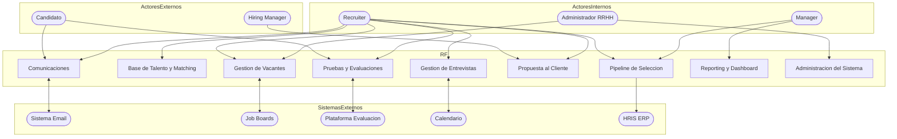

---

## 3. Módulo: Gestión de Vacantes

### Diagrama de casos de uso

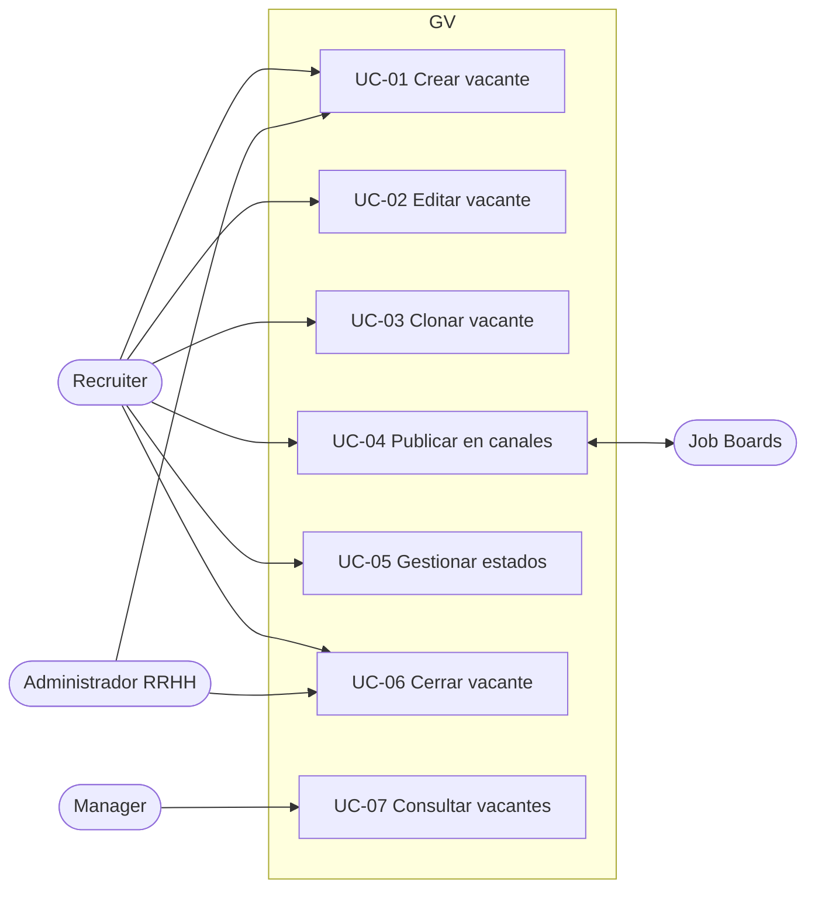

### Detalle de casos de uso

#### UC-01 — Crear vacante

| Campo | Detalle |
|---|---|
| **Actor principal** | Recruiter / Administrador RRHH |
| **Precondición** | Usuario autenticado con rol Recruiter o superior |
| **Trigger** | El cliente solicita cubrir una posición |
| **Flujo principal** | 1. El recruiter accede a "Nueva vacante" 2. Rellena: título, descripción, cliente, departamento, ubicación, modalidad, rango salarial, fecha límite 3. Define skills: selecciona del catálogo, marca must-have / nice-to-have, asigna peso (1-5) 4. Asigna recruiter responsable 5. Guarda como Borrador o pasa a Activa |
| **Flujo alternativo** | Si clona desde vacante existente (UC-03), los campos se precargan |
| **Postcondición** | Vacante creada con código único; motor de matching disponible inmediatamente |
| **Reglas de negocio** | Debe tener al menos 1 skill must-have para activar matching automático |

#### UC-04 — Publicar en canales

| Campo | Detalle |
|---|---|
| **Actor principal** | Recruiter |
| **Precondición** | Vacante en estado Activa |
| **Flujo principal** | 1. El recruiter selecciona canales de publicación (LinkedIn, Indeed, InfoJobs, web corporativa) 2. Revisa la vista previa del anuncio por canal 3. Confirma publicación simultánea o programada 4. El sistema publica vía API y registra fecha y canal |
| **Postcondición** | Vacante publicada; se inicia tracking de candidaturas por fuente |
| **Excepción** | Si falla la API de un canal, se notifica al recruiter y se reintenta en 30 min |

#### UC-05 — Gestionar estados de vacante

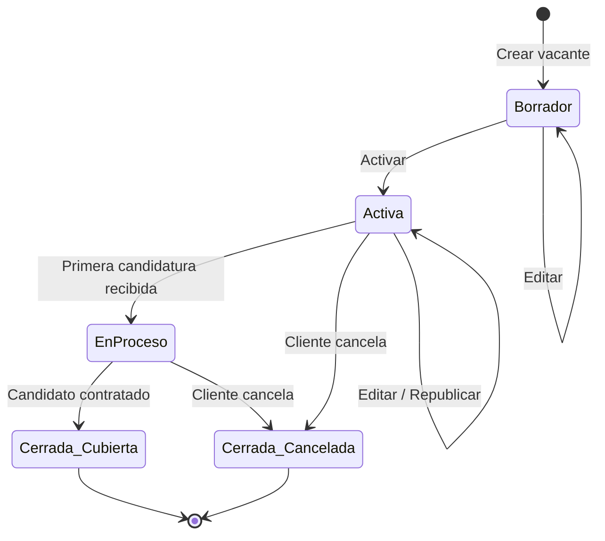

---

## 4. Módulo: Base de Talento y Matching

### Diagrama de casos de uso

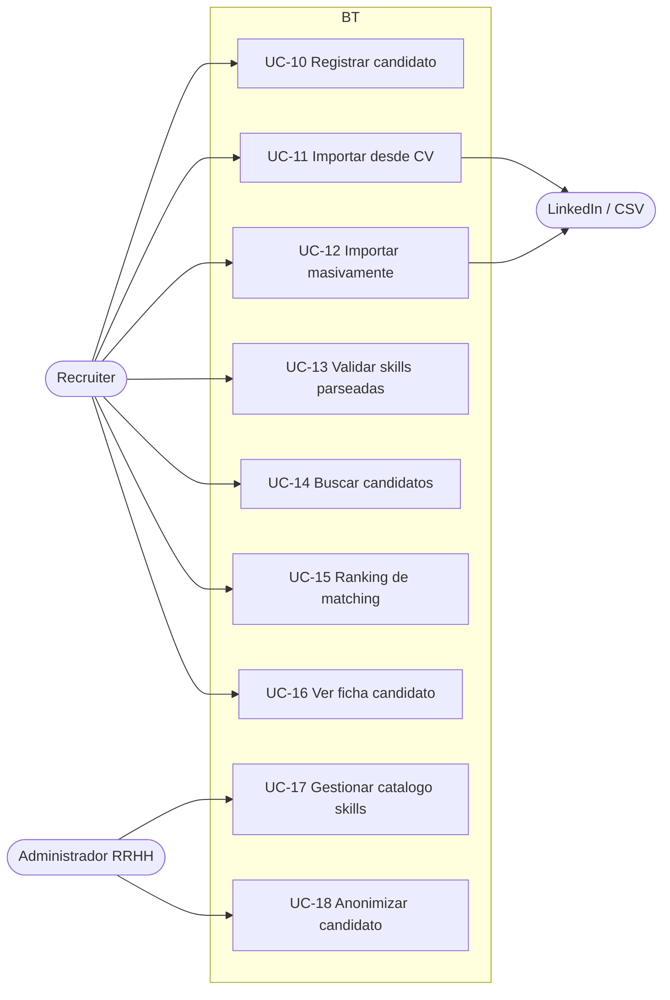

### Detalle de casos de uso

#### UC-11 — Importar candidato desde CV

| Campo | Detalle |
|---|---|
| **Actor principal** | Recruiter |
| **Flujo principal** | 1. Recruiter sube PDF o Word del CV 2. El parser extrae: nombre, contacto, experiencia, formación, skills detectadas 3. El sistema mapea skills al catálogo estandarizado y muestra propuesta 4. Recruiter valida, corrige o añade skills 5. Se verifica duplicado por email/teléfono 6. Candidato queda registrado en la BD |
| **Flujo alternativo** | Si el candidato ya existe, se ofrece fusionar perfiles o actualizar datos |
| **Postcondición** | Candidato disponible para matching inmediato |

#### UC-15 — Obtener ranking de matching

| Campo | Detalle |
|---|---|
| **Actor principal** | Recruiter (trigger automático al crear/modificar vacante) |
| **Precondición** | Vacante con al menos 1 skill must-have definida |
| **Flujo principal** | 1. El sistema recupera todos los candidatos de la BD 2. Calcula score por candidato: bloqueo si falta must-have, suma ponderada de nice-to-have, ajuste por nivel de dominio vs. requerido, ajuste por disponibilidad 3. Ordena el ranking de mayor a menor score 4. Presenta lista con score % global y desglose por skill 5. Candidatos ≥ 80% se marcan visualmente como "Top match" |
| **Rendimiento** | Resultado en < 3 segundos para 100.000 candidatos |
| **Filtros adicionales** | Disponibilidad, ubicación, pretensión salarial, fecha de última actualización |

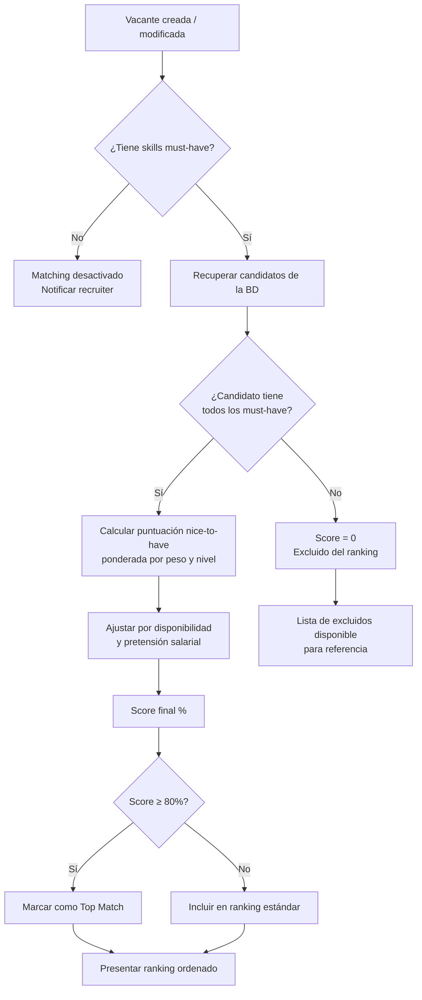

#### UC-17 — Gestionar catálogo de skills

| Campo | Detalle |
|---|---|
| **Actor principal** | Administrador RRHH |
| **Flujo principal** | 1. Admin accede al catálogo maestro 2. Crea / edita / desactiva skills 3. Define categoría (lenguaje, framework, soft skill, idioma, sector…) 4. Configura sinónimos (JS → JavaScript) 5. Los cambios se propagan automáticamente al motor de matching |

---

## 5. Módulo: Pipeline de Selección

### Diagrama de casos de uso

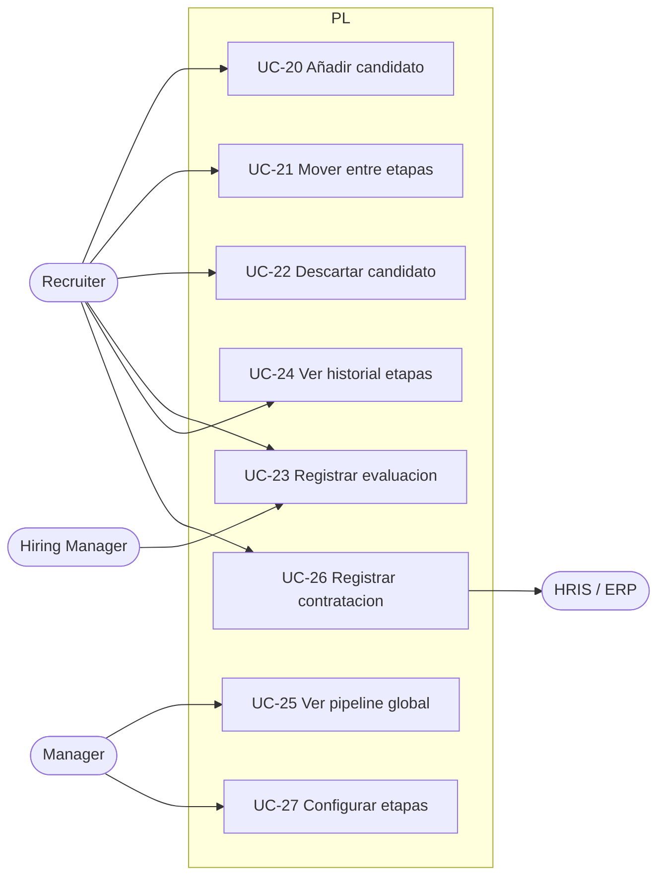

### Estados del candidato en el pipeline

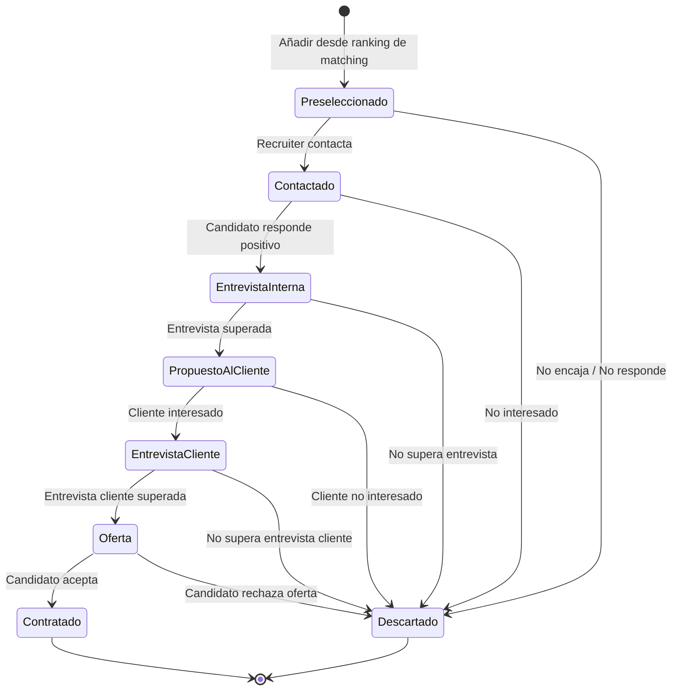

#### UC-21 — Mover candidato entre etapas

| Campo | Detalle |
|---|---|
| **Actor principal** | Recruiter |
| **Flujo principal** | 1. Recruiter arrastra la tarjeta del candidato (drag & drop) o usa el botón "Avanzar etapa" 2. Si hay campos requeridos en la etapa destino (ej.: resultado de entrevista), el sistema los solicita 3. Se registra automáticamente: etapa anterior, etapa nueva, usuario, timestamp 4. Se disparan comunicaciones automáticas configuradas para esa transición |
| **Flujo alternativo (descarte)** | Al mover a "Descartado", el sistema obliga a seleccionar motivo de la lista predefinida |
| **Postcondición** | Historial de etapas actualizado; candidato permanece en BD para futuros procesos |

---

## 6. Módulo: Pruebas y Evaluaciones

### Diagrama de casos de uso

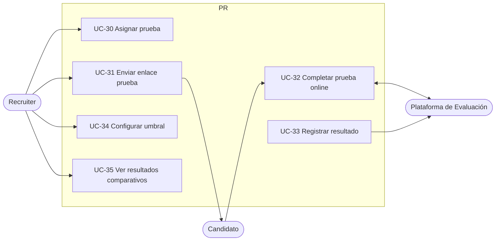

#### UC-30 — Asignar prueba a candidato

| Campo | Detalle |
|---|---|
| **Actor principal** | Recruiter |
| **Precondición** | Candidato en etapa "Entrevista Interna" o posterior |
| **Flujo principal** | 1. Recruiter selecciona tipo de prueba (técnica, psicométrica, idioma) 2. Selecciona plantilla o prueba de plataforma externa 3. Define fecha límite de realización 4. El sistema genera enlace único y envía email al candidato (UC-31) 5. El sistema monitoriza el estado: Pendiente / En curso / Completada |
| **Postcondición** | Resultado registrado automáticamente al completarse; notificación al recruiter |

#### UC-34 — Configurar umbral de paso automático

| Campo | Detalle |
|---|---|
| **Actor principal** | Manager / Administrador |
| **Flujo principal** | 1. Admin define puntuación mínima por tipo de prueba (ej.: ≥ 70%) 2. Si candidato supera umbral, avanza automáticamente a siguiente etapa 3. Si no lo supera, se descarta automáticamente con motivo "Prueba no superada" |

---

## 7. Módulo: Entrevistas

### Diagrama de casos de uso

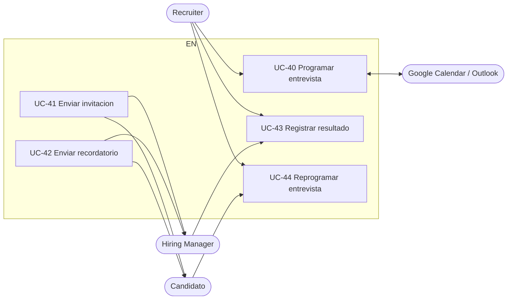

#### UC-40 — Programar entrevista

| Campo | Detalle |
|---|---|
| **Actor principal** | Recruiter |
| **Precondición** | Candidato en etapa que requiere entrevista |
| **Flujo principal** | 1. Recruiter selecciona candidato y tipo de entrevista (presencial / telefónica / videoconferencia) 2. Ve disponibilidad del entrevistador via integración con calendario 3. Selecciona slot horario 4. Sistema crea evento en calendario y envía invitaciones automáticas (UC-41) 5. Se programan recordatorios automáticos 24h y 1h antes |
| **Postcondición** | Entrevista en calendario de recruiter, entrevistador y candidato |

#### UC-43 — Registrar resultado y feedback

| Campo | Detalle |
|---|---|
| **Actor principal** | Recruiter / Hiring Manager |
| **Flujo principal** | 1. Tras la entrevista, el entrevistador accede al formulario de evaluación 2. Puntúa competencias definidas (1-5) con campo de texto por competencia 3. Añade valoración global y recomendación (avanzar / descartar / dudoso) 4. Puede adjuntar archivo (notas, grabación) 5. El feedback queda visible para el equipo según permisos |

---

## 8. Módulo: Propuesta al Cliente

### Diagrama de casos de uso

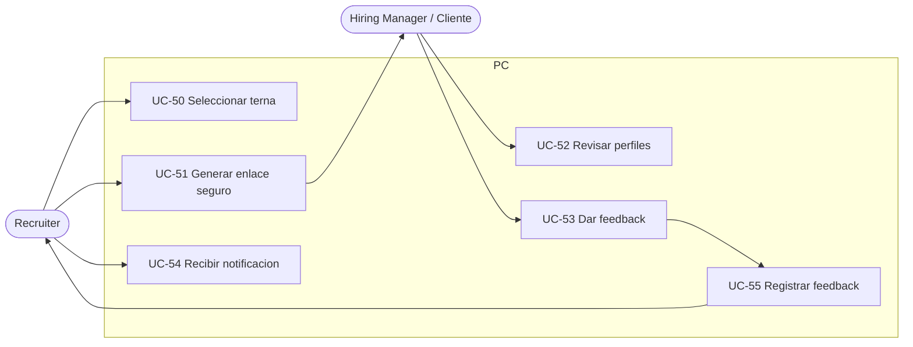

#### UC-51 — Generar portal / enlace seguro

| Campo | Detalle |
|---|---|
| **Actor principal** | Recruiter |
| **Flujo principal** | 1. Recruiter selecciona entre 2-5 candidatos del pipeline (estado "Propuesto al cliente") 2. Configura opciones: anonimizar datos hasta confirmación de interés (Sí/No), fecha de expiración del enlace 3. El sistema genera URL única con token 4. Recruiter envía el enlace al cliente por email o lo copia para compartir |
| **Postcondición** | Portal accesible por el cliente sin necesidad de login; acceso auditado |

#### UC-53 — Dar feedback por candidato

| Campo | Detalle |
|---|---|
| **Actor principal** | Hiring Manager (cliente externo) |
| **Flujo principal** | 1. Cliente abre el enlace del portal 2. Ve perfiles resumidos de los candidatos propuestos 3. Para cada candidato selecciona: Interesado / No interesado / Necesito más información 4. Opcionalmente añade comentario por candidato 5. Envía feedback |
| **Postcondición** | Feedback registrado automáticamente en el pipeline; notificación al recruiter (UC-54) |

---

## 9. Módulo: Comunicaciones

### Diagrama de casos de uso

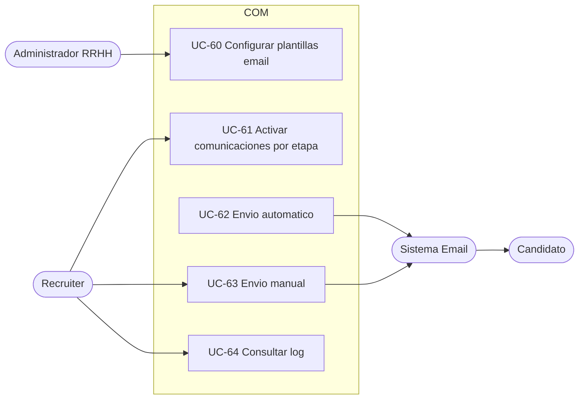

#### UC-60 — Configurar plantillas de email

| Campo | Detalle |
|---|---|
| **Actor principal** | Administrador RRHH |
| **Flujo principal** | 1. Admin accede al editor de plantillas 2. Selecciona etapa del pipeline para la que aplica 3. Redacta el cuerpo del email usando variables dinámicas: {{nombre_candidato}}, {{posicion}}, {{empresa_cliente}}, {{enlace_prueba}}, {{fecha_entrevista}}, etc. 4. Configura asunto, remitente y si el envío es automático o requiere confirmación |

#### UC-62 — Envío automático por transición de etapa

| Campo | Detalle |
|---|---|
| **Actor** | Sistema (trigger automático) |
| **Flujo principal** | 1. Se detecta cambio de etapa de un candidato 2. El sistema consulta si hay plantilla activa para esa transición 3. Renderiza la plantilla con los datos del candidato y la posición 4. Envía el email vía SMTP configurado 5. Registra en el log: timestamp, plantilla usada, estado de entrega |

---

## 10. Módulo: Reporting y Dashboard

### Diagrama de casos de uso

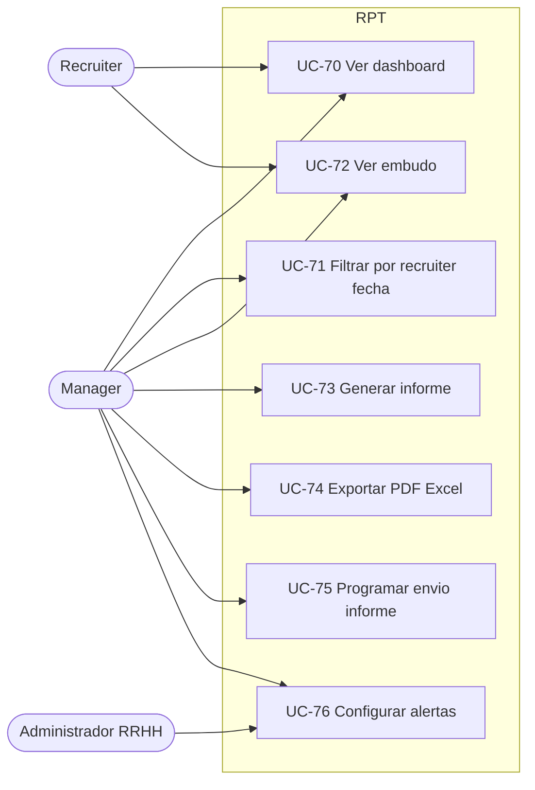

### Métricas del dashboard

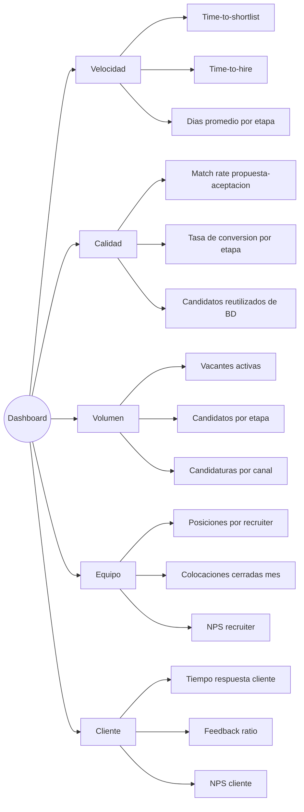

#### UC-70 — Ver dashboard en tiempo real

| Campo | Detalle |
|---|---|
| **Actor principal** | Manager / Recruiter |
| **Flujo principal** | 1. Usuario accede al dashboard 2. Ve: vacantes activas por estado, candidatos por etapa (funnel), alertas de procesos estancados (> N días sin movimiento), métricas del período actual vs. anterior 3. Puede hacer drill-down en cualquier métrica para ver el detalle |

---

## 11. Módulo: Administración del Sistema

### Diagrama de casos de uso

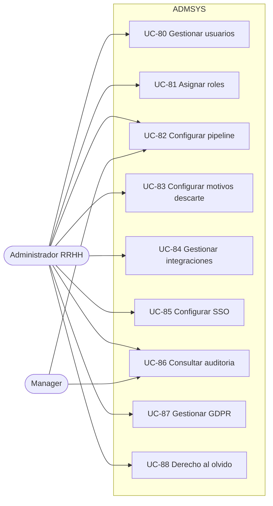

#### UC-87 — Gestionar consentimientos GDPR

| Campo | Detalle |
|---|---|
| **Actor principal** | Administrador RRHH |
| **Flujo principal** | 1. Admin configura el texto del consentimiento por país/idioma 2. El sistema registra fecha, versión y canal de obtención del consentimiento de cada candidato 3. Admin puede consultar el estado de consentimiento de cualquier candidato 4. Candidatos sin consentimiento válido no pueden ser procesados |

#### UC-88 — Ejecutar derecho al olvido

| Campo | Detalle |
|---|---|
| **Actor principal** | Administrador RRHH |
| **Trigger** | Solicitud del candidato o expiración de período de retención |
| **Flujo principal** | 1. Admin busca candidato por email 2. El sistema muestra todos los datos y procesos asociados 3. Admin ejecuta anonimización: datos personales reemplazados por hash, CV eliminado, skills e historial de procesos conservados de forma anónima para estadísticas 4. Se genera registro de auditoría de la acción |

---

## 12. Flujo end-to-end del proceso de selección

Este diagrama muestra el flujo completo desde que el cliente solicita una posición hasta la contratación, integrando todos los módulos y actores.

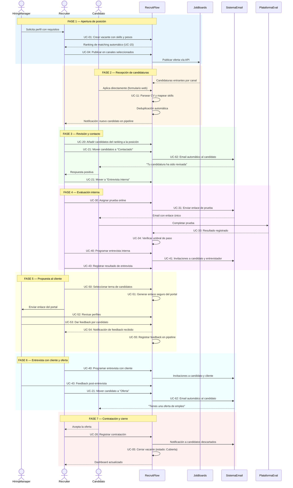

---

## Resumen de casos de uso por módulo

| Módulo | # UCs | Actores principales |
|---|---|---|
| Gestión de Vacantes | UC-01 a UC-07 | Recruiter, Admin |
| Base de Talento & Matching | UC-10 a UC-18 | Recruiter, Admin |
| Pipeline de Selección | UC-20 a UC-27 | Recruiter, Manager |
| Pruebas & Evaluaciones | UC-30 a UC-35 | Recruiter, Candidato |
| Gestión de Entrevistas | UC-40 a UC-44 | Recruiter, Candidato, Hiring Manager |
| Propuesta al Cliente | UC-50 a UC-55 | Recruiter, Hiring Manager |
| Comunicaciones | UC-60 a UC-64 | Admin, Recruiter, Candidato |
| Reporting & Dashboard | UC-70 a UC-76 | Manager, Recruiter |
| Administración del Sistema | UC-80 a UC-88 | Administrador RRHH |
| **Total** | **44 casos de uso** | |

---

*Documento generado a partir de ReadMe.md, PRD-RecruitFlow.md y recruitflow-vision-producto.md*
*Versión 1.0 — 2026-04-04*
