# Modelo de Datos — Entidades Adicionales — RecruitFlow
**Versión:** 1.0
**Fecha:** 2026-04-04
**Rol:** Arquitecto de Software

---

## Contexto

El modelo base cubre el núcleo transaccional del sistema: el ciclo de vida de una candidatura desde que se abre una posición hasta la contratación. Sin embargo, un sistema de RecruitFlow production-ready necesita entidades adicionales para cubrir:

- Publicación y tracking de canales
- Configuración del pipeline
- Enriquecimiento del perfil del candidato
- Operación interna del equipo
- Integraciones y auditoría

---

## Grupo 1 — Publicación y tracking de canales

### JobBoard _(canal de publicación)_
Catálogo de canales donde se publican las ofertas. Permite comparar el rendimiento de cada fuente.

| Campo | Tipo | Descripción |
|---|---|---|
| `id` | UUID PK | Identificador único |
| `name` | VARCHAR | Nombre del canal (LinkedIn, Indeed, InfoJobs…) |
| `type` | ENUM | free / paid / internal / social |
| `api_endpoint` | VARCHAR | URL base de la API de publicación |
| `is_active` | BOOLEAN | Canal disponible en el sistema |

**Relación:** Un `JobBoard` puede tener múltiples `PositionPublication`.

---

### PositionPublication _(publicación de una vacante en un canal)_
Registra cada publicación de una vacante en un canal externo y sus métricas de rendimiento. Sin esta entidad no es posible hacer *source of hire* ni calcular el coste por candidatura.

| Campo | Tipo | Descripción |
|---|---|---|
| `id` | UUID PK | Identificador único |
| `position_id` | UUID FK | Vacante publicada |
| `job_board_id` | UUID FK | Canal de publicación |
| `external_id` | VARCHAR | ID del anuncio en el canal externo |
| `status` | ENUM | draft / published / paused / expired / closed |
| `published_at` | TIMESTAMP | Fecha de publicación |
| `expires_at` | TIMESTAMP | Fecha de expiración del anuncio |
| `impressions` | INTEGER | Veces que se ha visto el anuncio |
| `clicks` | INTEGER | Clics recibidos |
| `applications_count` | INTEGER | Candidaturas originadas desde este canal |
| `cost` | DECIMAL | Coste de la publicación (si es canal de pago) |

**Relaciones:**
- `PositionPublication` N:1 `Position`
- `PositionPublication` N:1 `JobBoard`
- `Application.source_publication_id` → FK a `PositionPublication` (trazabilidad del origen)

---

## Grupo 2 — Configuración del pipeline

### PipelineTemplate _(plantilla de pipeline)_
Permite que cada empresa defina sus propias plantillas de pipeline reutilizables (ej.: "Pipeline técnico", "Pipeline comercial"). Elimina las etapas hardcodeadas del modelo.

| Campo | Tipo | Descripción |
|---|---|---|
| `id` | UUID PK | Identificador único |
| `company_id` | UUID FK | Tenant propietario |
| `name` | VARCHAR | Nombre de la plantilla (ej.: "Pipeline IT Senior") |
| `is_default` | BOOLEAN | Si se aplica por defecto a nuevas posiciones |

**Relación:** `PipelineTemplate` 1:N `PipelineStage`.

---

### PipelineStage _(etapa configurable del pipeline)_
Define las etapas concretas de un pipeline. Reemplaza el ENUM fijo de `Application.stage` por una entidad flexible y ordenada.

| Campo | Tipo | Descripción |
|---|---|---|
| `id` | UUID PK | Identificador único |
| `template_id` | UUID FK | Plantilla a la que pertenece |
| `name` | VARCHAR | Nombre de la etapa (ej.: "Entrevista técnica") |
| `order` | SMALLINT | Orden dentro del pipeline |
| `type` | ENUM | active / hired / discarded (tipos especiales de cierre) |
| `requires_feedback` | BOOLEAN | Si bloquea el avance hasta que hay evaluación registrada |
| `auto_email` | BOOLEAN | Si dispara un email automático al candidato |
| `sla_days` | SMALLINT | Días máximos permitidos en esta etapa antes de alerta |

**Relaciones:**
- `PipelineStage` N:1 `PipelineTemplate`
- `Position.pipeline_template_id` → FK a `PipelineTemplate`
- `Application.current_stage_id` → FK a `PipelineStage`
- `ApplicationStageHistory.stage_id` → FK a `PipelineStage`

---

### DiscardReason _(catálogo de motivos de descarte)_
Catálogo configurable de motivos de descarte. Imprescindible para analizar en qué punto y por qué se pierden candidatos.

| Campo | Tipo | Descripción |
|---|---|---|
| `id` | UUID PK | Identificador único |
| `company_id` | UUID FK | Tenant propietario |
| `label` | VARCHAR | Texto del motivo (ej.: "Pretensión salarial fuera de rango") |
| `category` | ENUM | candidate_side / client_side / process / other |
| `is_active` | BOOLEAN | Disponible para selección |

**Relación:** `Application.discard_reason_id` → FK a `DiscardReason`.

---

## Grupo 3 — Enriquecimiento del perfil del candidato

### CandidateExperience _(experiencia laboral)_
Historial de experiencias profesionales del candidato. El parser de CV extrae esta información y el recruiter la valida. Es la base para calcular `years_experience` de forma estructurada.

| Campo | Tipo | Descripción |
|---|---|---|
| `id` | UUID PK | Identificador único |
| `candidate_id` | UUID FK | Candidato |
| `company_name` | VARCHAR | Empresa donde trabajó |
| `title` | VARCHAR | Cargo o puesto |
| `started_at` | DATE | Fecha de inicio |
| `ended_at` | DATE | Fecha de fin (NULL si es trabajo actual) |
| `is_current` | BOOLEAN | Trabajo actual |
| `description` | TEXT | Descripción de responsabilidades |
| `location` | VARCHAR | Ciudad / País |

**Relación:** `CandidateExperience` N:1 `Candidate`.

---

### CandidateEducation _(formación académica)_
Títulos y formación del candidato. Permite filtrar por nivel de estudios o área de conocimiento.

| Campo | Tipo | Descripción |
|---|---|---|
| `id` | UUID PK | Identificador único |
| `candidate_id` | UUID FK | Candidato |
| `institution` | VARCHAR | Centro educativo |
| `degree` | VARCHAR | Título obtenido |
| `field_of_study` | VARCHAR | Área de estudio |
| `level` | ENUM | secondary / bachelor / master / phd / bootcamp / certification / other |
| `started_at` | DATE | Fecha de inicio |
| `ended_at` | DATE | Fecha de fin (NULL si en curso) |
| `is_current` | BOOLEAN | Formación en curso |

**Relación:** `CandidateEducation` N:1 `Candidate`.

---

### Document _(documentos adjuntos)_
Almacena cualquier fichero asociado a una candidatura o candidato: CV, carta de motivación, resultado de prueba, contrato de oferta, etc.

| Campo | Tipo | Descripción |
|---|---|---|
| `id` | UUID PK | Identificador único |
| `company_id` | UUID FK | Tenant propietario |
| `candidate_id` | UUID FK | Candidato asociado (nullable) |
| `application_id` | UUID FK | Candidatura asociada (nullable) |
| `type` | ENUM | cv / cover_letter / assessment_result / offer_letter / other |
| `file_name` | VARCHAR | Nombre original del fichero |
| `file_url` | VARCHAR | Ruta en almacenamiento (S3, Azure Blob…) |
| `file_size_kb` | INTEGER | Tamaño en KB |
| `mime_type` | VARCHAR | Tipo MIME (application/pdf, etc.) |
| `uploaded_by` | UUID FK | Usuario que subió el fichero |
| `uploaded_at` | TIMESTAMP | Fecha de subida |

**Relaciones:**
- `Document` N:1 `Candidate`
- `Document` N:1 `Application`
- `Document` N:1 `User` (uploaded_by)

---

### Tag _(etiqueta)_ y CandidateTag _(etiqueta en candidato)_
Sistema de etiquetado libre para clasificar candidatos de forma rápida y flexible, más ágil que los skills del catálogo.

**Tag**

| Campo | Tipo | Descripción |
|---|---|---|
| `id` | UUID PK | Identificador único |
| `company_id` | UUID FK | Tenant propietario |
| `name` | VARCHAR | Texto de la etiqueta |
| `color` | VARCHAR | Color HEX para la UI |

**CandidateTag**

| Campo | Tipo | Descripción |
|---|---|---|
| `candidate_id` | UUID FK | Candidato |
| `tag_id` | UUID FK | Etiqueta |
| `tagged_by` | UUID FK | Usuario que aplicó la etiqueta |
| `tagged_at` | TIMESTAMP | Fecha de aplicación |

**Relaciones:**
- `Tag` 1:N `CandidateTag`
- `Candidate` 1:N `CandidateTag`

---

## Grupo 4 — Operación interna del equipo

### Note _(nota interna)_
Notas libres de recruiters o managers sobre un candidato o una candidatura. Diferente a las evaluaciones estructuradas de entrevista: más rápidas, informales y contextuales.

| Campo | Tipo | Descripción |
|---|---|---|
| `id` | UUID PK | Identificador único |
| `company_id` | UUID FK | Tenant |
| `candidate_id` | UUID FK | Candidato (nullable) |
| `application_id` | UUID FK | Candidatura (nullable) |
| `author_id` | UUID FK | Usuario que escribe la nota |
| `body` | TEXT | Contenido de la nota |
| `is_private` | BOOLEAN | Solo visible para el autor |
| `created_at` | TIMESTAMP | Fecha de creación |

**Relaciones:**
- `Note` N:1 `Candidate`
- `Note` N:1 `Application`
- `Note` N:1 `User` (author)

---

### SavedSearch _(búsqueda guardada)_
Permite a los recruiters guardar queries frecuentes de búsqueda de candidatos para reutilizarlas con un clic. También puede configurarse para recibir alertas cuando hay nuevos candidatos que encajan.

| Campo | Tipo | Descripción |
|---|---|---|
| `id` | UUID PK | Identificador único |
| `user_id` | UUID FK | Recruiter propietario |
| `name` | VARCHAR | Nombre descriptivo de la búsqueda |
| `filters` | JSONB | Filtros serializados (skills, ubicación, disponibilidad…) |
| `alert_enabled` | BOOLEAN | Si genera notificación al haber nuevos matches |
| `last_run_at` | TIMESTAMP | Última vez ejecutada |
| `created_at` | TIMESTAMP | Fecha de creación |

**Relación:** `SavedSearch` N:1 `User`.

---

### Notification _(notificación in-app)_
Notificaciones internas dentro de la plataforma (distintas de los emails a candidatos). Informan al equipo de eventos relevantes: feedback del cliente recibido, candidato avanzado, posición estancada, etc.

| Campo | Tipo | Descripción |
|---|---|---|
| `id` | UUID PK | Identificador único |
| `user_id` | UUID FK | Destinatario |
| `type` | ENUM | client_feedback / stage_change / position_stalled / assessment_done / mention / other |
| `title` | VARCHAR | Título corto de la notificación |
| `body` | VARCHAR | Descripción del evento |
| `entity_type` | VARCHAR | Tipo de entidad relacionada (Application, Position…) |
| `entity_id` | UUID | ID de la entidad relacionada |
| `is_read` | BOOLEAN | Leída o no |
| `created_at` | TIMESTAMP | Fecha del evento |

**Relación:** `Notification` N:1 `User`.

---

## Grupo 5 — Integración y auditoría

### Webhook _(configuración de webhooks)_
Permite que clientes técnicos reciban eventos del sistema en tiempo real en sus propios sistemas sin necesidad de polling.

| Campo | Tipo | Descripción |
|---|---|---|
| `id` | UUID PK | Identificador único |
| `company_id` | UUID FK | Tenant propietario |
| `url` | VARCHAR | Endpoint destino |
| `events` | VARCHAR[] | Lista de eventos suscritos (stage_changed, hired, feedback_received…) |
| `secret` | VARCHAR | HMAC secret para verificar firma |
| `is_active` | BOOLEAN | Webhook activo |
| `last_triggered_at` | TIMESTAMP | Última ejecución |
| `failure_count` | SMALLINT | Fallos consecutivos (para desactivación automática) |

**Relación:** `Webhook` N:1 `Company`.

---

### ApiToken _(token de API)_
Credenciales para que sistemas externos interactúen con la API REST de RecruitFlow (HRIS, HRMS, herramientas internas del cliente).

| Campo | Tipo | Descripción |
|---|---|---|
| `id` | UUID PK | Identificador único |
| `company_id` | UUID FK | Tenant propietario |
| `created_by` | UUID FK | Usuario que generó el token |
| `name` | VARCHAR | Nombre descriptivo (ej.: "Integración SAP") |
| `token_hash` | VARCHAR | Hash del token (nunca se almacena en claro) |
| `scopes` | VARCHAR[] | Permisos (read:candidates, write:applications…) |
| `last_used_at` | TIMESTAMP | Última llamada autenticada |
| `expires_at` | TIMESTAMP | Caducidad (NULL = no expira) |
| `is_active` | BOOLEAN | Token activo |

**Relación:** `ApiToken` N:1 `Company`.

---

### AuditLog _(log de auditoría)_
Registro inmutable de todas las acciones críticas del sistema. Imprescindible para cumplimiento GDPR, auditorías internas y debugging de incidencias. Complementa a `ApplicationStageHistory` con una visión más amplia.

| Campo | Tipo | Descripción |
|---|---|---|
| `id` | UUID PK | Identificador único |
| `company_id` | UUID FK | Tenant |
| `actor_id` | UUID FK | Usuario que realizó la acción (nullable si es sistema) |
| `actor_type` | ENUM | user / system / api_token |
| `action` | VARCHAR | Acción realizada (candidate.anonymized, position.closed, user.created…) |
| `entity_type` | VARCHAR | Tipo de entidad afectada |
| `entity_id` | UUID | ID de la entidad afectada |
| `before` | JSONB | Estado anterior (snapshot) |
| `after` | JSONB | Estado posterior (snapshot) |
| `ip_address` | VARCHAR | IP de la petición |
| `created_at` | TIMESTAMP | Timestamp del evento |

**Relación:** `AuditLog` N:1 `Company`.

---

## Diagrama de entidades adicionales y sus relaciones con el modelo base

```mermaid
erDiagram
    JobBoard {
        string id PK "Identificador unico"
        string name "LinkedIn Indeed InfoJobs"
        string type "free paid internal social"
        boolean is_active "Canal disponible"
    }
    PositionPublication {
        string id PK "Identificador unico"
        string position_id FK "Vacante publicada"
        string job_board_id FK "Canal de publicacion"
        string status "draft published paused expired"
        int impressions "Veces que se vio el anuncio"
        int clicks "Clics recibidos"
        int applications_count "Candidaturas originadas"
        float cost "Coste si es canal de pago"
        datetime published_at "Fecha de publicacion"
    }
    PipelineTemplate {
        string id PK "Identificador unico"
        string company_id FK "Tenant propietario"
        string name "Nombre de la plantilla"
        boolean is_default "Aplicada por defecto"
    }
    PipelineStage {
        string id PK "Identificador unico"
        string template_id FK "Plantilla padre"
        string name "Nombre de la etapa"
        int order "Orden dentro del pipeline"
        string type "active hired discarded"
        int sla_days "Dias maximos en esta etapa"
        boolean requires_feedback "Bloquea sin evaluacion"
        boolean auto_email "Dispara email automatico"
    }
    DiscardReason {
        string id PK "Identificador unico"
        string company_id FK "Tenant propietario"
        string label "Texto del motivo"
        string category "candidate_side client_side process"
        boolean is_active "Disponible para seleccion"
    }
    CandidateExperience {
        string id PK "Identificador unico"
        string candidate_id FK "Candidato"
        string company_name "Empresa donde trabajo"
        string title "Cargo o puesto"
        date started_at "Fecha de inicio"
        date ended_at "Fecha de fin"
        boolean is_current "Trabajo actual"
    }
    CandidateEducation {
        string id PK "Identificador unico"
        string candidate_id FK "Candidato"
        string institution "Centro educativo"
        string degree "Titulo obtenido"
        string field_of_study "Area de estudio"
        string level "bachelor master phd bootcamp"
        boolean is_current "Formacion en curso"
    }
    Document {
        string id PK "Identificador unico"
        string company_id FK "Tenant propietario"
        string candidate_id FK "Candidato asociado"
        string application_id FK "Candidatura asociada"
        string type "cv cover_letter offer_letter"
        string file_url "Ruta en almacenamiento"
        string mime_type "Tipo MIME"
        datetime uploaded_at "Fecha de subida"
    }
    Tag {
        string id PK "Identificador unico"
        string company_id FK "Tenant propietario"
        string name "Texto de la etiqueta"
        string color "Color HEX para la UI"
    }
    CandidateTag {
        string candidate_id FK "Candidato etiquetado"
        string tag_id FK "Etiqueta aplicada"
        string tagged_by FK "Usuario que etiqueto"
        datetime tagged_at "Fecha de aplicacion"
    }
    Note {
        string id PK "Identificador unico"
        string candidate_id FK "Candidato relacionado"
        string application_id FK "Candidatura relacionada"
        string author_id FK "Usuario que escribe"
        string body "Contenido de la nota"
        boolean is_private "Solo visible al autor"
        datetime created_at "Fecha de creacion"
    }
    SavedSearch {
        string id PK "Identificador unico"
        string user_id FK "Recruiter propietario"
        string name "Nombre descriptivo"
        string filters "Filtros serializados JSON"
        boolean alert_enabled "Alerta de nuevos matches"
        datetime last_run_at "Ultima ejecucion"
    }
    Notification {
        string id PK "Identificador unico"
        string user_id FK "Destinatario"
        string type "client_feedback stage_change stalled"
        string title "Titulo de la notificacion"
        string entity_type "Tipo de entidad relacionada"
        string entity_id "ID de la entidad relacionada"
        boolean is_read "Leida o no"
        datetime created_at "Fecha del evento"
    }
    Webhook {
        string id PK "Identificador unico"
        string company_id FK "Tenant propietario"
        string url "Endpoint destino"
        string events "Eventos suscritos"
        string secret "HMAC secret para firma"
        boolean is_active "Webhook activo"
        int failure_count "Fallos consecutivos"
    }
    ApiToken {
        string id PK "Identificador unico"
        string company_id FK "Tenant propietario"
        string name "Nombre descriptivo"
        string token_hash "Hash nunca en claro"
        string scopes "Permisos del token"
        boolean is_active "Token activo"
        datetime expires_at "Caducidad"
    }
    AuditLog {
        string id PK "Identificador unico"
        string company_id FK "Tenant"
        string actor_id FK "Usuario que actuo"
        string actor_type "user system api_token"
        string action "Accion realizada"
        string entity_type "Tipo de entidad afectada"
        string entity_id "ID de entidad afectada"
        datetime created_at "Timestamp del evento"
    }

    JobBoard ||--o{ PositionPublication : publica
    PipelineTemplate ||--o{ PipelineStage : define
    Tag ||--o{ CandidateTag : aplicada
```

---

## Modelo completo consolidado (base + adicional)

```mermaid
erDiagram
    Company ||--o{ User : tiene
    Company ||--o{ Client : gestiona
    Company ||--o{ Skill : define
    Company ||--o{ Candidate : almacena
    Company ||--o{ Position : abre
    Company ||--o{ EmailTemplate : configura
    Company ||--o{ PipelineTemplate : configura
    Company ||--o{ DiscardReason : configura
    Company ||--o{ Tag : define
    Company ||--o{ Webhook : registra
    Company ||--o{ ApiToken : emite
    Company ||--o{ AuditLog : audita

    Client ||--o{ Position : solicita
    User ||--o{ Position : gestiona
    User ||--o{ Application : responsable
    User ||--o{ Interview : entrevistador
    User ||--o{ StageHistory : ejecuta
    User ||--o{ ClientProposal : crea
    User ||--o{ Note : escribe
    User ||--o{ SavedSearch : guarda
    User ||--o{ Notification : recibe
    User ||--o{ CandidateTag : etiqueta

    Position ||--o{ PositionSkill : requiere
    Position ||--o{ Application : recibe
    Position ||--o{ ClientProposal : genera
    Position ||--o{ PositionPublication : publicada

    Skill ||--o{ PositionSkill : requerida
    Skill ||--o{ CandidateSkill : dominada

    JobBoard ||--o{ PositionPublication : canal
    PipelineTemplate ||--o{ PipelineStage : define

    Candidate ||--o{ CandidateSkill : tiene
    Candidate ||--o{ Application : participa
    Candidate ||--o{ CandidateExperience : acumula
    Candidate ||--o{ CandidateEducation : acumula
    Candidate ||--o{ Document : adjunta
    Candidate ||--o{ CandidateTag : etiquetada
    Candidate ||--o{ Note : anotada

    Tag ||--o{ CandidateTag : aplicada

    Application ||--o{ StageHistory : registra
    Application ||--o{ Interview : genera
    Application ||--o{ Assessment : incluye
    Application ||--o{ ClientProposalItem : incluida
    Application ||--o{ Communication : genera
    Application ||--o{ Note : anotada
    Application ||--o{ Document : adjunta
    Application ||--o{ DiscardReason : motivo

    ClientProposal ||--o{ ClientProposalItem : contiene
    EmailTemplate ||--o{ Communication : utilizada
```

---

## Resumen de entidades adicionales

| Grupo | Entidad | Por qué es importante |
|---|---|---|
| Canales | `JobBoard` | Catálogo de fuentes de candidatos |
| Canales | `PositionPublication` | Tracking de rendimiento por canal; base del *source of hire* |
| Pipeline | `PipelineTemplate` | Elimina etapas hardcodeadas; pipeline flexible por tipo de proceso |
| Pipeline | `PipelineStage` | Define SLA por etapa, bloqueos, alertas y automatizaciones |
| Pipeline | `DiscardReason` | Analizar por qué y dónde se pierden candidatos |
| Perfil | `CandidateExperience` | Historial laboral estructurado; mejora la precisión del matching |
| Perfil | `CandidateEducation` | Filtrado por nivel y área de formación |
| Perfil | `Document` | Repositorio de ficheros asociados a candidatos y procesos |
| Perfil | `Tag` + `CandidateTag` | Clasificación ágil y flexible más allá de los skills |
| Operación | `Note` | Conocimiento contextual del equipo sobre candidatos |
| Operación | `SavedSearch` | Reutilización de búsquedas complejas de matching |
| Operación | `Notification` | Alertas in-app para el equipo sin depender del email |
| Integración | `Webhook` | Eventos en tiempo real hacia sistemas externos |
| Integración | `ApiToken` | Autenticación de integraciones con scopes granulares |
| Auditoría | `AuditLog` | Cumplimiento GDPR; trazabilidad de todas las acciones críticas |

---

*Documento de arquitectura de datos adicional — RecruitFlow v1.0*
