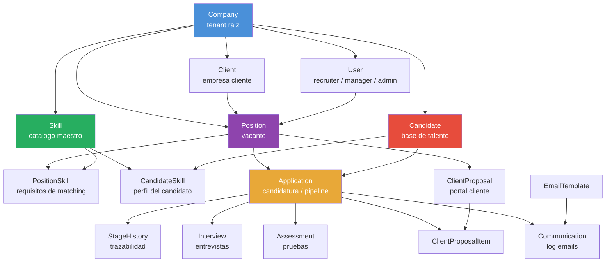

# Modelo de Datos — RecruitFlow
**Versión:** 1.0
**Fecha:** 2026-04-04
**Rol:** Arquitecto de Software

---

## 1. Entidades principales y campos esenciales

### 1.1 Company _(tenant — empresa de selección)_
Representa a la empresa que usa RecruitFlow. Es el tenant raíz en la arquitectura multi-tenant.

| Campo | Tipo | Descripción |
|---|---|---|
| `id` | UUID PK | Identificador único |
| `name` | VARCHAR | Nombre de la empresa |
| `slug` | VARCHAR UNIQUE | Identificador para URL/subdominio |
| `plan` | ENUM | free / pro / enterprise |
| `settings` | JSONB | Configuración personalizada (idioma, zona horaria, etc.) |
| `created_at` | TIMESTAMP | Fecha de alta |

---

### 1.2 User _(usuarios internos)_
Recruiters, managers y administradores de la empresa de selección.

| Campo | Tipo | Descripción |
|---|---|---|
| `id` | UUID PK | Identificador único |
| `company_id` | UUID FK | Tenant al que pertenece |
| `email` | VARCHAR UNIQUE | Email corporativo |
| `full_name` | VARCHAR | Nombre completo |
| `role` | ENUM | admin / manager / recruiter |
| `avatar_url` | VARCHAR | Foto de perfil |
| `is_active` | BOOLEAN | Cuenta activa/desactivada |
| `last_login_at` | TIMESTAMP | Control de acceso |

---

### 1.3 Client _(empresa cliente)_
Empresa que solicita perfiles a la consultora de selección.

| Campo | Tipo | Descripción |
|---|---|---|
| `id` | UUID PK | Identificador único |
| `company_id` | UUID FK | Tenant propietario |
| `name` | VARCHAR | Nombre de la empresa cliente |
| `industry` | VARCHAR | Sector de actividad |
| `contact_name` | VARCHAR | Nombre del interlocutor |
| `contact_email` | VARCHAR | Email del Hiring Manager |
| `contact_phone` | VARCHAR | Teléfono |
| `is_active` | BOOLEAN | Cliente activo |

---

### 1.4 Position _(vacante)_
Posición abierta que el cliente necesita cubrir. Entidad central del sistema.

| Campo | Tipo | Descripción |
|---|---|---|
| `id` | UUID PK | Identificador único |
| `code` | VARCHAR UNIQUE | Código autogenerado (ej: POS-2026-0042) |
| `company_id` | UUID FK | Tenant propietario |
| `client_id` | UUID FK | Cliente que solicita el perfil |
| `recruiter_id` | UUID FK | Recruiter responsable |
| `title` | VARCHAR | Título del puesto |
| `description` | TEXT | Descripción completa |
| `location` | VARCHAR | Ciudad / País |
| `modality` | ENUM | presencial / remoto / híbrido |
| `salary_min` | DECIMAL | Rango salarial mínimo |
| `salary_max` | DECIMAL | Rango salarial máximo |
| `status` | ENUM | draft / active / in_progress / closed_filled / closed_cancelled |
| `priority` | ENUM | low / medium / high / urgent |
| `deadline` | DATE | Fecha límite para cubrir la posición |
| `opened_at` | TIMESTAMP | Fecha de apertura |
| `closed_at` | TIMESTAMP | Fecha de cierre |

---

### 1.5 Skill _(catálogo maestro de habilidades)_
Catálogo centralizado y normalizado de skills. Propiedad de la empresa (tenant).

| Campo | Tipo | Descripción |
|---|---|---|
| `id` | UUID PK | Identificador único |
| `company_id` | UUID FK | Tenant propietario |
| `name` | VARCHAR | Nombre canónico (ej: "JavaScript") |
| `category` | ENUM | language / framework / soft_skill / language_spoken / sector / tool / other |
| `aliases` | VARCHAR[] | Sinónimos (["JS", "js", "javascript"]) |
| `is_active` | BOOLEAN | Disponible en el catálogo |

---

### 1.6 PositionSkill _(skills requeridas por una posición)_
Tabla de unión enriquecida entre Position y Skill. Define los requisitos de matching.

| Campo | Tipo | Descripción |
|---|---|---|
| `id` | UUID PK | Identificador único |
| `position_id` | UUID FK | Posición |
| `skill_id` | UUID FK | Skill del catálogo |
| `requirement` | ENUM | must_have / nice_to_have |
| `weight` | SMALLINT | Peso para el scoring (1-5) |
| `min_level` | ENUM | basic / medium / advanced / expert |

---

### 1.7 Candidate _(candidato)_
Perfil profesional almacenado en la base de talento del tenant.

| Campo | Tipo | Descripción |
|---|---|---|
| `id` | UUID PK | Identificador único |
| `company_id` | UUID FK | Tenant propietario |
| `email` | VARCHAR | Email (índice de deduplicación) |
| `phone` | VARCHAR | Teléfono (índice de deduplicación) |
| `full_name` | VARCHAR | Nombre completo |
| `location` | VARCHAR | Ciudad / País de residencia |
| `years_experience` | SMALLINT | Años totales de experiencia |
| `availability` | ENUM | immediate / two_weeks / one_month / not_available |
| `salary_expectation` | DECIMAL | Pretensión salarial |
| `cv_url` | VARCHAR | Ruta al CV almacenado |
| `linkedin_url` | VARCHAR | Perfil de LinkedIn |
| `source` | ENUM | linkedin / cv_upload / referral / job_board / manual |
| `gdpr_consent` | BOOLEAN | Consentimiento de tratamiento de datos |
| `gdpr_consent_at` | TIMESTAMP | Fecha del consentimiento |
| `anonymized_at` | TIMESTAMP | Fecha de anonimización (derecho al olvido) |
| `created_at` | TIMESTAMP | Fecha de alta en la BD |

---

### 1.8 CandidateSkill _(skills del candidato)_
Tabla de unión enriquecida entre Candidate y Skill. Base del motor de matching.

| Campo | Tipo | Descripción |
|---|---|---|
| `id` | UUID PK | Identificador único |
| `candidate_id` | UUID FK | Candidato |
| `skill_id` | UUID FK | Skill del catálogo |
| `level` | ENUM | basic / medium / advanced / expert |
| `years_using` | SMALLINT | Años de uso de la skill |
| `verified` | BOOLEAN | Validado manualmente por recruiter (vs. parser) |

---

### 1.9 Application _(candidatura)_
Relación entre un candidato y una posición. Representa su paso por el proceso de selección. Es la entidad del pipeline.

| Campo | Tipo | Descripción |
|---|---|---|
| `id` | UUID PK | Identificador único |
| `position_id` | UUID FK | Posición a la que aplica |
| `candidate_id` | UUID FK | Candidato |
| `recruiter_id` | UUID FK | Recruiter que gestiona esta candidatura |
| `stage` | ENUM | shortlisted / contacted / internal_interview / proposed / client_interview / offer / hired / discarded |
| `match_score` | DECIMAL | Score de matching calculado (0-100) |
| `match_detail` | JSONB | Desglose del score por skill |
| `discard_reason` | VARCHAR | Motivo de descarte (obligatorio si stage=discarded) |
| `source` | ENUM | matching / manual / job_board / referral |
| `created_at` | TIMESTAMP | Fecha de entrada al proceso |
| `updated_at` | TIMESTAMP | Última actualización |

---

### 1.10 ApplicationStageHistory _(historial de etapas)_
Log inmutable de cada cambio de etapa de una candidatura. Garantiza trazabilidad completa.

| Campo | Tipo | Descripción |
|---|---|---|
| `id` | UUID PK | Identificador único |
| `application_id` | UUID FK | Candidatura |
| `from_stage` | ENUM | Etapa anterior |
| `to_stage` | ENUM | Etapa nueva |
| `changed_by` | UUID FK | Usuario que realizó el cambio |
| `discard_reason` | VARCHAR | Solo si to_stage = discarded |
| `notes` | TEXT | Notas opcionales del cambio |
| `changed_at` | TIMESTAMP | Timestamp del cambio |

---

### 1.11 Interview _(entrevista)_
Entrevista agendada en el contexto de una candidatura.

| Campo | Tipo | Descripción |
|---|---|---|
| `id` | UUID PK | Identificador único |
| `application_id` | UUID FK | Candidatura asociada |
| `interviewer_id` | UUID FK | Entrevistador (User interno o Hiring Manager) |
| `type` | ENUM | phone / video / in_person |
| `scheduled_at` | TIMESTAMP | Fecha y hora programada |
| `duration_minutes` | SMALLINT | Duración estimada |
| `location_or_link` | VARCHAR | Sala, dirección o enlace de videoconferencia |
| `status` | ENUM | scheduled / completed / cancelled / no_show |
| `calendar_event_id` | VARCHAR | ID del evento en Google/Outlook |
| `feedback_score` | SMALLINT | Puntuación global (1-5) |
| `feedback_notes` | TEXT | Notas del entrevistador |
| `result` | ENUM | advance / discard / on_hold |

---

### 1.12 Assessment _(prueba de evaluación)_
Prueba técnica o psicométrica asignada a un candidato en un proceso.

| Campo | Tipo | Descripción |
|---|---|---|
| `id` | UUID PK | Identificador único |
| `application_id` | UUID FK | Candidatura asociada |
| `type` | ENUM | technical / psychometric / language / custom |
| `platform` | VARCHAR | TestGorilla, HackerRank, interno, etc. |
| `external_id` | VARCHAR | ID de la prueba en plataforma externa |
| `link` | VARCHAR | Enlace único enviado al candidato |
| `status` | ENUM | pending / in_progress / completed / expired |
| `score` | DECIMAL | Puntuación obtenida |
| `pass_threshold` | DECIMAL | Umbral mínimo para avanzar |
| `passed` | BOOLEAN | Calculado: score >= pass_threshold |
| `expires_at` | TIMESTAMP | Fecha límite para completar |
| `completed_at` | TIMESTAMP | Fecha de finalización |

---

### 1.13 ClientProposal _(propuesta al cliente)_
Agrupación de candidatos enviada al Hiring Manager para su revisión.

| Campo | Tipo | Descripción |
|---|---|---|
| `id` | UUID PK | Identificador único |
| `position_id` | UUID FK | Posición para la que se propone |
| `created_by` | UUID FK | Recruiter que genera la propuesta |
| `token` | VARCHAR UNIQUE | Token seguro para el enlace público |
| `is_anonymized` | BOOLEAN | Si los datos personales están ocultos |
| `expires_at` | TIMESTAMP | Caducidad del enlace |
| `viewed_at` | TIMESTAMP | Primera vez que el cliente abre el enlace |
| `created_at` | TIMESTAMP | Fecha de generación |

---

### 1.14 ClientProposalItem _(candidato dentro de una propuesta)_
Detalle de cada candidato incluido en una propuesta y el feedback del cliente.

| Campo | Tipo | Descripción |
|---|---|---|
| `id` | UUID PK | Identificador único |
| `proposal_id` | UUID FK | Propuesta padre |
| `application_id` | UUID FK | Candidatura incluida |
| `client_decision` | ENUM | interested / not_interested / more_info / pending |
| `client_comment` | TEXT | Comentario libre del cliente |
| `decided_at` | TIMESTAMP | Fecha del feedback |

---

### 1.15 Communication _(log de comunicaciones)_
Registro de todos los emails enviados a candidatos y clientes.

| Campo | Tipo | Descripción |
|---|---|---|
| `id` | UUID PK | Identificador único |
| `company_id` | UUID FK | Tenant |
| `application_id` | UUID FK | Candidatura (nullable si es comunicación general) |
| `recipient_email` | VARCHAR | Destinatario |
| `template_id` | UUID FK | Plantilla usada (nullable si es manual) |
| `subject` | VARCHAR | Asunto del email |
| `body` | TEXT | Cuerpo renderizado |
| `trigger` | ENUM | automatic / manual |
| `status` | ENUM | sent / delivered / failed / bounced |
| `sent_at` | TIMESTAMP | Fecha de envío |

---

### 1.16 EmailTemplate _(plantilla de email)_
Plantillas configurables con variables dinámicas por etapa del pipeline.

| Campo | Tipo | Descripción |
|---|---|---|
| `id` | UUID PK | Identificador único |
| `company_id` | UUID FK | Tenant propietario |
| `name` | VARCHAR | Nombre descriptivo |
| `stage_trigger` | ENUM | Etapa del pipeline que dispara el envío |
| `subject` | VARCHAR | Asunto con soporte de variables |
| `body` | TEXT | Cuerpo HTML con variables ({{nombre_candidato}}, etc.) |
| `is_active` | BOOLEAN | Si está habilitada para envío automático |

---

## 2. Diagrama Entidad-Relación

```mermaid
erDiagram
    Company {
        string id PK "Identificador unico del tenant"
        string name "Nombre de la empresa"
        string slug "Identificador para URL"
        string plan "free pro enterprise"
        string settings "Configuracion personalizada"
    }
    User {
        string id PK "Identificador unico"
        string company_id FK "Tenant propietario"
        string email "Email corporativo"
        string full_name "Nombre completo"
        string role "admin manager recruiter"
        boolean is_active "Cuenta activa"
    }
    Client {
        string id PK "Identificador unico"
        string company_id FK "Tenant propietario"
        string name "Nombre de la empresa cliente"
        string industry "Sector de actividad"
        string contact_email "Email del hiring manager"
    }
    Position {
        string id PK "Identificador unico"
        string code "Codigo autogenerado POS-2026-0042"
        string company_id FK "Tenant propietario"
        string client_id FK "Cliente que solicita el perfil"
        string recruiter_id FK "Recruiter responsable"
        string title "Titulo del puesto"
        string status "draft active in_progress closed"
        string priority "low medium high urgent"
        date deadline "Fecha limite para cubrir"
    }
    Skill {
        string id PK "Identificador unico"
        string company_id FK "Tenant propietario"
        string name "Nombre canonico ej JavaScript"
        string category "language framework soft_skill"
        boolean is_active "Disponible en catalogo"
    }
    PositionSkill {
        string id PK "Identificador unico"
        string position_id FK "Posicion requerida"
        string skill_id FK "Skill del catalogo"
        string requirement "must_have nice_to_have"
        int weight "Peso para scoring 1 a 5"
        string min_level "basic medium advanced expert"
    }
    Candidate {
        string id PK "Identificador unico"
        string company_id FK "Tenant propietario"
        string email "Indice de deduplicacion"
        string full_name "Nombre completo"
        string location "Ciudad o pais de residencia"
        string availability "immediate two_weeks one_month"
        float salary_expectation "Pretension salarial"
        boolean gdpr_consent "Consentimiento de datos"
        datetime anonymized_at "Fecha de anonimizacion"
    }
    CandidateSkill {
        string id PK "Identificador unico"
        string candidate_id FK "Candidato"
        string skill_id FK "Skill del catalogo"
        string level "basic medium advanced expert"
        int years_using "Anos de uso de la skill"
        boolean verified "Validado por recruiter"
    }
    Application {
        string id PK "Identificador unico"
        string position_id FK "Posicion a la que aplica"
        string candidate_id FK "Candidato"
        string recruiter_id FK "Recruiter gestor"
        string stage "Etapa actual del pipeline"
        float match_score "Score de matching 0 a 100"
        string discard_reason "Motivo de descarte"
        datetime created_at "Fecha de entrada al proceso"
    }
    StageHistory {
        string id PK "Identificador unico"
        string application_id FK "Candidatura"
        string from_stage "Etapa anterior"
        string to_stage "Etapa nueva"
        string changed_by FK "Usuario que realizo el cambio"
        datetime changed_at "Timestamp del cambio"
    }
    Interview {
        string id PK "Identificador unico"
        string application_id FK "Candidatura asociada"
        string interviewer_id FK "Entrevistador"
        string type "phone video in_person"
        datetime scheduled_at "Fecha y hora programada"
        string status "scheduled completed cancelled"
        int feedback_score "Puntuacion global 1 a 5"
        string result "advance discard on_hold"
    }
    Assessment {
        string id PK "Identificador unico"
        string application_id FK "Candidatura asociada"
        string type "technical psychometric language"
        string platform "TestGorilla HackerRank otro"
        float score "Puntuacion obtenida"
        float pass_threshold "Umbral minimo para avanzar"
        boolean passed "Score mayor o igual al umbral"
    }
    ClientProposal {
        string id PK "Identificador unico"
        string position_id FK "Posicion para la propuesta"
        string created_by FK "Recruiter que genera la propuesta"
        string token "Token seguro para enlace publico"
        boolean is_anonymized "Datos personales ocultos"
        datetime expires_at "Caducidad del enlace"
    }
    ClientProposalItem {
        string id PK "Identificador unico"
        string proposal_id FK "Propuesta padre"
        string application_id FK "Candidatura incluida"
        string client_decision "interested not_interested pending"
        string client_comment "Comentario del cliente"
    }
    EmailTemplate {
        string id PK "Identificador unico"
        string company_id FK "Tenant propietario"
        string name "Nombre descriptivo"
        string stage_trigger "Etapa que dispara el envio"
        string subject "Asunto con variables dinamicas"
        boolean is_active "Habilitada para envio automatico"
    }
    Communication {
        string id PK "Identificador unico"
        string application_id FK "Candidatura relacionada"
        string template_id FK "Plantilla utilizada"
        string recipient_email "Destinatario"
        string status "sent delivered failed bounced"
        datetime sent_at "Fecha de envio"
    }

    Company ||--o{ User : tiene
    Company ||--o{ Client : gestiona
    Company ||--o{ Skill : define
    Company ||--o{ Candidate : almacena
    Company ||--o{ Position : abre
    Company ||--o{ EmailTemplate : configura

    Client ||--o{ Position : solicita
    User ||--o{ Position : gestiona
    User ||--o{ Application : responsable
    User ||--o{ Interview : entrevistador
    User ||--o{ StageHistory : ejecuta
    User ||--o{ ClientProposal : crea

    Position ||--o{ PositionSkill : requiere
    Position ||--o{ Application : recibe
    Position ||--o{ ClientProposal : genera

    Skill ||--o{ PositionSkill : requerida
    Skill ||--o{ CandidateSkill : dominada

    Candidate ||--o{ CandidateSkill : tiene
    Candidate ||--o{ Application : participa

    Application ||--o{ StageHistory : registra
    Application ||--o{ Interview : genera
    Application ||--o{ Assessment : incluye
    Application ||--o{ ClientProposalItem : incluida
    Application ||--o{ Communication : genera

    ClientProposal ||--o{ ClientProposalItem : contiene
    EmailTemplate ||--o{ Communication : utilizada
```



---

## 3. Mapa de relaciones clave



---

## 4. Decisiones de diseño relevantes

### Multi-tenancy por `company_id`
Todas las entidades propias del negocio llevan `company_id` como FK. El aislamiento de datos entre tenants se garantiza filtrando siempre por este campo. No se usa schema-per-tenant para simplificar migraciones.

### Application como entidad central del pipeline
`Application` no es una simple tabla de unión entre `Candidate` y `Position`. Tiene vida propia: almacena el `stage` actual, el `match_score` calculado y el `discard_reason`. Todo el pipeline orbita alrededor de ella.

### Separación de StageHistory
El historial de etapas es una tabla inmutable separada (append-only). Nunca se actualiza ni elimina. Esto garantiza auditoría completa y permite calcular el tiempo en cada etapa (time-to-hire por fase).

### match_score en Application, no en Candidate
El score de matching es contextual: un mismo candidato puede tener 90% para una posición de backend Python y 40% para una de frontend React. Se calcula y almacena por candidatura, no por candidato.

### match_detail como JSONB
El desglose del score por skill se guarda como JSONB en `Application.match_detail`. Ejemplo:
```json
{
  "python": { "required_level": "advanced", "candidate_level": "expert", "score": 100 },
  "aws":    { "required_level": "medium",   "candidate_level": "basic",  "score": 40 },
  "docker": { "required_level": "must_have","candidate_level": null,     "score": 0, "blocking": true }
}
```

### Skill con aliases array
El campo `aliases` en `Skill` (tipo array en PostgreSQL) permite normalizar entradas del parser de CV ("JS", "javascript", "JavaScript") al mismo skill canónico, sin necesidad de tabla de sinónimos separada.

### ClientProposal con token público
`ClientProposal` tiene un `token` único que se incluye en la URL del portal. El cliente accede sin login. El token es opaco (UUID v4 o similar), de un solo uso configurable, con expiración.

### GDPR integrado en Candidate
Los campos `gdpr_consent`, `gdpr_consent_at` y `anonymized_at` están en la propia entidad `Candidate`. El derecho al olvido no elimina el registro (rompería el historial) sino que vacía los campos PII y marca `anonymized_at`.

---

*Documento de arquitectura de datos — RecruitFlow v1.0*
