# RecruitFlow — Documento de Arquitectura
**Versión:** 1.0
**Fecha:** 2026-04-04
**Autor:** Arquitecto de Software Senior
**Estado:** Aprobado

---

## Configuración del proyecto (leída por los agentes)

| Variable | Valor |
|---|---|
| `REPO_ROOT` | `C:/proyectos/AI4Devs-design-1-202602` |
| `BASE_BRANCH` | `main` |
| `JIRA_PROJECT_KEY` | `RF` |
| `PROJECT_NAME` | `recruitflow` |
| `BACKEND_DIR` | `recruitflow-api-rest` |
| `FRONTEND_DIR` | `recruitflow-frontend` |

---

## Tabla de contenidos

1. [Resumen ejecutivo](#1-resumen-ejecutivo)
2. [Stack tecnológico](#2-stack-tecnológico)
3. [Modelo C4](#3-modelo-c4)
4. [Arquitectura hexagonal — Backend](#4-arquitectura-hexagonal--backend)
5. [Arquitectura hexagonal — Frontend](#5-arquitectura-hexagonal--frontend)
6. [Estructura de módulos](#6-estructura-de-módulos)
7. [Diagramas de flujo clave](#7-diagramas-de-flujo-clave)
8. [Infraestructura y despliegue Docker](#8-infraestructura-y-despliegue-docker)
9. [Decisiones de arquitectura (ADR)](#9-decisiones-de-arquitectura-adr)
10. [Contratos de API REST por módulo](#10-contratos-de-api-rest-por-módulo)
11. [Especificación OpenAPI 3.0](#11-especificación-openapi-30)
12. [Diseño de seguridad](../security/security-design.md) *(documento separado)*

---

## 1. Resumen ejecutivo

RecruitFlow es una plataforma ATS (Applicant Tracking System) especializada para empresas de selección de personal. El sistema gestiona el ciclo completo de reclutamiento: desde la apertura de una vacante hasta la contratación del candidato, con un motor de matching automático basado en skills.

### Principios arquitectónicos

| Principio | Aplicación |
|---|---|
| **Arquitectura Hexagonal** | Separación estricta entre dominio, aplicación e infraestructura en Back y Front |
| **Modularidad** | Cada módulo de negocio es autónomo con sus propias capas hexagonales |
| **Domain-Driven Design** | El modelo de dominio dirige el diseño; la infraestructura se adapta al dominio |
| **AOP para cross-cutting** | Logging, auditoría, seguridad y métricas desacoplados mediante aspectos |
| **API-First** | El contrato REST se define antes del desarrollo; Front y Back evolucionan en paralelo |
| **Containerización** | Todo el sistema se despliega en Docker para portabilidad y escalabilidad |

---

## 2. Stack tecnológico

### Backend

| Componente | Tecnología | Versión | Propósito |
|---|---|---|---|
| Framework | Spring Boot | 3.3.x | Contenedor de aplicación y autoconfiguración |
| ORM | Hibernate + JPA | 6.x | Mapeo objeto-relacional y gestión de persistencia |
| AOP | Spring AOP + AspectJ | 6.x | Logging, auditoría, seguridad transversal |
| Seguridad | Spring Security + JWT | 6.x | Autenticación, autorización y OAuth2 |
| API | Spring Web MVC (REST) | 3.3.x | Exposición de endpoints REST |
| Validación | Bean Validation (Hibernate Validator) | 8.x | Validación de DTOs y entidades |
| Testing | JUnit 5 + Mockito + Testcontainers | — | Tests unitarios e integración |
| Build | Maven | 3.9.x | Gestión de dependencias y ciclo de vida |
| Documentación API | SpringDoc OpenAPI | 2.x | Generación automática de Swagger UI |

### Frontend

| Componente | Tecnología | Versión | Propósito |
|---|---|---|---|
| Framework | React | 18.x | Librería UI basada en componentes |
| Lenguaje | TypeScript | 5.x | Tipado estático sobre JavaScript |
| Build tool | Vite | 5.x | Bundler y servidor de desarrollo |
| Estado global | Zustand | 4.x | Gestión de estado ligero |
| HTTP client | Axios | 1.x | Comunicación con la API REST |
| Routing | React Router | 6.x | Navegación SPA |
| UI components | shadcn/ui + Tailwind CSS | — | Sistema de diseño |
| Testing | Vitest + Testing Library | — | Tests unitarios y de componentes |
| Forms | React Hook Form + Zod | — | Formularios con validación tipada |

### Infraestructura

| Componente | Tecnología | Propósito |
|---|---|---|
| Base de datos | SQL Server 2022 | Almacenamiento relacional principal |
| Contenedores | Docker + Docker Compose | Orquestación de servicios en desarrollo y producción |
| Proxy inverso | Nginx | Enrutamiento, SSL termination, serving de estáticos |
| Almacenamiento ficheros | Azure Blob Storage / S3 compatible | CVs, documentos, adjuntos |
| Email | SMTP / SendGrid | Comunicaciones con candidatos |
| CI/CD | GitHub Actions | Pipeline de integración y despliegue continuo |

---

## 3. Modelo C4

### 3.1 Nivel 1 — Contexto del sistema

Muestra RecruitFlow en relación con los usuarios y sistemas externos.

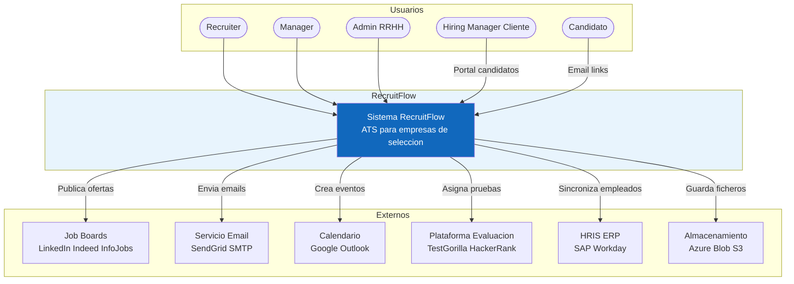

---

### 3.2 Nivel 2 — Contenedores

Descomposición de RecruitFlow en contenedores Docker desplegables.

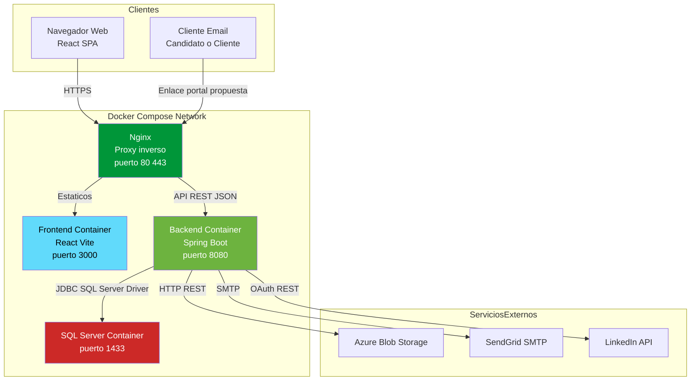

---

### 3.3 Nivel 3 — Componentes del Backend

Componentes internos del contenedor Spring Boot organizados por capas hexagonales.

```mermaid
graph LR
    subgraph API[Adaptadores entrada REST]
        C1[VacantesController]
        C2[CandidatosController]
        C3[ApplicationController]
        C4[MatchingController]
        C5[PropuestaController]
        C6[AuthController]
    end

    subgraph APP[Capa de Aplicacion]
        UC1[GestionVacantesUseCase]
        UC2[GestionCandidatosUseCase]
        UC3[PipelineUseCase]
        UC4[MatchingEngineUseCase]
        UC5[PropuestaClienteUseCase]
        UC6[ComunicacionesUseCase]
    end

    subgraph DOM[Dominio]
        D1[Position Domain]
        D2[Candidate Domain]
        D3[Application Domain]
        D4[Matching Domain]
        D5[Skill Domain]
    end

    subgraph OUT[Adaptadores salida Persistencia]
        R1[PositionRepository JPA]
        R2[CandidateRepository JPA]
        R3[ApplicationRepository JPA]
        R4[SkillRepository JPA]
    end

    subgraph EXT[Adaptadores salida Externos]
        E1[EmailServiceAdapter]
        E2[JobBoardAdapter]
        E3[CalendarAdapter]
        E4[StorageAdapter]
    end

    subgraph AOP[Aspectos transversales]
        A1[LoggingAspect]
        A2[AuditAspect]
        A3[SecurityAspect]
        A4[PerformanceAspect]
    end

    API --> APP
    APP --> DOM
    DOM --> OUT
    DOM --> EXT
    AOP -.->|intercepta| API
    AOP -.->|intercepta| APP
```

---

### 3.4 Nivel 3 — Componentes del Frontend

Componentes internos del contenedor React organizados por capas hexagonales.

```mermaid
graph LR
    subgraph UI[Adaptadores entrada Componentes React]
        P1[VacantesPage]
        P2[CandidatosPage]
        P3[PipelinePage]
        P4[DashboardPage]
        P5[PropuestaPortalPage]
    end

    subgraph APPF[Capa Aplicacion Hooks y Estado]
        H1[useVacantes]
        H2[useCandidatos]
        H3[usePipeline]
        H4[useMatching]
        H5[useAuth]
        ST[Zustand Store]
    end

    subgraph DOMF[Dominio Tipos y Reglas]
        T1[Position Types]
        T2[Candidate Types]
        T3[Application Types]
        T4[Matching Types]
        T5[Validators]
    end

    subgraph APIC[Adaptadores salida API Clients]
        AC1[VacantesApiClient]
        AC2[CandidatosApiClient]
        AC3[PipelineApiClient]
        AC4[AuthApiClient]
    end

    UI --> APPF
    APPF --> DOMF
    APPF --> APIC
    APIC -->|Axios HTTP| BE[(Backend API)]
```

---

### 3.5 Nivel 4 — Código: Arquitectura hexagonal de un módulo

Detalle de implementación del módulo Candidatos como ejemplo canónico.

```mermaid
graph TB
    subgraph InboundAdapters[Adaptadores Entrada]
        REST[CandidateController\nREST @RestController]
        EVT[CVParserEventListener\n@EventListener]
    end

    subgraph InputPorts[Puertos Entrada]
        IP1[RegisterCandidateUseCase\ninterface]
        IP2[SearchCandidatesUseCase\ninterface]
        IP3[UpdateSkillsUseCase\ninterface]
    end

    subgraph ApplicationServices[Servicios de Aplicacion]
        AS1[CandidateApplicationService\nimplements UseCases]
    end

    subgraph Domain[Dominio]
        E1[Candidate\nAggregate Root]
        E2[CandidateSkill\nValue Object]
        E3[CandidateId\nValue Object]
        DS[CandidateMatchingService\nDomain Service]
        DE[CandidateRegisteredEvent\nDomain Event]
    end

    subgraph OutputPorts[Puertos Salida]
        OP1[CandidateRepository\ninterface]
        OP2[SkillCatalogPort\ninterface]
        OP3[CVParserPort\ninterface]
        OP4[NotificationPort\ninterface]
    end

    subgraph OutboundAdapters[Adaptadores Salida]
        JPA[CandidateJpaRepository\n@Repository]
        CVP[CVParserServiceAdapter\nIntegracion externa]
        NTF[EmailNotificationAdapter\nSendGrid]
        STO[BlobStorageAdapter\nAzure]
    end

    REST --> IP1
    REST --> IP2
    EVT --> IP3
    IP1 --> AS1
    IP2 --> AS1
    IP3 --> AS1
    AS1 --> E1
    AS1 --> DS
    E1 --> DE
    AS1 --> OP1
    AS1 --> OP2
    AS1 --> OP3
    AS1 --> OP4
    OP1 --> JPA
    OP3 --> CVP
    OP4 --> NTF
    STO --> AS1
```

---

## 4. Arquitectura hexagonal — Backend

### 4.1 Estructura de capas

La arquitectura hexagonal (Ports & Adapters) garantiza que el dominio no depende de ningún framework o tecnología externa.

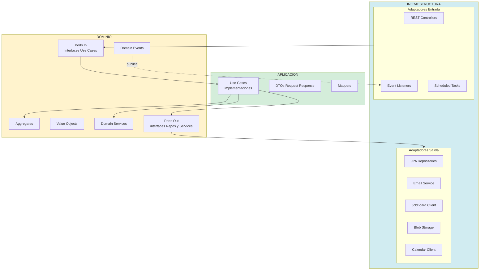

### 4.2 Reglas de dependencia

```
INFRAESTRUCTURA → APLICACION → DOMINIO
                ↑                    |
                |____________________|
                (el dominio no conoce infraestructura)
```

- **Dominio**: cero dependencias externas. Solo Java puro.
- **Aplicación**: depende del dominio. Nunca de infraestructura.
- **Infraestructura**: depende de aplicación y dominio. Implementa los puertos.

### 4.3 Aspectos AOP

Los aspectos interceptan las capas de forma transversal sin modificar el código de negocio.

```mermaid
graph LR
    subgraph Aspectos
        LA[LoggingAspect\n@Around @Service]
        AA[AuditAspect\n@AfterReturning acciones criticas]
        SA[SecurityAspect\n@Before verificar permisos]
        PA[PerformanceAspect\n@Around medir tiempo]
        TA[TransactionAspect\n@Transactional]
    end

    subgraph Capas
        CT[Controllers]
        UC[Use Cases]
        RP[Repositories]
    end

    LA -.->|logging entrada salida| CT
    LA -.->|logging metodos| UC
    AA -.->|audit trail| UC
    SA -.->|check JWT roles| CT
    PA -.->|metricas latencia| UC
    PA -.->|metricas query| RP
    TA -.->|transacciones| UC
```

| Aspecto | Pointcut | Acción |
|---|---|---|
| `LoggingAspect` | `@Around execution(* ..service..*(..))`  | Log de entrada/salida con parámetros |
| `AuditAspect` | `@AfterReturning` en métodos `@Auditable` | Escribe en `AuditLog` con before/after |
| `SecurityAspect` | `@Before` en `@RequiresPermission` | Valida JWT y roles antes de ejecutar |
| `PerformanceAspect` | `@Around` en `@MonitorPerformance` | Mide tiempo y alerta si supera umbral |
| `TransactionAspect` | `@Transactional` en Use Cases | Gestión declarativa de transacciones |

### 4.4 Estructura de paquetes del proyecto

```
com.recruitflow
├── shared/                          # Compartido entre módulos
│   ├── domain/
│   │   ├── AggregateRoot.java
│   │   ├── DomainEvent.java
│   │   └── ValueObject.java
│   ├── infrastructure/
│   │   ├── aop/
│   │   │   ├── LoggingAspect.java
│   │   │   ├── AuditAspect.java
│   │   │   ├── SecurityAspect.java
│   │   │   └── PerformanceAspect.java
│   │   ├── config/
│   │   │   ├── SecurityConfig.java
│   │   │   ├── JpaConfig.java
│   │   │   └── OpenApiConfig.java
│   │   └── exception/
│   │       └── GlobalExceptionHandler.java
│   └── application/
│       └── dto/
│           ├── ApiResponse.java
│           └── PageResponse.java
│
├── vacantes/                        # Módulo Vacantes
│   ├── domain/
│   │   ├── model/
│   │   │   ├── Position.java        # Aggregate Root
│   │   │   ├── PositionId.java      # Value Object
│   │   │   └── PositionSkill.java   # Value Object
│   │   ├── service/
│   │   │   └── PositionDomainService.java
│   │   ├── event/
│   │   │   └── PositionCreatedEvent.java
│   │   └── port/
│   │       ├── in/
│   │       │   ├── CreatePositionUseCase.java
│   │       │   ├── UpdatePositionUseCase.java
│   │       │   └── PublishPositionUseCase.java
│   │       └── out/
│   │           ├── PositionRepository.java
│   │           └── JobBoardPort.java
│   ├── application/
│   │   ├── PositionApplicationService.java
│   │   ├── dto/
│   │   │   ├── CreatePositionRequest.java
│   │   │   └── PositionResponse.java
│   │   └── mapper/
│   │       └── PositionMapper.java
│   └── infrastructure/
│       ├── adapter/
│       │   ├── in/
│       │   │   └── web/
│       │   │       └── PositionController.java
│       │   └── out/
│       │       ├── persistence/
│       │       │   ├── PositionJpaRepository.java
│       │       │   └── PositionJpaEntity.java
│       │       └── jobboard/
│       │           └── LinkedInJobBoardAdapter.java
│       └── config/
│           └── VacantesModuleConfig.java
│
├── candidatos/                      # Módulo Candidatos (mismo patrón)
├── matching/                        # Módulo Motor de Matching
├── pipeline/                        # Módulo Pipeline / Candidaturas
├── entrevistas/                     # Módulo Entrevistas
├── pruebas/                         # Módulo Evaluaciones
├── propuestas/                      # Módulo Propuesta al Cliente
├── comunicaciones/                  # Módulo Comunicaciones
├── reporting/                       # Módulo Reporting
└── administracion/                  # Módulo Administración
```

---

## 5. Arquitectura hexagonal — Frontend

### 5.1 Principios aplicados al frontend

La arquitectura hexagonal en React separa:
- **Dominio**: tipos TypeScript, reglas de negocio puras, sin dependencias de React
- **Aplicación**: hooks de caso de uso, estado global con Zustand
- **Infraestructura**: componentes React (entrada), clientes API Axios (salida)

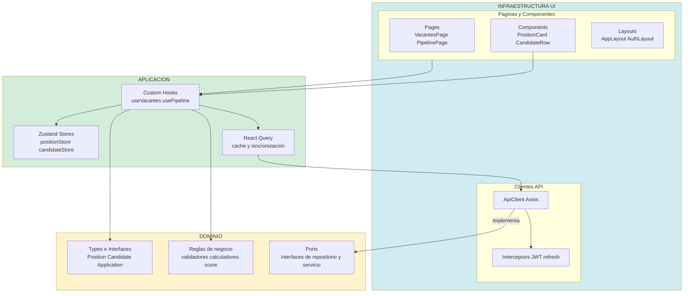

### 5.2 Estructura de directorios del proyecto React

```
src/
├── shared/                          # Compartido entre módulos
│   ├── domain/
│   │   ├── types/
│   │   │   ├── api.types.ts         # ApiResponse, PageResponse
│   │   │   └── auth.types.ts
│   │   └── utils/
│   │       ├── date.utils.ts
│   │       └── format.utils.ts
│   ├── application/
│   │   ├── useAuth.ts
│   │   └── useNotification.ts
│   └── infrastructure/
│       ├── api/
│       │   ├── axiosInstance.ts     # Config base + interceptores JWT
│       │   └── apiClient.ts
│       ├── components/
│       │   ├── AppLayout.tsx
│       │   ├── Sidebar.tsx
│       │   └── ui/                  # shadcn/ui components
│       └── router/
│           └── AppRouter.tsx
│
├── vacantes/                        # Módulo Vacantes
│   ├── domain/
│   │   ├── position.types.ts        # Position, PositionSkill, PositionStatus
│   │   ├── position.validators.ts   # Zod schemas
│   │   └── position.ports.ts        # IPositionRepository interface
│   ├── application/
│   │   ├── useVacantes.ts           # Hook: CRUD vacantes
│   │   ├── usePublicarVacante.ts    # Hook: publicación multi-canal
│   │   └── positionStore.ts         # Zustand slice
│   └── infrastructure/
│       ├── api/
│       │   └── vacantesApiClient.ts # Axios calls → implements port
│       ├── components/
│       │   ├── PositionForm.tsx
│       │   ├── PositionCard.tsx
│       │   └── SkillSelector.tsx
│       └── pages/
│           ├── VacantesListPage.tsx
│           └── VacanteDetailPage.tsx
│
├── candidatos/                      # Módulo Candidatos
├── matching/                        # Módulo Matching
├── pipeline/                        # Módulo Pipeline
├── entrevistas/                     # Módulo Entrevistas
├── propuestas/                      # Módulo Propuesta Cliente
├── comunicaciones/                  # Módulo Comunicaciones
├── reporting/                       # Módulo Reporting
└── administracion/                  # Módulo Admin
```

---

## 6. Estructura de módulos

### 6.1 Mapa de módulos y responsabilidades

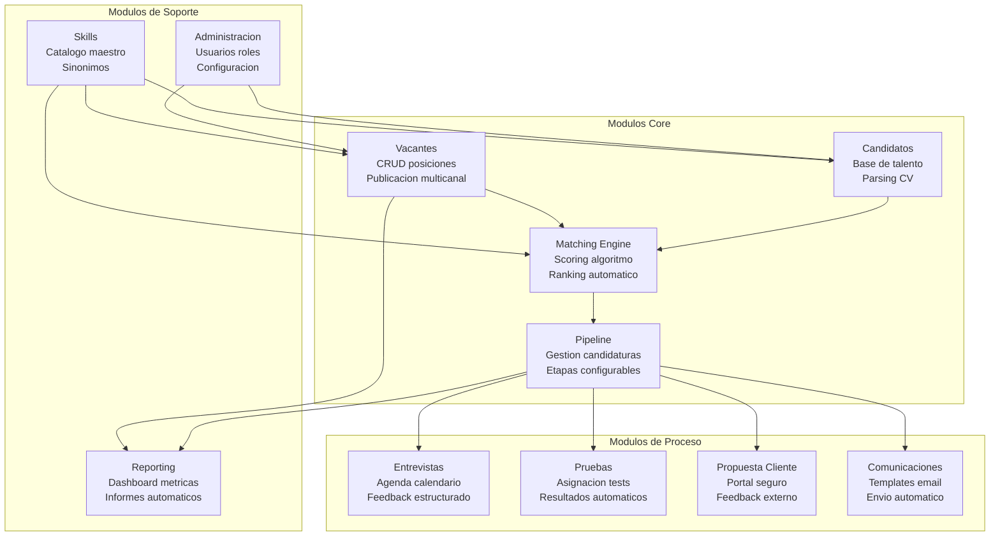

### 6.2 Contratos de API REST por módulo

| Módulo | Prefijo | Operaciones principales |
|---|---|---|
| Vacantes | `/api/v1/positions` | GET, POST, PUT, DELETE, GET /match, POST /publish |
| Candidatos | `/api/v1/candidates` | GET, POST, PUT, POST /import, GET /{id}/skills |
| Matching | `/api/v1/matching` | GET /rank?positionId=, POST /recalculate |
| Pipeline | `/api/v1/applications` | GET, POST, PUT /stage, GET /history |
| Entrevistas | `/api/v1/interviews` | GET, POST, PUT, POST /feedback |
| Pruebas | `/api/v1/assessments` | GET, POST, GET /{id}/results |
| Propuestas | `/api/v1/proposals` | POST, GET /{token}/public, POST /{token}/feedback |
| Comunicaciones | `/api/v1/communications` | GET /templates, POST /send, GET /log |
| Reporting | `/api/v1/reports` | GET /dashboard, GET /funnel, GET /metrics |
| Administración | `/api/v1/admin` | CRUD users, roles, pipeline-templates, skills |

---

## 7. Diagramas de flujo clave

### 7.1 Flujo de autenticación y autorización (JWT + AOP)

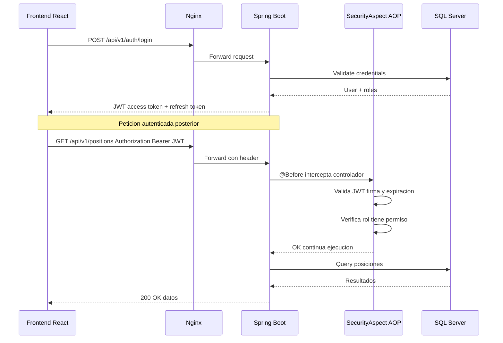

### 7.2 Flujo del motor de matching (core del sistema)

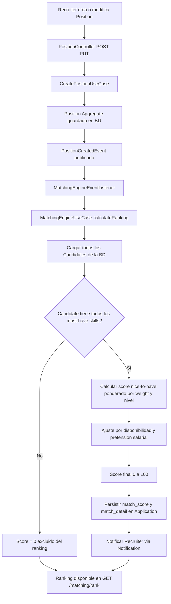

### 7.3 Flujo de propuesta al cliente

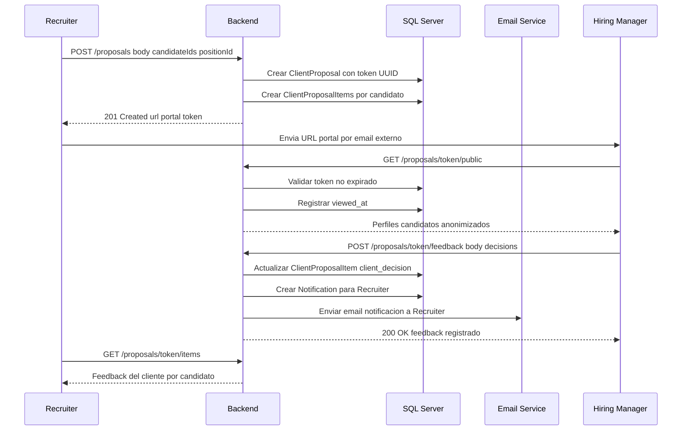

### 7.4 Flujo de parsing de CV y enriquecimiento de perfil

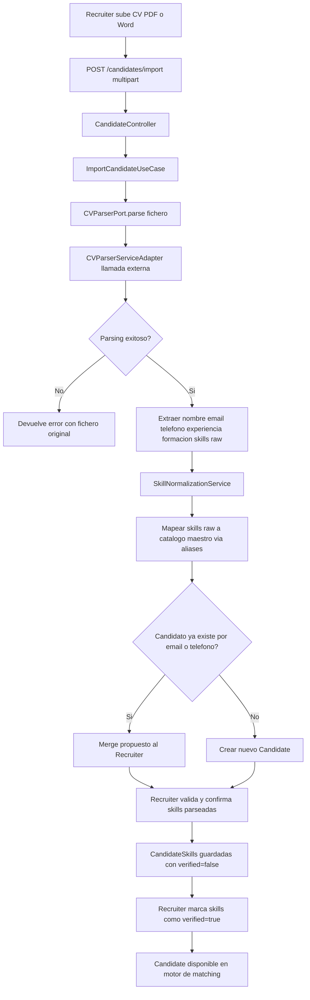

---

## 8. Infraestructura y despliegue Docker

### 8.1 Arquitectura de contenedores

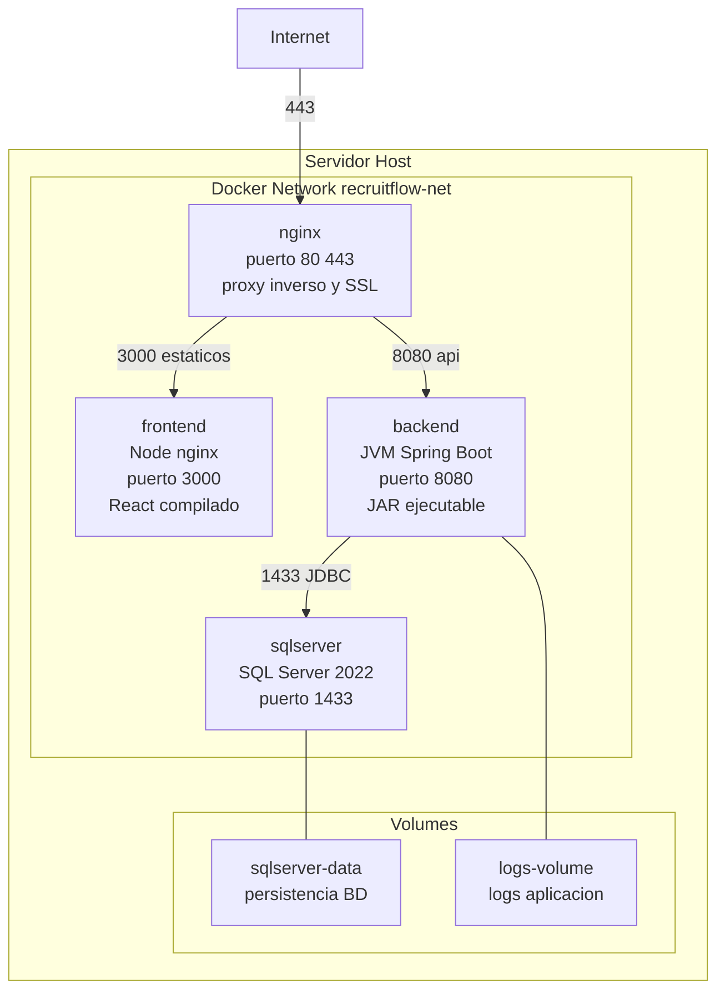

### 8.2 Docker Compose

```yaml
# docker-compose.yml
version: '3.9'

services:

  nginx:
    image: nginx:alpine
    container_name: recruitflow-nginx
    ports:
      - "80:80"
      - "443:443"
    volumes:
      - ./nginx/nginx.conf:/etc/nginx/nginx.conf:ro
      - ./nginx/certs:/etc/nginx/certs:ro
    depends_on:
      - frontend
      - backend
    networks:
      - recruitflow-net

  frontend:
    build:
      context: ./frontend
      dockerfile: Dockerfile
    container_name: recruitflow-frontend
    environment:
      - VITE_API_BASE_URL=http://backend:8080/api/v1
    depends_on:
      - backend
    networks:
      - recruitflow-net

  backend:
    build:
      context: ./backend
      dockerfile: Dockerfile
    container_name: recruitflow-backend
    environment:
      - SPRING_DATASOURCE_URL=jdbc:sqlserver://sqlserver:1433;databaseName=recruitflow
      - SPRING_DATASOURCE_USERNAME=${DB_USER}
      - SPRING_DATASOURCE_PASSWORD=${DB_PASSWORD}
      - JWT_SECRET=${JWT_SECRET}
      - SENDGRID_API_KEY=${SENDGRID_API_KEY}
    depends_on:
      sqlserver:
        condition: service_healthy
    volumes:
      - logs-volume:/app/logs
    networks:
      - recruitflow-net

  sqlserver:
    image: mcr.microsoft.com/mssql/server:2022-latest
    container_name: recruitflow-sqlserver
    environment:
      - ACCEPT_EULA=Y
      - SA_PASSWORD=${DB_PASSWORD}
      - MSSQL_PID=Express
    volumes:
      - sqlserver-data:/var/opt/mssql
      - ./db/init:/docker-entrypoint-initdb.d:ro
    healthcheck:
      test: /opt/mssql-tools/bin/sqlcmd -S localhost -U sa -P ${DB_PASSWORD} -Q "SELECT 1"
      interval: 10s
      timeout: 5s
      retries: 5
    networks:
      - recruitflow-net

networks:
  recruitflow-net:
    driver: bridge

volumes:
  sqlserver-data:
  logs-volume:
```

### 8.3 Dockerfile — Backend Spring Boot

```dockerfile
# backend/Dockerfile
FROM eclipse-temurin:21-jdk-alpine AS builder
WORKDIR /app
COPY pom.xml .
COPY src ./src
RUN mvn clean package -DskipTests

FROM eclipse-temurin:21-jre-alpine
WORKDIR /app
RUN addgroup -S recruitflow && adduser -S recruitflow -G recruitflow
COPY --from=builder /app/target/*.jar app.jar
USER recruitflow
EXPOSE 8080
ENTRYPOINT ["java", "-jar", "app.jar"]
```

### 8.4 Dockerfile — Frontend React

```dockerfile
# frontend/Dockerfile
FROM node:20-alpine AS builder
WORKDIR /app
COPY package*.json .
RUN npm ci
COPY . .
RUN npm run build

FROM nginx:alpine
COPY --from=builder /app/dist /usr/share/nginx/html
COPY nginx/default.conf /etc/nginx/conf.d/default.conf
EXPOSE 3000
```

### 8.5 Pipeline CI/CD

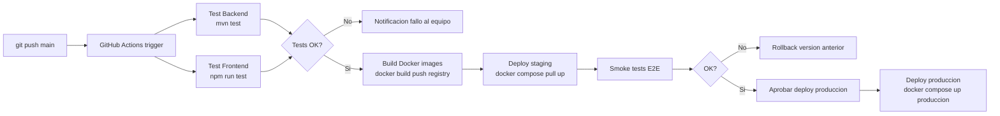

---

## 9. Decisiones de arquitectura (ADR)

### ADR-001 — Arquitectura Hexagonal sobre Layered Architecture

| Campo | Detalle |
|---|---|
| **Estado** | Aprobado |
| **Contexto** | El sistema tiene múltiples integraciones externas (job boards, email, calendarios, evaluaciones) que pueden cambiar con el tiempo |
| **Decisión** | Usar arquitectura hexagonal (Ports & Adapters) en lugar de arquitectura en capas tradicional |
| **Consecuencias positivas** | El dominio es independiente de frameworks; los adaptadores se pueden sustituir sin tocar el dominio; facilita el testing con mocks de puertos |
| **Consecuencias negativas** | Mayor complejidad inicial; más archivos e interfaces; curva de aprendizaje para el equipo |

### ADR-002 — Spring AOP para cross-cutting concerns

| Campo | Detalle |
|---|---|
| **Estado** | Aprobado |
| **Contexto** | Logging, auditoría GDPR y métricas de rendimiento deben aplicarse a múltiples módulos sin contaminar el código de negocio |
| **Decisión** | Implementar logging, auditoría, seguridad y métricas como aspectos Spring AOP con anotaciones personalizadas |
| **Consecuencias positivas** | El código de dominio queda limpio; los aspectos se activan/desactivan sin cambios en el dominio |
| **Consecuencias negativas** | Comportamiento no evidente al leer el código; debugging más complejo; proxy-based AOP no intercepta llamadas internas |

### ADR-003 — SQL Server como base de datos principal

| Campo | Detalle |
|---|---|
| **Estado** | Aprobado |
| **Contexto** | Necesitamos ACID, joins complejos para matching, full-text search para búsqueda de candidatos y JSON support para match_detail |
| **Decisión** | SQL Server 2022 como base de datos principal |
| **Consecuencias positivas** | JSON support nativo para match_detail; Full-Text Search para búsqueda; compatibilidad con entorno corporativo cliente |
| **Consecuencias negativas** | Licencia de coste; mayor consumo de recursos que alternativas open-source |

### ADR-004 — Modularización por capacidad de negocio

| Campo | Detalle |
|---|---|
| **Estado** | Aprobado |
| **Contexto** | El sistema tiene 9 módulos funcionales claramente diferenciados; necesitamos que puedan evolucionar de forma independiente |
| **Decisión** | Cada módulo de negocio contiene sus propias capas hexagonales completas (domain, application, infrastructure) |
| **Consecuencias positivas** | Alta cohesión dentro del módulo; bajo acoplamiento entre módulos; facilita migración futura a microservicios si fuese necesario |
| **Consecuencias negativas** | Duplicación de algún boilerplate entre módulos; gestión de transacciones entre módulos requiere cuidado |

### ADR-005 — Zustand sobre Redux para estado frontend

| Campo | Detalle |
|---|---|
| **Estado** | Aprobado |
| **Contexto** | El frontend necesita gestión de estado global para candidatos en pipeline, posiciones activas y notificaciones |
| **Decisión** | Zustand como gestor de estado global; React Query para estado del servidor (caché de llamadas API) |
| **Consecuencias positivas** | API minimalista; menos boilerplate que Redux; React Query optimiza automáticamente la caché y refetch |
| **Consecuencias negativas** | Menor ecosistema que Redux; DevTools menos maduras |

### ADR-006 — Comunicación Front-Back exclusivamente via API REST

| Campo | Detalle |
|---|---|
| **Estado** | Aprobado |
| **Contexto** | El frontend y backend deben poder desarrollarse y desplegarse de forma independiente |
| **Decisión** | El frontend solo se comunica con el backend a través de la API REST documentada con OpenAPI. No hay SSR ni BFF. Para notificaciones en tiempo real se usará polling en v1 y WebSocket en v2. |
| **Consecuencias positivas** | Desacoplamiento total; API reutilizable para futuros clientes mobile o integraciones |
| **Consecuencias negativas** | Latencia de polling para notificaciones en v1; CORS debe configurarse correctamente |

---

## 10. Contratos de API REST por módulo

### 10.1 Convenciones generales

**Base URL**: `https://api.recruitflow.io/api/v1`

**Autenticación**: Todos los endpoints (excepto `/auth/**`) requieren:
```
Authorization: Bearer <access_token>
```

**Multi-tenancy**: El `company_id` se extrae del JWT. No se incluye en path ni body.

**Paginación** — query params estándar en todos los listados:

| Param | Tipo | Default | Descripción |
|---|---|---|---|
| page | int | 0 | Página (0-based) |
| size | int | 20 | Elementos por página (máx. 100) |
| sort | string | createdAt,desc | campo,asc\|desc |

**Envelope de respuesta paginada**:
```json
{
  "content": [...],
  "page": 0,
  "size": 20,
  "totalElements": 150,
  "totalPages": 8
}
```

**Formato de error estándar**:
```json
{
  "code": "VALIDATION_ERROR",
  "message": "Los datos enviados no son válidos",
  "details": ["El campo 'title' es obligatorio"],
  "timestamp": "2026-04-04T10:00:00Z"
}
```

**Códigos HTTP**:

| Código | Uso |
|---|---|
| 200 | OK — operación exitosa con respuesta |
| 201 | Created — recurso creado |
| 204 | No Content — operación exitosa sin cuerpo |
| 400 | Bad Request — error de validación de campos |
| 401 | Unauthorized — token ausente o inválido |
| 403 | Forbidden — sin permisos para la operación |
| 404 | Not Found — recurso no encontrado |
| 409 | Conflict — estado incompatible con la operación |
| 422 | Unprocessable Entity — regla de negocio violada |
| 500 | Internal Server Error — error no controlado |

---

### 10.2 Módulo Vacantes — `/positions`

#### `GET /positions` — Listar vacantes

**Query params adicionales**:

| Param | Tipo | Descripción |
|---|---|---|
| status | string | DRAFT \| OPEN \| ON_HOLD \| CLOSED |
| clientId | UUID | Filtrar por cliente |
| search | string | Full-text en título y descripción |

**Response 200**:
```json
{
  "content": [
    {
      "id": "3fa85f64-5717-4562-b3fc-2c963f66afa6",
      "title": "Senior Java Developer",
      "clientId": "uuid",
      "clientName": "Empresa ABC",
      "status": "OPEN",
      "openings": 3,
      "applicationsCount": 12,
      "matchAvg": 0.74,
      "createdAt": "2026-04-01T09:00:00Z",
      "closingDate": "2026-05-01"
    }
  ],
  "page": 0,
  "size": 20,
  "totalElements": 45,
  "totalPages": 3
}
```

---

#### `POST /positions` — Crear vacante

**Request body**:
```json
{
  "title": "Senior Java Developer",
  "clientId": "uuid",
  "description": "Descripción detallada del puesto",
  "requirements": "Requisitos técnicos y de experiencia",
  "location": "Madrid",
  "modality": "HYBRID",
  "salaryMin": 45000,
  "salaryMax": 60000,
  "currency": "EUR",
  "openings": 3,
  "closingDate": "2026-05-01",
  "requiredSkills": [
    { "skillId": "uuid", "level": "ADVANCED", "required": true }
  ]
}
```

**Validaciones**:

| Campo | Regla |
|---|---|
| title | Requerido · 3–200 caracteres |
| clientId | Requerido · debe existir y pertenecer a la empresa |
| description | Requerido · máximo 5000 caracteres |
| modality | Enum: ONSITE \| REMOTE \| HYBRID |
| salaryMin | Opcional · > 0 · ≤ salaryMax |
| salaryMax | Opcional · > 0 · ≥ salaryMin |
| openings | Requerido · 1–999 |
| closingDate | Opcional · fecha futura |
| requiredSkills[].level | Enum: BASIC \| INTERMEDIATE \| ADVANCED \| EXPERT |

**Response 201**:
```json
{
  "id": "uuid",
  "title": "Senior Java Developer",
  "status": "DRAFT",
  "createdAt": "2026-04-04T10:00:00Z"
}
```

---

#### `GET /positions/{id}` — Detalle de vacante

**Response 200**:
```json
{
  "id": "uuid",
  "title": "Senior Java Developer",
  "client": { "id": "uuid", "name": "Empresa ABC" },
  "description": "...",
  "requirements": "...",
  "location": "Madrid",
  "modality": "HYBRID",
  "salary": { "min": 45000, "max": 60000, "currency": "EUR" },
  "openings": 3,
  "status": "OPEN",
  "closingDate": "2026-05-01",
  "requiredSkills": [
    { "skillId": "uuid", "skillName": "Java", "level": "ADVANCED", "required": true }
  ],
  "applicationsCount": 12,
  "createdAt": "2026-04-01T09:00:00Z",
  "updatedAt": "2026-04-03T15:00:00Z"
}
```

**Errores**: 404 si no existe o no pertenece a la empresa.

---

#### `PATCH /positions/{id}` — Actualizar vacante

**Request body** (todos los campos opcionales):
```json
{
  "title": "Senior Java Developer",
  "description": "...",
  "status": "OPEN",
  "closingDate": "2026-06-01",
  "openings": 5
}
```

**Errores**: 409 si la vacante está en estado CLOSED.

---

#### `DELETE /positions/{id}` — Cerrar vacante

Cierra la vacante (soft delete: cambia status a CLOSED).

**Response**: 204

**Errores**: 409 si ya está CLOSED.

---

#### `POST /positions/{id}/publish` — Publicar en portales

**Request body**:
```json
{
  "jobBoardIds": ["uuid1", "uuid2"],
  "expiresAt": "2026-05-01"
}
```

**Validaciones**: jobBoardIds no vacío · expiresAt fecha futura · vacante en estado OPEN.

**Response 200**:
```json
{
  "published": [
    {
      "jobBoardId": "uuid",
      "jobBoardName": "InfoJobs",
      "externalUrl": "https://infojobs.net/job/xxx",
      "expiresAt": "2026-05-01"
    }
  ],
  "failed": []
}
```

---

### 10.3 Módulo Candidatos — `/candidates`

#### `GET /candidates` — Listar candidatos (talent pool)

**Query params adicionales**:

| Param | Tipo | Descripción |
|---|---|---|
| search | string | Full-text en nombre, email y skills |
| status | string | ACTIVE \| INACTIVE \| BLACKLISTED |
| skillIds | UUID[] | Candidatos que dominan estas skills (AND) |
| availableFrom | date | Disponibilidad a partir de (ISO 8601) |
| positionId | UUID | Si se indica, incluye matchScore para esa vacante |

**Response 200**:
```json
{
  "content": [
    {
      "id": "uuid",
      "fullName": "Ana García",
      "email": "ana.garcia@email.com",
      "location": "Barcelona",
      "status": "ACTIVE",
      "topSkills": ["Java", "Spring Boot", "Docker"],
      "availableFrom": "2026-05-01",
      "matchScore": 0.87,
      "lastActivity": "2026-04-02T11:00:00Z"
    }
  ],
  "page": 0,
  "size": 20,
  "totalElements": 312,
  "totalPages": 16
}
```

---

#### `POST /candidates` — Registrar candidato

**Request body**:
```json
{
  "firstName": "Ana",
  "lastName": "García",
  "email": "ana.garcia@email.com",
  "phone": "+34600000000",
  "location": "Barcelona",
  "linkedinUrl": "https://linkedin.com/in/anagarcia",
  "availableFrom": "2026-05-01",
  "salaryExpectation": 45000,
  "currency": "EUR",
  "sourceId": "uuid",
  "skills": [
    { "skillId": "uuid", "level": "ADVANCED", "yearsExperience": 5 }
  ]
}
```

**Validaciones**:

| Campo | Regla |
|---|---|
| firstName | Requerido · 1–100 caracteres |
| lastName | Requerido · 1–100 caracteres |
| email | Requerido · formato email · único por empresa |
| phone | Opcional · formato E.164 |
| linkedinUrl | Opcional · URL válida · dominio linkedin.com |
| salaryExpectation | Opcional · > 0 |
| skills[].level | Enum: BASIC \| INTERMEDIATE \| ADVANCED \| EXPERT |
| skills[].yearsExperience | Opcional · 0–50 |

**Response 201**:
```json
{
  "id": "uuid",
  "fullName": "Ana García",
  "email": "ana.garcia@email.com",
  "createdAt": "2026-04-04T10:00:00Z"
}
```

**Errores**: 409 si el email ya existe para la empresa.

---

#### `GET /candidates/{id}` — Detalle de candidato

**Response 200**:
```json
{
  "id": "uuid",
  "firstName": "Ana",
  "lastName": "García",
  "email": "ana.garcia@email.com",
  "phone": "+34600000000",
  "location": "Barcelona",
  "status": "ACTIVE",
  "availableFrom": "2026-05-01",
  "salary": { "expectation": 45000, "currency": "EUR" },
  "skills": [
    { "skillId": "uuid", "skillName": "Java", "level": "ADVANCED", "yearsExperience": 5 }
  ],
  "experience": [
    { "id": "uuid", "company": "Tech SL", "role": "Backend Developer", "from": "2021-01", "to": "2024-12", "description": "..." }
  ],
  "education": [
    { "id": "uuid", "institution": "UPM", "degree": "Ingeniería Informática", "from": "2016", "to": "2020" }
  ],
  "documents": [
    { "id": "uuid", "type": "CV", "fileName": "cv_ana_garcia.pdf", "uploadedAt": "2026-04-01T09:00:00Z" }
  ],
  "tags": ["java-senior", "disponible"],
  "applications": [
    { "id": "uuid", "positionTitle": "Senior Java Dev", "stage": "INTERVIEW", "matchScore": 0.87 }
  ],
  "gdpr": {
    "consentDate": "2026-04-01",
    "dataRetentionExpiry": "2027-04-01"
  },
  "createdAt": "2026-04-01T09:00:00Z",
  "updatedAt": "2026-04-03T14:00:00Z"
}
```

---

#### `PATCH /candidates/{id}` — Actualizar candidato

**Request body** (todos los campos opcionales — PATCH parcial):
```json
{
  "phone": "+34611111111",
  "location": "Madrid",
  "availableFrom": "2026-06-01",
  "salaryExpectation": 50000,
  "status": "INACTIVE"
}
```

**Response 200**: Candidato completo actualizado.

---

#### `POST /candidates/{id}/documents` — Subir documento

**Request**: `multipart/form-data`

| Campo | Tipo | Descripción |
|---|---|---|
| file | binary | Archivo a subir |
| type | string | CV \| COVER_LETTER \| CERTIFICATE \| OTHER |

**Validaciones**: Tamaño máximo 10 MB · Formatos permitidos: PDF, DOCX, DOC.

**Response 201**:
```json
{
  "id": "uuid",
  "type": "CV",
  "fileName": "cv_ana_garcia.pdf",
  "fileSize": 245678,
  "mimeType": "application/pdf",
  "uploadedAt": "2026-04-04T10:00:00Z"
}
```

---

#### `POST /candidates/parse-cv` — Parsear CV

**Request**: `multipart/form-data` con campo `file` (PDF o DOCX).

**Response 200**:
```json
{
  "suggestedData": {
    "firstName": "Ana",
    "lastName": "García",
    "email": "ana@email.com",
    "phone": "+34600000000",
    "skills": [
      { "name": "Java", "yearsExperience": 5 },
      { "name": "Spring Boot", "yearsExperience": 4 }
    ],
    "experience": [
      { "company": "Tech SL", "role": "Backend Developer", "from": "2021-01", "to": "2024-12" }
    ],
    "education": [
      { "institution": "UPM", "degree": "Ingeniería Informática", "from": "2016", "to": "2020" }
    ]
  },
  "confidence": 0.91,
  "warnings": []
}
```

---

### 10.4 Módulo Matching — `/matching`

#### `POST /matching/position/{positionId}/run` — Ejecutar matching

Evalúa todos los candidatos del pool contra una vacante y retorna los mejores.

**Request body**:
```json
{
  "limit": 50,
  "minScore": 0.5,
  "filters": {
    "location": "Madrid",
    "availableFrom": "2026-05-01",
    "maxSalary": 60000
  }
}
```

**Validaciones**: `limit` 1–200 · `minScore` 0.0–1.0.

**Response 200**:
```json
{
  "positionId": "uuid",
  "executedAt": "2026-04-04T10:00:00Z",
  "totalEvaluated": 1250,
  "executionMs": 340,
  "results": [
    {
      "candidateId": "uuid",
      "candidateName": "Ana García",
      "candidateEmail": "ana@email.com",
      "matchScore": 0.87,
      "matchDetail": {
        "skillsScore": 0.90,
        "experienceScore": 0.85,
        "locationScore": 1.0,
        "salaryScore": 0.80
      },
      "missingSkills": [
        { "skillName": "Kubernetes", "level": "INTERMEDIATE", "required": false }
      ]
    }
  ]
}
```

---

#### `GET /matching/candidate/{candidateId}/positions` — Posiciones para candidato

**Query params**: `limit` (default 10) · `minScore` (default 0.5).

**Response 200**:
```json
{
  "candidateId": "uuid",
  "results": [
    {
      "positionId": "uuid",
      "positionTitle": "Senior Java Developer",
      "clientName": "Empresa ABC",
      "matchScore": 0.87,
      "status": "OPEN"
    }
  ]
}
```

---

#### `GET /matching/application/{applicationId}/score` — Score de candidatura

**Response 200**:
```json
{
  "applicationId": "uuid",
  "matchScore": 0.87,
  "matchDetail": {
    "skillsScore": 0.90,
    "experienceScore": 0.85,
    "locationScore": 1.0,
    "salaryScore": 0.80
  },
  "missingSkills": [
    { "skillId": "uuid", "skillName": "Kubernetes", "level": "INTERMEDIATE", "required": false }
  ],
  "calculatedAt": "2026-04-04T10:00:00Z"
}
```

---

### 10.5 Módulo Pipeline — `/applications`

#### `POST /applications` — Crear candidatura

**Request body**:
```json
{
  "candidateId": "uuid",
  "positionId": "uuid",
  "sourceId": "uuid",
  "notes": "Candidato recomendado por el cliente"
}
```

**Validaciones**: No puede existir candidatura activa del mismo candidato en la misma vacante.

**Response 201**:
```json
{
  "id": "uuid",
  "candidateId": "uuid",
  "positionId": "uuid",
  "stage": "APPLIED",
  "matchScore": 0.82,
  "createdAt": "2026-04-04T10:00:00Z"
}
```

**Errores**: 409 si ya existe candidatura activa.

---

#### `GET /applications` — Listar candidaturas

**Query params**:

| Param | Tipo | Descripción |
|---|---|---|
| positionId | UUID | Candidaturas de una vacante |
| candidateId | UUID | Candidaturas de un candidato |
| stage | string | APPLIED \| SCREENING \| INTERVIEW \| OFFER \| HIRED \| DISCARDED |
| recruiterId | UUID | Asignadas a un recruiter |

**Response 200**: Listado paginado estándar con resumen de cada candidatura.

---

#### `GET /applications/{id}` — Detalle de candidatura

**Response 200**:
```json
{
  "id": "uuid",
  "candidate": {
    "id": "uuid",
    "fullName": "Ana García",
    "email": "ana.garcia@email.com",
    "topSkills": ["Java", "Spring Boot"]
  },
  "position": { "id": "uuid", "title": "Senior Java Developer", "clientName": "Empresa ABC" },
  "stage": "INTERVIEW",
  "matchScore": 0.87,
  "stageHistory": [
    { "stage": "APPLIED",   "changedAt": "2026-04-01T09:00:00Z", "changedBy": "laura@rf.io" },
    { "stage": "SCREENING", "changedAt": "2026-04-02T11:00:00Z", "changedBy": "laura@rf.io" },
    { "stage": "INTERVIEW", "changedAt": "2026-04-03T14:00:00Z", "changedBy": "laura@rf.io" }
  ],
  "interviews": [
    { "id": "uuid", "type": "TECHNICAL", "scheduledAt": "2026-04-10T10:00:00Z", "status": "SCHEDULED" }
  ],
  "notes": [
    { "id": "uuid", "body": "Candidato muy motivado", "createdBy": "laura@rf.io", "createdAt": "2026-04-02T11:00:00Z" }
  ],
  "createdAt": "2026-04-01T09:00:00Z"
}
```

---

#### `PATCH /applications/{id}/stage` — Avanzar etapa del pipeline

**Request body**:
```json
{
  "stage": "INTERVIEW",
  "notes": "Pasa a entrevista técnica",
  "discardReasonId": null
}
```

**Validaciones**: Si `stage` es DISCARDED, `discardReasonId` es requerido.

**Transiciones válidas**:
```
APPLIED → SCREENING → INTERVIEW → OFFER → HIRED
       ↘           ↘           ↘       ↘
                              DISCARDED (desde cualquier etapa)
```

**Errores**: 409 si la transición no es válida · 422 si DISCARDED sin motivo.

**Response 200**: Candidatura actualizada.

---

#### `GET /applications/kanban/{positionId}` — Vista Kanban

**Response 200**:
```json
{
  "positionId": "uuid",
  "positionTitle": "Senior Java Developer",
  "stages": {
    "APPLIED":   [{ "id": "uuid", "candidateName": "Ana García",  "matchScore": 0.87 }],
    "SCREENING": [{ "id": "uuid", "candidateName": "Carlos López", "matchScore": 0.74 }],
    "INTERVIEW": [],
    "OFFER":     [],
    "HIRED":     []
  }
}
```

---

#### `POST /applications/{id}/notes` — Añadir nota

**Request body**:
```json
{
  "body": "Candidato muy motivado, buen fit cultural",
  "visibility": "INTERNAL"
}
```

**Validaciones**: `body` requerido · 1–2000 caracteres · `visibility`: INTERNAL \| SHARED_WITH_CLIENT.

**Response 201**: `{ "id": "uuid", "body": "...", "createdBy": "laura@rf.io", "createdAt": "..." }`

---

### 10.6 Módulo Entrevistas — `/interviews`

#### `POST /interviews` — Programar entrevista

**Request body**:
```json
{
  "applicationId": "uuid",
  "type": "TECHNICAL",
  "scheduledAt": "2026-04-10T10:00:00Z",
  "durationMinutes": 60,
  "location": "Google Meet",
  "meetingUrl": "https://meet.google.com/xxx-yyy-zzz",
  "interviewerIds": ["uuid1", "uuid2"],
  "notes": "Preparar ejercicio de algoritmos"
}
```

**Validaciones**:

| Campo | Regla |
|---|---|
| type | Enum: PHONE \| VIDEO \| TECHNICAL \| HR \| CLIENT \| FINAL |
| scheduledAt | Fecha futura · mínimo 1 hora desde ahora |
| durationMinutes | 15–480 |
| interviewerIds | Mínimo 1 · deben ser usuarios activos de la empresa |
| meetingUrl | Opcional · URL válida si se proporciona |

**Response 201**:
```json
{
  "id": "uuid",
  "applicationId": "uuid",
  "type": "TECHNICAL",
  "scheduledAt": "2026-04-10T10:00:00Z",
  "durationMinutes": 60,
  "status": "SCHEDULED",
  "calendarEventId": "google_event_id_si_integrado",
  "meetingUrl": "https://meet.google.com/xxx-yyy-zzz"
}
```

---

#### `GET /interviews/{id}` — Detalle de entrevista

**Response 200**: Entrevista completa con interviewers, candidato, posición y feedback si existe.

---

#### `PATCH /interviews/{id}` — Reagendar entrevista

**Request body**:
```json
{
  "scheduledAt": "2026-04-12T11:00:00Z",
  "durationMinutes": 90,
  "meetingUrl": "https://meet.google.com/new-url",
  "interviewerIds": ["uuid1"]
}
```

**Errores**: 409 si la entrevista ya se realizó o fue cancelada.

---

#### `DELETE /interviews/{id}` — Cancelar entrevista

**Response**: 204

**Errores**: 409 si ya se realizó.

---

#### `POST /interviews/{id}/feedback` — Registrar feedback

**Request body**:
```json
{
  "rating": 4,
  "recommendation": "ADVANCE",
  "technicalScore": 8,
  "softSkillsScore": 7,
  "comments": "Buen conocimiento técnico, mejorar comunicación",
  "privateNotes": "Para uso interno del equipo"
}
```

**Validaciones**:

| Campo | Regla |
|---|---|
| rating | Requerido · 1–5 |
| recommendation | Requerido · Enum: ADVANCE \| HOLD \| DISCARD |
| technicalScore | Opcional · 0–10 |
| softSkillsScore | Opcional · 0–10 |
| comments | Requerido · 10–3000 caracteres |

**Response 200**: Feedback registrado. La entrevista pasa a estado COMPLETED.

---

### 10.7 Módulo Pruebas — `/assessments`

#### `POST /assessments` — Asignar prueba técnica

**Request body**:
```json
{
  "applicationId": "uuid",
  "templateId": "uuid",
  "dueDate": "2026-04-15",
  "instructions": "Instrucciones adicionales para el candidato"
}
```

**Validaciones**: `dueDate` fecha futura · `templateId` debe pertenecer a la empresa.

**Response 201**:
```json
{
  "id": "uuid",
  "applicationId": "uuid",
  "status": "PENDING",
  "dueDate": "2026-04-15",
  "candidateAccessLink": "https://app.recruitflow.io/assessment/token/xxx",
  "createdAt": "2026-04-04T10:00:00Z"
}
```

---

#### `POST /assessments/{id}/submit` — Enviar solución

**Request**: `multipart/form-data`

| Campo | Tipo | Descripción |
|---|---|---|
| file | binary | Archivo con la solución (opcional) |
| repositoryUrl | string | URL del repositorio (opcional) |
| notes | string | Notas del candidato |

**Validaciones**: Al menos `file` o `repositoryUrl` debe proporcionarse.

**Response 200**: `{ "id": "uuid", "status": "SUBMITTED", "submittedAt": "..." }`

---

#### `POST /assessments/{id}/evaluate` — Evaluar prueba

**Request body**:
```json
{
  "score": 85,
  "maxScore": 100,
  "passed": true,
  "evaluatorNotes": "Buena estructura de código, cobertura de tests al 80%",
  "criteria": [
    { "name": "Funcionalidad", "score": 90, "maxScore": 100 },
    { "name": "Calidad de código", "score": 80, "maxScore": 100 },
    { "name": "Tests", "score": 75, "maxScore": 100 }
  ]
}
```

**Response 200**: Prueba actualizada con estado EVALUATED.

---

### 10.8 Módulo Propuestas — `/offers`

#### `POST /offers` — Crear propuesta económica

**Request body**:
```json
{
  "applicationId": "uuid",
  "salary": 55000,
  "currency": "EUR",
  "startDate": "2026-05-15",
  "contractType": "FULL_TIME",
  "benefits": "Seguro médico, ticket restaurante, 23 días de vacaciones",
  "validUntil": "2026-04-20",
  "notes": "Nota interna del recruiter"
}
```

**Validaciones**:

| Campo | Regla |
|---|---|
| salary | Requerido · > 0 |
| currency | Requerido · ISO 4217 (EUR, USD, GBP…) |
| startDate | Requerido · fecha futura |
| contractType | Enum: FULL_TIME \| PART_TIME \| CONTRACTOR \| TEMPORARY |
| validUntil | Requerido · fecha futura · < startDate |

**Response 201**:
```json
{
  "id": "uuid",
  "applicationId": "uuid",
  "status": "DRAFT",
  "salary": 55000,
  "currency": "EUR",
  "startDate": "2026-05-15",
  "contractType": "FULL_TIME",
  "validUntil": "2026-04-20",
  "createdAt": "2026-04-04T10:00:00Z"
}
```

---

#### `POST /offers/{id}/send` — Enviar propuesta al candidato

**Response 200**:
```json
{
  "id": "uuid",
  "status": "SENT",
  "sentAt": "2026-04-04T10:05:00Z",
  "sentToEmail": "ana.garcia@email.com"
}
```

**Errores**: 409 si la propuesta ya fue enviada o expiró.

---

#### `PATCH /offers/{id}/respond` — Registrar respuesta del candidato

**Request body**:
```json
{
  "response": "ACCEPTED",
  "notes": "Acepta con inicio el 20 de mayo"
}
```

**Validaciones**: `response` Enum: ACCEPTED \| REJECTED \| NEGOTIATING.

**Response 200**: Propuesta actualizada. Si ACCEPTED, la candidatura avanza automáticamente a HIRED.

---

### 10.9 Módulo Comunicaciones — `/communications`

#### `POST /communications/email` — Enviar email

**Request body**:
```json
{
  "to": ["candidateId1", "candidateId2"],
  "templateId": "uuid",
  "variables": {
    "interviewDate": "10 de abril",
    "interviewTime": "10:00",
    "meetingUrl": "https://meet.google.com/xxx"
  },
  "applicationId": "uuid"
}
```

**Validaciones**: `to` no vacío · si `templateId` presente, `variables` debe contener todas las variables requeridas por la plantilla · `applicationId` opcional (para trazabilidad).

**Response 200**:
```json
{
  "sent": 2,
  "failed": 0,
  "messageIds": ["msg_id_1", "msg_id_2"]
}
```

---

#### `GET /communications/templates` — Listar plantillas

**Query params**: `category` (string) · `page` · `size`.

**Response 200**: Listado paginado de plantillas con `id`, `name`, `category`, `subject`, `variables[]`.

---

#### `POST /communications/templates` — Crear plantilla

**Request body**:
```json
{
  "name": "Confirmación de entrevista",
  "category": "INTERVIEW",
  "subject": "Tu entrevista con {{companyName}} — {{interviewDate}}",
  "body": "Hola {{candidateName}},\n\nTe confirmamos tu entrevista...",
  "variables": ["candidateName", "companyName", "interviewDate", "interviewTime", "meetingUrl"]
}
```

**Validaciones**: `name` único por empresa · `variables` en el body deben coincidir con los declarados.

**Response 201**: Plantilla creada.

---

### 10.10 Módulo Administración — `/auth`, `/users`, `/skills`, `/clients`

#### `POST /auth/login` — Autenticación

**Request body**:
```json
{
  "email": "recruiter@empresa.com",
  "password": "contraseña"
}
```

**Response 200**:
```json
{
  "accessToken": "eyJhbGciOiJIUzI1NiIsInR5cCI6IkpXVCJ9...",
  "refreshToken": "eyJhbGciOiJIUzI1NiIsInR5cCI6IkpXVCJ9...",
  "expiresIn": 3600,
  "tokenType": "Bearer",
  "user": {
    "id": "uuid",
    "email": "recruiter@empresa.com",
    "fullName": "Laura Martínez",
    "role": "RECRUITER",
    "companyId": "uuid",
    "companyName": "RecruitAgency SL"
  }
}
```

**Errores**: 401 si credenciales incorrectas · 403 si cuenta desactivada.

---

#### `POST /auth/refresh` — Renovar access token

**Request body**: `{ "refreshToken": "eyJ..." }`

**Response 200**: `{ "accessToken": "eyJ...", "expiresIn": 3600 }`

**Errores**: 401 si el refresh token ha expirado o fue revocado.

---

#### `POST /auth/logout` — Cerrar sesión

**Request body**: `{ "refreshToken": "eyJ..." }`

**Response**: 204. Invalida el refresh token en base de datos.

---

#### `GET /users` — Listar usuarios de la empresa

**Response 200**: Listado paginado con `id`, `fullName`, `email`, `role`, `status`, `lastLogin`.

---

#### `POST /users` — Crear usuario y enviar invitación

**Request body**:
```json
{
  "email": "nuevo@empresa.com",
  "firstName": "Nuevo",
  "lastName": "Usuario",
  "role": "RECRUITER"
}
```

**Validaciones**: `email` único en el sistema · `role` Enum: ADMIN \| MANAGER \| RECRUITER \| CLIENT.

**Response 201**: `{ "id": "uuid", "email": "...", "role": "RECRUITER", "invitationSentAt": "..." }`

---

#### `GET /skills` — Catálogo de skills

**Query params**: `search` (string) · `category` (string) · `page` · `size`.

**Response 200**: Listado paginado con `id`, `name`, `category`, `aliases[]`, `usageCount`.

---

#### `POST /skills` — Añadir skill al catálogo

**Request body**:
```json
{
  "name": "Spring Boot",
  "category": "Backend",
  "aliases": ["Spring", "Spring Framework"]
}
```

**Validaciones**: `name` único en la empresa · 2–100 caracteres.

**Response 201**: `{ "id": "uuid", "name": "Spring Boot", "category": "Backend", "aliases": [...] }`

---

#### `GET /clients` — Listar clientes

**Response 200**: Listado paginado con `id`, `name`, `contactName`, `contactEmail`, `activePositions`.

---

#### `POST /clients` — Crear cliente

**Request body**:
```json
{
  "name": "Empresa ABC",
  "industry": "Tecnología",
  "contactName": "Elena Sánchez",
  "contactEmail": "elena@empresaabc.com",
  "contactPhone": "+34911000000",
  "website": "https://empresaabc.com"
}
```

**Validaciones**: `name` requerido · `contactEmail` formato email.

**Response 201**: Cliente creado.

---

## 11. Especificación OpenAPI 3.0

La especificación completa en formato YAML se encuentra en el archivo [`openapi.yaml`](./openapi.yaml) en la misma carpeta `docs/architecture/`.

### Resumen de paths cubiertos

| Módulo | Paths |
|---|---|
| Auth | `/auth/login` · `/auth/refresh` · `/auth/logout` |
| Vacantes | `/positions` · `/positions/{id}` · `/positions/{id}/publish` |
| Candidatos | `/candidates` · `/candidates/{id}` · `/candidates/{id}/documents` · `/candidates/parse-cv` |
| Matching | `/matching/position/{id}/run` · `/matching/candidate/{id}/positions` · `/matching/application/{id}/score` |
| Pipeline | `/applications` · `/applications/{id}` · `/applications/{id}/stage` · `/applications/kanban/{positionId}` · `/applications/{id}/notes` |
| Entrevistas | `/interviews` · `/interviews/{id}` · `/interviews/{id}/feedback` |
| Pruebas | `/assessments` · `/assessments/{id}/submit` · `/assessments/{id}/evaluate` |
| Propuestas | `/offers` · `/offers/{id}/send` · `/offers/{id}/respond` |
| Comunicaciones | `/communications/email` · `/communications/templates` |
| Administración | `/users` · `/skills` · `/clients` |

### Uso del fichero openapi.yaml

```bash
# Visualizar en Swagger UI (con Docker)
docker run -p 8090:8080 -e SWAGGER_JSON=/spec/openapi.yaml \
  -v $(pwd):/spec swaggerapi/swagger-ui

# Generar cliente TypeScript (frontend)
npx @openapitools/openapi-generator-cli generate \
  -i openapi.yaml -g typescript-axios -o src/generated/api

# Generar stubs Spring Boot (backend)
npx @openapitools/openapi-generator-cli generate \
  -i openapi.yaml -g spring -o src/generated/server \
  --additional-properties=useSpringBoot3=true
```

---

*Documento de arquitectura RecruitFlow v1.0 — Sujeto a revisión en cada sprint de arquitectura*
*Próxima revisión: 2026-05-04*
