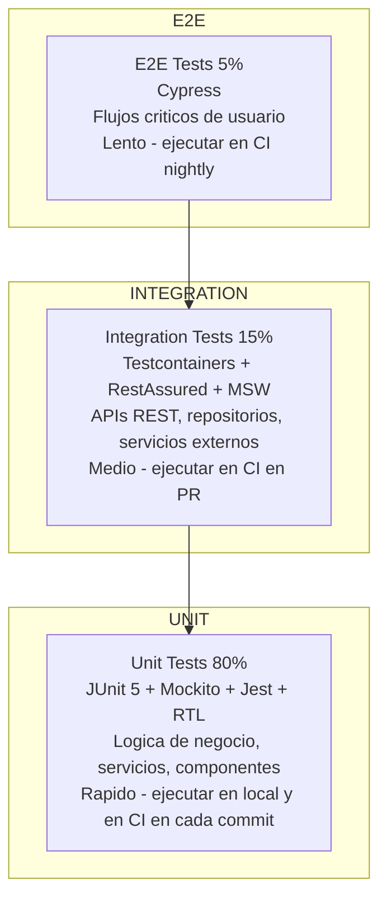
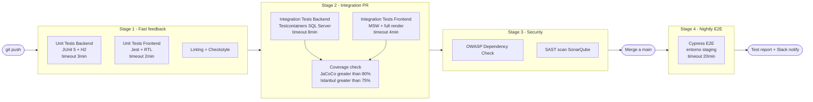

# RecruitFlow — Testing Strategy
**Versión:** 1.0
**Fecha:** 2026-04-04
**Autor:** QA Architect / Senior Tester
**Estado:** Aprobado

---

## Tabla de contenidos

1. [Filosofía y objetivos](#1-filosofía-y-objetivos)
2. [Pirámide de testing](#2-pirámide-de-testing)
3. [Cobertura objetivo](#3-cobertura-objetivo)
4. [Testing Backend — Spring Boot](#4-testing-backend--spring-boot)
5. [Testing Frontend — React + Vite](#5-testing-frontend--react--vite)
6. [Tests E2E — Cypress](#6-tests-e2e--cypress)
7. [Estructura de directorios](#7-estructura-de-directorios)
8. [Convenciones y nomenclatura](#8-convenciones-y-nomenclatura)
9. [Pipeline CI/CD](#9-pipeline-cicd)
10. [Definición de Done (DoD)](#10-definición-de-done-dod)

---

## 1. Filosofía y objetivos

### Principios de testing en RecruitFlow

| Principio | Descripción |
|---|---|
| **Test lo que importa** | Priorizar lógica de negocio, rutas críticas y reglas de seguridad sobre código trivial |
| **Tests como documentación** | Un test bien nombrado describe el comportamiento esperado del sistema |
| **Fail fast** | Los tests unitarios corren en segundos; los de integración en minutos; E2E bajo demanda |
| **Independencia** | Cada test debe poder ejecutarse en cualquier orden y en aislamiento |
| **Determinismo** | Sin dependencias de tiempo real, datos externos ni puertos fijos |
| **Shift left** | Los bugs se detectan lo más cerca posible del momento de escritura del código |

### Qué NO testar

- Getters y setters triviales sin lógica
- Configuración de frameworks (Spring beans, Hibernate mappings)
- Código generado (entidades JPA, clientes OpenAPI generados)
- Migraciones de base de datos (se verifican en despliegue)

---

## 2. Pirámide de testing



### Distribución por tipo y capa

| Tipo | % | Alcance | Velocidad | Cuándo ejecutar |
|---|---|---|---|---|
| **Unit** | 80% | Clases/funciones aisladas con mocks | < 30 s (suite completa) | Cada commit · pre-push hook |
| **Integration** | 15% | API REST + BD real (Testcontainers) + servicios externos (WireMock) | 2–5 min | Cada PR · merge a main |
| **E2E** | 5% | Flujos completos en navegador real | 10–20 min | Nightly · release |

---

## 3. Cobertura objetivo

### Backend

| Capa | Cobertura mínima | Cobertura objetivo |
|---|---|---|
| Domain (entidades, value objects) | 90% | 95% |
| Application (use cases, services) | 85% | 90% |
| Infrastructure (repositorios, adapters) | 70% | 80% |
| Controllers (REST) | 80% | 85% |
| **Total proyecto** | **80%** | **85%** |

### Frontend

| Capa | Cobertura mínima |
|---|---|
| Hooks (React Query, Zustand) | 80% |
| Componentes de UI críticos | 75% |
| Utilidades y transformadores | 90% |
| Páginas completas | 60% |

> La cobertura se mide con **JaCoCo** (backend) e **Istanbul/c8** (frontend). El pipeline de CI bloquea el merge si la cobertura cae por debajo del mínimo.

---

## 4. Testing Backend — Spring Boot

### 4.1 Stack de tecnologías

| Herramienta | Versión | Propósito |
|---|---|---|
| JUnit 5 | 5.10.x | Framework principal: anotaciones, ciclo de vida, aserciones |
| Mockito | 5.x | Mocking y stubbing de dependencias |
| AssertJ | 3.x | Aserciones fluidas y legibles |
| Spring Boot Test | 3.3.x | `@SpringBootTest`, `@WebMvcTest`, `@DataJpaTest` |
| RestAssured | 5.x | Testing de APIs REST con DSL fluido |
| H2 Database | 2.x | BD en memoria para unit tests de repositorios rápidos |
| Testcontainers + SQL Server | 1.19.x | SQL Server contenerizado para integration tests reales |
| WireMock | 3.x | Mock de servicios HTTP externos (portales de empleo, CV parser) |
| JaCoCo | 0.8.x | Medición de cobertura de líneas, ramas y métodos |
| Spring Security Test | 6.x | `@WithMockUser`, `@WithUserDetails`, contextos de seguridad |
| Awaitility | 4.x | Aserciones asíncronas (eventos de dominio, procesamiento async) |

---

### 4.2 Unit Tests — Lógica de dominio y servicios

#### Qué se testea

- Reglas de negocio en entidades de dominio y value objects
- Use cases (application services) con todas las dependencias mockeadas
- Validaciones de entrada y lanzamiento de excepciones de dominio
- Transformaciones DTO ↔ Domain ↔ Entity
- Cálculo del match score

#### Estructura de un test unitario

```java
// Patrón: Given / When / Then (BDD)
// Nomenclatura: methodName_stateUnderTest_expectedBehavior

@ExtendWith(MockitoExtension.class)
class MatchingServiceTest {

    @Mock
    private CandidateRepository candidateRepository;

    @Mock
    private PositionRepository positionRepository;

    @Mock
    private MatchScoreCalculator scoreCalculator;

    @InjectMocks
    private MatchingService matchingService;

    @Test
    @DisplayName("runMatching: cuando posición tiene skills requeridas, ordena candidatos por score descendente")
    void runMatching_positionWithRequiredSkills_returnsCandidatesSortedByScoreDesc() {
        // Given
        UUID positionId = UUID.randomUUID();
        Position position = PositionMother.withRequiredSkills(List.of("Java", "Spring"));
        List<Candidate> candidates = CandidateMother.listOf(3);

        given(positionRepository.findByIdAndCompanyId(positionId, COMPANY_ID))
            .willReturn(Optional.of(position));
        given(candidateRepository.findAllActiveByCompanyId(COMPANY_ID))
            .willReturn(candidates);
        given(scoreCalculator.calculate(any(), any()))
            .willReturn(0.9f, 0.6f, 0.75f);

        // When
        MatchingResult result = matchingService.runMatching(positionId, COMPANY_ID,
            RunMatchingRequest.builder().minScore(0.5f).limit(50).build());

        // Then
        assertThat(result.getResults()).hasSize(3);
        assertThat(result.getResults())
            .extracting(MatchingResult.CandidateMatch::getMatchScore)
            .containsExactly(0.9f, 0.75f, 0.6f);  // ordenado descendente
    }

    @Test
    @DisplayName("runMatching: cuando minScore es 0.8, filtra candidatos con score inferior")
    void runMatching_withMinScoreFilter_excludesCandidatesBelowThreshold() {
        // Given ... When ... Then
        assertThat(result.getResults()).hasSize(1);  // solo el de 0.9
    }

    @Test
    @DisplayName("runMatching: cuando la vacante no existe, lanza ResourceNotFoundException")
    void runMatching_positionNotFound_throwsResourceNotFoundException() {
        given(positionRepository.findByIdAndCompanyId(any(), any()))
            .willReturn(Optional.empty());

        assertThatThrownBy(() -> matchingService.runMatching(UUID.randomUUID(), COMPANY_ID, request))
            .isInstanceOf(ResourceNotFoundException.class)
            .hasMessageContaining("Position not found");
    }
}
```

#### Object Mothers — Fixtures reutilizables

```java
// src/test/java/com/recruitflow/shared/fixtures/CandidateMother.java
public class CandidateMother {

    public static Candidate active() {
        return Candidate.builder()
            .id(UUID.randomUUID())
            .firstName("Ana")
            .lastName("García")
            .email("ana.garcia@test.com")
            .status(CandidateStatus.ACTIVE)
            .companyId(TestConstants.COMPANY_ID)
            .skills(List.of(SkillMother.java_advanced(), SkillMother.springBoot_intermediate()))
            .build();
    }

    public static Candidate withSkills(List<CandidateSkill> skills) {
        return active().toBuilder().skills(skills).build();
    }

    public static List<Candidate> listOf(int count) {
        return IntStream.range(0, count)
            .mapToObj(i -> active().toBuilder()
                .id(UUID.randomUUID())
                .email("candidate" + i + "@test.com")
                .build())
            .toList();
    }
}
```

#### Tests de dominio — Entidades y Value Objects

```java
@DisplayName("Application — reglas de transición de etapa")
class ApplicationStageTransitionTest {

    @ParameterizedTest(name = "Transición {0} → {1} debe ser válida")
    @CsvSource({
        "APPLIED,    SCREENING",
        "SCREENING,  INTERVIEW",
        "INTERVIEW,  OFFER",
        "OFFER,      HIRED",
        "APPLIED,    DISCARDED",
        "SCREENING,  DISCARDED",
        "INTERVIEW,  DISCARDED",
        "OFFER,      DISCARDED"
    })
    void advanceStage_validTransition_succeeds(ApplicationStage from, ApplicationStage to) {
        Application application = ApplicationMother.inStage(from);
        assertThatNoException().isThrownBy(() -> application.advanceTo(to));
    }

    @ParameterizedTest(name = "Transición {0} → {1} debe ser inválida")
    @CsvSource({
        "HIRED,     INTERVIEW",
        "DISCARDED, SCREENING",
        "OFFER,     APPLIED",
        "HIRED,     DISCARDED"
    })
    void advanceStage_invalidTransition_throwsDomainException(ApplicationStage from, ApplicationStage to) {
        Application application = ApplicationMother.inStage(from);
        assertThatThrownBy(() -> application.advanceTo(to))
            .isInstanceOf(InvalidStageTransitionException.class);
    }

    @Test
    @DisplayName("Descartar sin motivo lanza excepción de dominio")
    void discard_withoutReason_throwsDomainException() {
        Application application = ApplicationMother.inStage(ApplicationStage.SCREENING);
        assertThatThrownBy(() -> application.discard(null))
            .isInstanceOf(DiscardReasonRequiredException.class);
    }
}
```

---

### 4.3 Tests de repositorios con `@DataJpaTest` + H2

```java
@DataJpaTest
@AutoConfigureTestDatabase(replace = AutoConfigureTestDatabase.Replace.NONE)
@TestPropertySource(properties = "spring.datasource.url=jdbc:h2:mem:testdb;MODE=MSSQLServer")
class CandidateRepositoryTest {

    @Autowired
    private CandidateRepository candidateRepository;

    @Autowired
    private TestEntityManager entityManager;

    @Test
    @DisplayName("findAllActiveByCompanyId: solo devuelve candidatos activos del tenant")
    void findAllActiveByCompanyId_returnsOnlyActiveFromTenant() {
        // Given
        UUID companyId = UUID.randomUUID();
        UUID otherCompanyId = UUID.randomUUID();

        entityManager.persist(CandidateEntity.from(CandidateMother.active().withCompany(companyId)));
        entityManager.persist(CandidateEntity.from(CandidateMother.inactive().withCompany(companyId)));
        entityManager.persist(CandidateEntity.from(CandidateMother.active().withCompany(otherCompanyId)));
        entityManager.flush();

        // When
        List<CandidateEntity> result = candidateRepository.findAllActiveByCompanyId(companyId);

        // Then
        assertThat(result).hasSize(1);
        assertThat(result.get(0).getCompanyId()).isEqualTo(companyId);
        assertThat(result.get(0).getStatus()).isEqualTo(CandidateStatus.ACTIVE);
    }

    @Test
    @DisplayName("findByEmailAndCompanyId: email único dentro del mismo tenant")
    void findByEmailAndCompanyId_existingEmail_returnsCandidate() {
        // Given
        String email = "test@empresa.com";
        UUID companyId = UUID.randomUUID();
        entityManager.persist(CandidateEntity.from(CandidateMother.withEmail(email, companyId)));
        entityManager.flush();

        // When
        Optional<CandidateEntity> result = candidateRepository.findByEmailAndCompanyId(email, companyId);

        // Then
        assertThat(result).isPresent();
        assertThat(result.get().getEmail()).isEqualTo(email);
    }
}
```

---

### 4.4 Tests de controllers con `@WebMvcTest`

```java
@WebMvcTest(PositionController.class)
@Import(SecurityConfig.class)
class PositionControllerTest {

    @Autowired
    private MockMvc mockMvc;

    @MockBean
    private CreatePositionUseCase createPositionUseCase;

    @MockBean
    private ListPositionsUseCase listPositionsUseCase;

    @Autowired
    private ObjectMapper objectMapper;

    @Test
    @DisplayName("POST /positions: RECRUITER puede crear vacante con datos válidos")
    @WithMockUser(roles = "RECRUITER", username = "recruiter@empresa.com")
    void createPosition_validRequest_returns201() throws Exception {
        // Given
        CreatePositionRequest request = PositionRequestMother.valid();
        PositionCreatedResponse response = PositionResponseMother.created();
        given(createPositionUseCase.execute(any())).willReturn(response);

        // When / Then
        mockMvc.perform(post("/api/v1/positions")
                .contentType(MediaType.APPLICATION_JSON)
                .content(objectMapper.writeValueAsString(request)))
            .andExpect(status().isCreated())
            .andExpect(jsonPath("$.id").isNotEmpty())
            .andExpect(jsonPath("$.status").value("DRAFT"));
    }

    @Test
    @DisplayName("POST /positions: Sin autenticación devuelve 401")
    void createPosition_unauthenticated_returns401() throws Exception {
        mockMvc.perform(post("/api/v1/positions")
                .contentType(MediaType.APPLICATION_JSON)
                .content(objectMapper.writeValueAsString(PositionRequestMother.valid())))
            .andExpect(status().isUnauthorized());
    }

    @Test
    @DisplayName("POST /positions: Título vacío devuelve 400 con detalle de error")
    @WithMockUser(roles = "RECRUITER")
    void createPosition_emptyTitle_returns400WithValidationDetail() throws Exception {
        CreatePositionRequest request = PositionRequestMother.withEmptyTitle();

        mockMvc.perform(post("/api/v1/positions")
                .contentType(MediaType.APPLICATION_JSON)
                .content(objectMapper.writeValueAsString(request)))
            .andExpect(status().isBadRequest())
            .andExpect(jsonPath("$.code").value("VALIDATION_ERROR"))
            .andExpect(jsonPath("$.details[0]").value(containsString("title")));
    }

    @Test
    @DisplayName("DELETE /positions/{id}: RECRUITER no puede cerrar vacante — devuelve 403")
    @WithMockUser(roles = "RECRUITER")
    void closePosition_asRecruiter_returns403() throws Exception {
        mockMvc.perform(delete("/api/v1/positions/{id}", UUID.randomUUID()))
            .andExpect(status().isForbidden());
    }
}
```

---

### 4.5 Tests de seguridad — RBAC

```java
@SpringBootTest(webEnvironment = SpringBootTest.WebEnvironment.RANDOM_PORT)
@AutoConfigureMockMvc
class SecurityRbacTest {

    @Autowired
    private MockMvc mockMvc;

    // Matriz de permisos: endpoint → [rol permitido, rol denegado]
    private static Stream<Arguments> permissionMatrix() {
        return Stream.of(
            // Cierre de vacante: solo ADMIN
            Arguments.of("DELETE", "/api/v1/positions/{id}", "ADMIN",     200),
            Arguments.of("DELETE", "/api/v1/positions/{id}", "RECRUITER", 403),
            // Gestión de usuarios: solo ADMIN
            Arguments.of("POST",   "/api/v1/users",          "ADMIN",     201),
            Arguments.of("POST",   "/api/v1/users",          "RECRUITER", 403),
            // Envío de propuesta: solo ADMIN/MANAGER
            Arguments.of("POST",   "/api/v1/offers/{id}/send", "ADMIN",     200),
            Arguments.of("POST",   "/api/v1/offers/{id}/send", "RECRUITER", 403),
            // Crear vacante: ADMIN y RECRUITER
            Arguments.of("POST",   "/api/v1/positions",      "ADMIN",     201),
            Arguments.of("POST",   "/api/v1/positions",      "RECRUITER", 201)
        );
    }

    @ParameterizedTest(name = "{0} {1} como {2} → {3}")
    @MethodSource("permissionMatrix")
    void rbacMatrix_correctHttpStatusPerRoleAndEndpoint(
            String method, String path, String role, int expectedStatus) throws Exception {
        // ...
    }
}
```

---

### 4.6 Integration Tests con Testcontainers + SQL Server

```java
@SpringBootTest(webEnvironment = SpringBootTest.WebEnvironment.RANDOM_PORT)
@Testcontainers
@ActiveProfiles("integration-test")
class CandidateApiIntegrationTest {

    @Container
    static MSSQLServerContainer<?> sqlServer =
        new MSSQLServerContainer<>("mcr.microsoft.com/mssql/server:2022-latest")
            .acceptLicense()
            .withPassword("RecruitFlow_Test_2026!");

    @DynamicPropertySource
    static void sqlServerProperties(DynamicPropertyRegistry registry) {
        registry.add("spring.datasource.url",      sqlServer::getJdbcUrl);
        registry.add("spring.datasource.username", sqlServer::getUsername);
        registry.add("spring.datasource.password", sqlServer::getPassword);
    }

    @Autowired
    private RequestSpecification requestSpec;  // RestAssured pre-configurado

    @Autowired
    private TestDataSeeder seeder;

    private String adminToken;

    @BeforeEach
    void setUp() {
        seeder.cleanAll();
        adminToken = AuthHelper.loginAsAdmin(requestSpec);
    }

    @Test
    @DisplayName("Ciclo completo: crear candidato → subir CV → parsear → asignar a vacante")
    void fullCandidateOnboardingFlow() {
        // 1. Crear candidato
        String candidateId =
            given(requestSpec)
                .header("Authorization", "Bearer " + adminToken)
                .body(CandidateRequestMother.valid())
            .when()
                .post("/api/v1/candidates")
            .then()
                .statusCode(201)
                .body("id", notNullValue())
                .extract().path("id");

        // 2. Subir CV
        given(requestSpec)
            .header("Authorization", "Bearer " + adminToken)
            .multiPart("file", new File("src/test/resources/fixtures/cv_sample.pdf"))
            .multiPart("type", "CV")
        .when()
            .post("/api/v1/candidates/{id}/documents", candidateId)
        .then()
            .statusCode(201)
            .body("type", equalTo("CV"))
            .body("fileName", equalTo("cv_sample.pdf"));

        // 3. Crear vacante y ejecutar matching
        String positionId = seeder.createPosition(PositionMother.java_senior());

        given(requestSpec)
            .header("Authorization", "Bearer " + adminToken)
            .body(RunMatchingRequest.builder().minScore(0.0f).limit(10).build())
        .when()
            .post("/api/v1/matching/position/{id}/run", positionId)
        .then()
            .statusCode(200)
            .body("totalEvaluated", greaterThan(0))
            .body("results", hasSize(greaterThan(0)));
    }

    @Test
    @DisplayName("Tenant isolation: ADMIN de empresa A no puede ver candidatos de empresa B")
    void tenantIsolation_adminCannotAccessOtherTenantData() {
        // Given: candidato en empresa B
        UUID empresaB = seeder.createCompany("Empresa B");
        String candidatoBId = seeder.createCandidate(empresaB);

        // When: admin de empresa A intenta acceder
        given(requestSpec)
            .header("Authorization", "Bearer " + adminToken)  // token de empresa A
        .when()
            .get("/api/v1/candidates/{id}", candidatoBId)
        .then()
            .statusCode(404);  // 404, no 403 — no revelar existencia
    }

    @Test
    @DisplayName("Pipeline completo: candidato avanza desde APPLIED hasta HIRED")
    void fullPipelineFlow_candidateAdvancesToHired() {
        String candidateId = seeder.createCandidate();
        String positionId  = seeder.createPosition(PositionMother.open());
        String appId       = seeder.createApplication(candidateId, positionId);

        // APPLIED → SCREENING
        patchStage(appId, "SCREENING", null);
        // SCREENING → INTERVIEW
        patchStage(appId, "INTERVIEW", null);
        // INTERVIEW → OFFER (requiere MANAGER/ADMIN)
        patchStage(appId, "OFFER", null);
        // OFFER → HIRED
        patchStage(appId, "HIRED", null);

        given(requestSpec)
            .header("Authorization", "Bearer " + adminToken)
        .when()
            .get("/api/v1/applications/{id}", appId)
        .then()
            .statusCode(200)
            .body("stage", equalTo("HIRED"))
            .body("stageHistory", hasSize(4));
    }
}
```

---

### 4.7 Test de AOP — Auditoría y seguridad

```java
@SpringBootTest
@ActiveProfiles("test")
class AuditAspectTest {

    @Autowired
    private CandidateApplicationService candidateService;

    @MockBean
    private AuditLogRepository auditLogRepository;

    @Test
    @DisplayName("AuditAspect: cambio de etapa de candidatura queda registrado en audit log")
    @WithUserDetails("admin@empresa.com")
    void advanceStage_triggersAuditLog() {
        // When
        candidateService.advanceStage(applicationId, UpdateStageCommand.of(INTERVIEW));

        // Then
        ArgumentCaptor<AuditLog> captor = ArgumentCaptor.forClass(AuditLog.class);
        verify(auditLogRepository).save(captor.capture());

        AuditLog log = captor.getValue();
        assertThat(log.getAction()).isEqualTo("CANDIDATE_STAGE_CHANGED");
        assertThat(log.getEntityType()).isEqualTo("Application");
        assertThat(log.getUserEmail()).isEqualTo("admin@empresa.com");
        assertThat(log.getPreviousState()).contains("SCREENING");
        assertThat(log.getNewState()).contains("INTERVIEW");
    }
}
```

---

## 5. Testing Frontend — React + Vite

### 5.1 Stack de tecnologías

| Herramienta | Versión | Propósito |
|---|---|---|
| Jest | 29.x | Framework de testing: runner, aserciones, snapshots |
| React Testing Library | 14.x | Testing de componentes desde perspectiva del usuario |
| Testing Library User Event | 14.x | Simulación realista de interacciones (click, type, keyboard) |
| MSW (Mock Service Worker) | 2.x | Intercepta fetch/axios y devuelve mocks de API en tests |
| Jest DOM | 6.x | Matchers adicionales para DOM (`toBeInTheDocument`, etc.) |
| Istanbul / c8 | — | Cobertura de código |
| Vitest | 1.x | Alternativa a Jest con soporte nativo Vite (más rápido) |

### 5.2 Configuración de Jest con Vite

```typescript
// jest.config.ts
import type { Config } from 'jest'

const config: Config = {
  preset: 'ts-jest',
  testEnvironment: 'jsdom',
  setupFilesAfterFramework: ['<rootDir>/src/test/setup.ts'],
  moduleNameMapper: {
    '^@/(.*)$': '<rootDir>/src/$1',
    '\\.(css|scss)$': 'identity-obj-proxy',
    '\\.(png|svg|jpg)$': '<rootDir>/src/test/__mocks__/fileMock.ts',
  },
  collectCoverageFrom: [
    'src/**/*.{ts,tsx}',
    '!src/**/*.d.ts',
    '!src/generated/**',
    '!src/main.tsx',
    '!src/test/**',
  ],
  coverageThresholds: {
    global: { lines: 75, branches: 70, functions: 75, statements: 75 },
  },
}

export default config
```

```typescript
// src/test/setup.ts
import '@testing-library/jest-dom'
import { server } from './mocks/server'

beforeAll(() => server.listen({ onUnhandledRequest: 'warn' }))
afterEach(() => server.resetHandlers())
afterAll(() => server.close())
```

---

### 5.3 MSW — Handlers de API mock

```typescript
// src/test/mocks/handlers/positions.ts
import { http, HttpResponse } from 'msw'
import { positionFactory } from '../factories/positionFactory'

export const positionHandlers = [
  http.get('/api/v1/positions', ({ request }) => {
    const url = new URL(request.url)
    const page = Number(url.searchParams.get('page') ?? 0)
    return HttpResponse.json({
      content: positionFactory.buildList(5),
      page,
      size: 20,
      totalElements: 45,
      totalPages: 3,
    })
  }),

  http.post('/api/v1/positions', async ({ request }) => {
    const body = await request.json() as CreatePositionRequest
    return HttpResponse.json(
      positionFactory.build({ title: body.title, status: 'DRAFT' }),
      { status: 201 }
    )
  }),

  http.delete('/api/v1/positions/:id', () => {
    return new HttpResponse(null, { status: 204 })
  }),
]

// src/test/mocks/server.ts
import { setupServer } from 'msw/node'
import { positionHandlers } from './handlers/positions'
import { candidateHandlers } from './handlers/candidates'
import { authHandlers } from './handlers/auth'

export const server = setupServer(
  ...authHandlers,
  ...positionHandlers,
  ...candidateHandlers,
)
```

---

### 5.4 Factories de datos de test

```typescript
// src/test/factories/positionFactory.ts
import { faker } from '@faker-js/faker'
import type { Position } from '@/vacantes/domain/types'

export const positionFactory = {
  build: (overrides: Partial<Position> = {}): Position => ({
    id: faker.string.uuid(),
    title: faker.person.jobTitle(),
    clientId: faker.string.uuid(),
    clientName: faker.company.name(),
    status: 'OPEN',
    openings: faker.number.int({ min: 1, max: 5 }),
    applicationsCount: faker.number.int({ min: 0, max: 20 }),
    matchAvg: faker.number.float({ min: 0.5, max: 1, fractionDigits: 2 }),
    createdAt: faker.date.recent().toISOString(),
    closingDate: faker.date.future().toISOString().split('T')[0],
    ...overrides,
  }),

  buildList: (count: number, overrides: Partial<Position> = {}): Position[] =>
    Array.from({ length: count }, () => positionFactory.build(overrides)),
}
```

---

### 5.5 Unit Tests de componentes React

```tsx
// src/vacantes/infrastructure/components/__tests__/PositionCard.test.tsx
import { render, screen } from '@testing-library/react'
import userEvent from '@testing-library/user-event'
import { PositionCard } from '../PositionCard'
import { positionFactory } from '@/test/factories/positionFactory'

describe('PositionCard', () => {

  it('muestra el título y cliente de la vacante', () => {
    const position = positionFactory.build({
      title: 'Senior Java Developer',
      clientName: 'Empresa ABC',
    })

    render(<PositionCard position={position} />)

    expect(screen.getByText('Senior Java Developer')).toBeInTheDocument()
    expect(screen.getByText('Empresa ABC')).toBeInTheDocument()
  })

  it('muestra el badge de estado correcto según el status', () => {
    const openPosition = positionFactory.build({ status: 'OPEN' })
    const { rerender } = render(<PositionCard position={openPosition} />)

    expect(screen.getByRole('status')).toHaveTextContent('Abierta')

    const draftPosition = positionFactory.build({ status: 'DRAFT' })
    rerender(<PositionCard position={draftPosition} />)

    expect(screen.getByRole('status')).toHaveTextContent('Borrador')
  })

  it('llama a onEdit cuando el usuario hace click en el botón editar', async () => {
    const user = userEvent.setup()
    const onEdit = jest.fn()
    const position = positionFactory.build()

    render(<PositionCard position={position} onEdit={onEdit} />)

    await user.click(screen.getByRole('button', { name: /editar/i }))

    expect(onEdit).toHaveBeenCalledTimes(1)
    expect(onEdit).toHaveBeenCalledWith(position.id)
  })

  it('no muestra el botón de eliminar si el usuario es RECRUITER', () => {
    render(
      <AuthContext.Provider value={{ role: 'RECRUITER' }}>
        <PositionCard position={positionFactory.build()} />
      </AuthContext.Provider>
    )

    expect(screen.queryByRole('button', { name: /eliminar/i })).not.toBeInTheDocument()
  })
})
```

---

### 5.6 Unit Tests de hooks personalizados

```tsx
// src/vacantes/application/hooks/__tests__/usePositions.test.tsx
import { renderHook, waitFor } from '@testing-library/react'
import { QueryClientProvider } from '@tanstack/react-query'
import { usePositions } from '../usePositions'
import { server } from '@/test/mocks/server'
import { http, HttpResponse } from 'msw'
import { createTestQueryClient } from '@/test/utils'

const wrapper = ({ children }: { children: React.ReactNode }) => (
  <QueryClientProvider client={createTestQueryClient()}>
    {children}
  </QueryClientProvider>
)

describe('usePositions', () => {

  it('devuelve la lista de vacantes cargadas desde la API', async () => {
    const { result } = renderHook(() => usePositions(), { wrapper })

    expect(result.current.isLoading).toBe(true)

    await waitFor(() => expect(result.current.isSuccess).toBe(true))

    expect(result.current.data?.content).toHaveLength(5)
    expect(result.current.data?.totalElements).toBe(45)
  })

  it('devuelve isError=true cuando la API falla con 500', async () => {
    server.use(
      http.get('/api/v1/positions', () =>
        HttpResponse.json({ code: 'INTERNAL_ERROR' }, { status: 500 })
      )
    )

    const { result } = renderHook(() => usePositions(), { wrapper })

    await waitFor(() => expect(result.current.isError).toBe(true))
  })

  it('aplica los filtros de búsqueda en la query string', async () => {
    let capturedUrl = ''
    server.use(
      http.get('/api/v1/positions', ({ request }) => {
        capturedUrl = request.url
        return HttpResponse.json({ content: [], totalElements: 0, page: 0, size: 20, totalPages: 0 })
      })
    )

    renderHook(() => usePositions({ status: 'OPEN', search: 'Java' }), { wrapper })

    await waitFor(() => expect(capturedUrl).toContain('status=OPEN'))
    expect(capturedUrl).toContain('search=Java')
  })
})
```

---

### 5.7 Tests de formularios con validación

```tsx
// src/vacantes/infrastructure/components/__tests__/PositionForm.test.tsx
describe('PositionForm — validaciones', () => {

  it('muestra error si el título tiene menos de 3 caracteres', async () => {
    const user = userEvent.setup()
    render(<PositionForm onSubmit={jest.fn()} />)

    await user.type(screen.getByLabelText(/título/i), 'AB')
    await user.tab()  // trigger blur

    expect(screen.getByText(/mínimo 3 caracteres/i)).toBeInTheDocument()
  })

  it('deshabilita el botón de guardar mientras se envía el formulario', async () => {
    const user = userEvent.setup()
    const onSubmit = jest.fn(() => new Promise(resolve => setTimeout(resolve, 500)))

    render(<PositionForm onSubmit={onSubmit} />)
    fillValidForm(user)

    await user.click(screen.getByRole('button', { name: /guardar/i }))

    expect(screen.getByRole('button', { name: /guardando/i })).toBeDisabled()
  })

  it('submit exitoso llama a onSubmit con los datos transformados', async () => {
    const user = userEvent.setup()
    const onSubmit = jest.fn()

    render(<PositionForm onSubmit={onSubmit} />)

    await user.type(screen.getByLabelText(/título/i), 'Senior Java Developer')
    await user.selectOptions(screen.getByLabelText(/modalidad/i), 'HYBRID')
    await user.type(screen.getByLabelText(/plazas/i), '3')
    await user.click(screen.getByRole('button', { name: /guardar/i }))

    expect(onSubmit).toHaveBeenCalledWith(expect.objectContaining({
      title: 'Senior Java Developer',
      modality: 'HYBRID',
      openings: 3,
    }))
  })
})
```

---

### 5.8 Tests de Zustand store

```typescript
// src/pipeline/application/store/__tests__/pipelineStore.test.ts
import { act, renderHook } from '@testing-library/react'
import { usePipelineStore } from '../pipelineStore'

describe('pipelineStore', () => {

  beforeEach(() => {
    usePipelineStore.setState(usePipelineStore.getInitialState())
  })

  it('moveApplication: actualiza la etapa del candidato en el store local', () => {
    const appId = 'app-uuid-1'
    act(() => {
      usePipelineStore.getState().setApplications([
        { id: appId, stage: 'APPLIED', candidateName: 'Ana García', matchScore: 0.87 },
      ])
    })

    act(() => {
      usePipelineStore.getState().moveApplication(appId, 'SCREENING')
    })

    const app = usePipelineStore.getState().getApplicationById(appId)
    expect(app?.stage).toBe('SCREENING')
  })

  it('moveApplication: aplica optimistic update que revierte si la API falla', async () => {
    server.use(
      http.patch('/api/v1/applications/:id/stage', () =>
        HttpResponse.json({ code: 'CONFLICT' }, { status: 409 })
      )
    )
    // ... verificar que el estado revierte al original
  })
})
```

---

## 6. Tests E2E — Cypress

### 6.1 Configuración

```typescript
// cypress.config.ts
import { defineConfig } from 'cypress'

export default defineConfig({
  e2e: {
    baseUrl: 'http://localhost:5173',
    specPattern: 'cypress/e2e/**/*.cy.ts',
    supportFile: 'cypress/support/e2e.ts',
    video: true,
    screenshotOnRunFailure: true,
    viewportWidth: 1280,
    viewportHeight: 800,
    defaultCommandTimeout: 10000,
    env: {
      apiUrl: 'http://localhost:8080/api/v1',
      adminEmail: 'admin@recruitflow-test.io',
      adminPassword: 'TestPassword123!',
    },
  },
})
```

```typescript
// cypress/support/commands.ts
Cypress.Commands.add('loginAs', (role: 'ADMIN' | 'RECRUITER') => {
  const credentials = {
    ADMIN:     { email: Cypress.env('adminEmail'),     password: Cypress.env('adminPassword') },
    RECRUITER: { email: 'recruiter@recruitflow-test.io', password: 'TestPassword123!' },
  }
  cy.request('POST', `${Cypress.env('apiUrl')}/auth/login`, credentials[role])
    .then(({ body }) => {
      window.localStorage.setItem('rf_access_token', body.accessToken)
    })
})

Cypress.Commands.add('seedPosition', (overrides = {}) => {
  cy.request({
    method: 'POST',
    url: `${Cypress.env('apiUrl')}/positions`,
    headers: { Authorization: `Bearer ${window.localStorage.getItem('rf_access_token')}` },
    body: { title: 'Senior Java Developer', ...overrides },
  }).then(({ body }) => body.id)
})
```

---

### 6.2 Flujos E2E críticos

#### Flujo 1: Creación de vacante y matching

```typescript
// cypress/e2e/positions/create-and-match.cy.ts
describe('Vacante: crear y ejecutar matching', () => {

  beforeEach(() => {
    cy.loginAs('ADMIN')
    cy.visit('/vacantes')
  })

  it('Admin puede crear una vacante completa y ejecutar el motor de matching', () => {
    // 1. Navegar al formulario de nueva vacante
    cy.findByRole('button', { name: /nueva vacante/i }).click()
    cy.url().should('include', '/vacantes/nueva')

    // 2. Rellenar el formulario
    cy.findByLabelText(/título/i).type('Senior Java Developer')
    cy.findByLabelText(/cliente/i).select('Empresa ABC')
    cy.findByLabelText(/descripción/i).type('Buscamos Java Developer con experiencia en microservicios')
    cy.findByLabelText(/modalidad/i).select('HYBRID')
    cy.findByLabelText(/número de plazas/i).clear().type('3')

    // 3. Añadir skills requeridas
    cy.findByRole('button', { name: /añadir skill/i }).click()
    cy.findByPlaceholderText(/buscar skill/i).type('Java')
    cy.findByText('Java').click()
    cy.findByLabelText(/nivel requerido/i).select('ADVANCED')

    // 4. Guardar
    cy.findByRole('button', { name: /guardar vacante/i }).click()

    // 5. Verificar creación exitosa
    cy.findByRole('alert').should('contain', 'Vacante creada correctamente')
    cy.url().should('match', /\/vacantes\/[a-f0-9-]+/)

    // 6. Publicar la vacante
    cy.findByRole('button', { name: /publicar/i }).click()
    cy.findByRole('button', { name: /confirmar/i }).click()
    cy.findByText('OPEN').should('be.visible')

    // 7. Ejecutar matching
    cy.findByRole('button', { name: /ejecutar matching/i }).click()
    cy.findByTestId('matching-results').should('be.visible')
    cy.findByTestId('matching-results').find('[data-testid="candidate-match-card"]')
      .should('have.length.greaterThan', 0)
  })
})
```

---

#### Flujo 2: Pipeline Kanban completo

```typescript
// cypress/e2e/pipeline/kanban-flow.cy.ts
describe('Pipeline: avance de candidato en el Kanban', () => {

  let positionId: string
  let applicationId: string

  before(() => {
    cy.loginAs('ADMIN')
    cy.seedPosition({ title: 'E2E Test Position', status: 'OPEN' })
      .then(id => { positionId = id })
    cy.seedCandidate().then(candidateId => {
      cy.seedApplication(candidateId, positionId).then(id => { applicationId = id })
    })
  })

  beforeEach(() => {
    cy.loginAs('ADMIN')
    cy.visit(`/pipeline/${positionId}/kanban`)
  })

  it('muestra el candidato en la columna APPLIED y permite arrastrarlo a SCREENING', () => {
    // Verificar estado inicial
    cy.findByTestId('column-APPLIED')
      .findByText('Ana García')
      .should('be.visible')

    // Simular drag & drop
    cy.findByTestId('column-APPLIED')
      .findByText('Ana García')
      .drag('[data-testid="column-SCREENING"]')

    // Verificar que el candidato está en SCREENING
    cy.findByTestId('column-SCREENING')
      .findByText('Ana García')
      .should('be.visible')

    cy.findByTestId('column-APPLIED')
      .findByText('Ana García')
      .should('not.exist')
  })

  it('Recruiter no puede mover un candidato a la columna OFFER', () => {
    cy.loginAs('RECRUITER')
    cy.visit(`/pipeline/${positionId}/kanban`)

    cy.findByTestId('column-OFFER').should('have.attr', 'data-locked', 'true')
  })
})
```

---

#### Flujo 3: Autenticación y control de acceso

```typescript
// cypress/e2e/auth/login-and-rbac.cy.ts
describe('Autenticación y control de acceso', () => {

  it('Login exitoso redirige al dashboard', () => {
    cy.visit('/login')
    cy.findByLabelText(/email/i).type('admin@recruitflow-test.io')
    cy.findByLabelText(/contraseña/i).type('TestPassword123!')
    cy.findByRole('button', { name: /iniciar sesión/i }).click()
    cy.url().should('include', '/dashboard')
    cy.findByText('Bienvenido').should('be.visible')
  })

  it('Credenciales incorrectas muestran mensaje de error', () => {
    cy.visit('/login')
    cy.findByLabelText(/email/i).type('admin@recruitflow-test.io')
    cy.findByLabelText(/contraseña/i).type('WrongPassword')
    cy.findByRole('button', { name: /iniciar sesión/i }).click()
    cy.findByRole('alert').should('contain', 'Email o contraseña incorrectos')
    cy.url().should('include', '/login')
  })

  it('Recruiter no puede acceder a la sección de gestión de usuarios', () => {
    cy.loginAs('RECRUITER')
    cy.visit('/admin/usuarios')
    cy.url().should('include', '/403')
    cy.findByText(/no tienes permisos/i).should('be.visible')
  })

  it('Token expirado redirige al login con mensaje de sesión caducada', () => {
    cy.loginAs('RECRUITER')
    // Forzar expiración del token
    cy.window().then(win => win.localStorage.setItem('rf_access_token', 'expired.token.here'))
    cy.visit('/vacantes')
    cy.url().should('include', '/login')
    cy.findByText(/tu sesión ha expirado/i).should('be.visible')
  })
})
```

---

#### Flujo 4: Onboarding de candidato

```typescript
// cypress/e2e/candidates/candidate-onboarding.cy.ts
describe('Candidato: registro y subida de CV', () => {

  it('Recruiter puede registrar un candidato y subir su CV', () => {
    cy.loginAs('RECRUITER')
    cy.visit('/candidatos/nuevo')

    cy.findByLabelText(/nombre/i).type('Ana')
    cy.findByLabelText(/apellidos/i).type('García López')
    cy.findByLabelText(/email/i).type('ana.garcia@test.com')
    cy.findByLabelText(/teléfono/i).type('+34600123456')
    cy.findByLabelText(/ubicación/i).type('Madrid')

    // Subir CV
    cy.findByLabelText(/subir cv/i)
      .selectFile('cypress/fixtures/cv_sample.pdf', { force: true })
    cy.findByText('cv_sample.pdf').should('be.visible')

    cy.findByRole('button', { name: /registrar candidato/i }).click()

    cy.findByRole('alert').should('contain', 'Candidato registrado correctamente')
    cy.url().should('match', /\/candidatos\/[a-f0-9-]+/)
    cy.findByText('Ana García López').should('be.visible')
  })
})
```

---

## 7. Estructura de directorios

### 7.1 Backend — Tests

```
backend/
└── src/
    ├── main/java/com/recruitflow/
    └── test/
        ├── java/com/recruitflow/
        │   ├── shared/
        │   │   ├── fixtures/                 # Object Mothers
        │   │   │   ├── CandidateMother.java
        │   │   │   ├── PositionMother.java
        │   │   │   ├── ApplicationMother.java
        │   │   │   └── SkillMother.java
        │   │   ├── helpers/
        │   │   │   ├── AuthHelper.java       # Login + token helpers
        │   │   │   └── TestDataSeeder.java   # BD setup/teardown
        │   │   └── config/
        │   │       └── TestContainersConfig.java
        │   │
        │   ├── vacantes/
        │   │   ├── domain/
        │   │   │   └── PositionTest.java                      # Unit - dominio
        │   │   ├── application/
        │   │   │   ├── CreatePositionUseCaseTest.java          # Unit - use case
        │   │   │   └── ListPositionsUseCaseTest.java
        │   │   ├── infrastructure/
        │   │   │   ├── PositionRepositoryTest.java             # Unit - repo H2
        │   │   │   └── PositionControllerTest.java            # Unit - controller
        │   │   └── PositionApiIntegrationTest.java            # Integration - SQL Server real
        │   │
        │   ├── candidatos/
        │   │   ├── domain/
        │   │   ├── application/
        │   │   ├── infrastructure/
        │   │   └── CandidateApiIntegrationTest.java
        │   │
        │   ├── matching/
        │   │   ├── domain/
        │   │   │   └── MatchScoreCalculatorTest.java           # Unit - algoritmo
        │   │   ├── application/
        │   │   │   └── MatchingServiceTest.java
        │   │   └── MatchingApiIntegrationTest.java
        │   │
        │   ├── pipeline/
        │   │   ├── domain/
        │   │   │   └── ApplicationStageTransitionTest.java    # Unit - transiciones
        │   │   └── PipelineApiIntegrationTest.java
        │   │
        │   └── security/
        │       ├── SecurityRbacTest.java                      # Matriz de permisos
        │       ├── JwtValidationTest.java
        │       └── TenantIsolationTest.java
        │
        └── resources/
            ├── fixtures/
            │   └── cv_sample.pdf
            └── application-test.properties
```

### 7.2 Frontend — Tests

```
frontend/
└── src/
    ├── test/
    │   ├── setup.ts                          # Jest setup global
    │   ├── utils.tsx                         # renderWithProviders, createTestQueryClient
    │   ├── factories/                        # Faker factories
    │   │   ├── positionFactory.ts
    │   │   ├── candidateFactory.ts
    │   │   └── applicationFactory.ts
    │   └── mocks/
    │       ├── server.ts                     # MSW server
    │       └── handlers/
    │           ├── auth.ts
    │           ├── positions.ts
    │           ├── candidates.ts
    │           ├── applications.ts
    │           └── matching.ts
    │
    ├── vacantes/
    │   ├── domain/types/
    │   ├── application/
    │   │   └── hooks/
    │   │       └── __tests__/
    │   │           └── usePositions.test.tsx      # Unit - hook
    │   └── infrastructure/
    │       ├── components/
    │       │   └── __tests__/
    │       │       ├── PositionCard.test.tsx      # Unit - componente
    │       │       ├── PositionForm.test.tsx      # Unit - formulario
    │       │       └── PositionList.test.tsx
    │       └── pages/
    │           └── __tests__/
    │               └── PositionsPage.test.tsx     # Integration - página completa
    │
    ├── candidatos/
    │   └── [misma estructura]
    │
    └── pipeline/
        ├── application/store/
        │   └── __tests__/
        │       └── pipelineStore.test.ts          # Unit - store Zustand
        └── infrastructure/components/
            └── __tests__/
                └── KanbanBoard.test.tsx

└── cypress/
    ├── e2e/
    │   ├── auth/
    │   │   └── login-and-rbac.cy.ts
    │   ├── positions/
    │   │   └── create-and-match.cy.ts
    │   ├── candidates/
    │   │   └── candidate-onboarding.cy.ts
    │   └── pipeline/
    │       └── kanban-flow.cy.ts
    ├── fixtures/
    │   └── cv_sample.pdf
    └── support/
        ├── commands.ts
        └── e2e.ts
```

---

## 8. Convenciones y nomenclatura

### 8.1 Backend — Nomenclatura de tests

```
methodName_stateUnderTest_expectedBehavior

Ejemplos:
  runMatching_withMinScoreFilter_excludesCandidatesBelowThreshold
  createPosition_emptyTitle_returns400WithValidationDetail
  advanceStage_invalidTransition_throwsDomainException
  login_wrongPassword_incrementsFailureCounter
```

### 8.2 Frontend — Nomenclatura describe/it

```
describe('ComponentName o hookName', () => {
  it('hace X cuando Y', () => { ... })
  it('no hace X si el usuario es RECRUITER', () => { ... })
  it('muestra error cuando la API devuelve 500', () => { ... })
})
```

### 8.3 Anotaciones en JUnit 5

| Anotación | Uso |
|---|---|
| `@DisplayName("...")` | Descripción legible del test |
| `@Nested` | Agrupar tests relacionados (clase inner) |
| `@ParameterizedTest` | Tests con múltiples inputs |
| `@Tag("unit")` / `@Tag("integration")` | Filtrado en CI |
| `@Disabled("reason")` | Tests temporalmente desactivados — deben tener issue asociado |
| `@TestMethodOrder` | Cuando el orden importa (flujo de negocio) |

### 8.4 Regla de los tres A

Todos los tests siguen **Arrange / Act / Assert** (o **Given / When / Then**):

```java
// BIEN: clara separación de secciones
@Test
void createCandidate_duplicateEmail_throws409() {
    // Arrange / Given
    String email = "ana@test.com";
    seeder.createCandidate(email, COMPANY_ID);

    // Act / When
    ThrowableAssert.ThrowingCallable action = () ->
        candidateService.create(CreateCandidateCommand.builder().email(email).build(), COMPANY_ID);

    // Assert / Then
    assertThatThrownBy(action)
        .isInstanceOf(DuplicateEmailException.class)
        .hasMessageContaining(email);
}
```

---

## 9. Pipeline CI/CD

### 9.1 Stages del pipeline de testing



### 9.2 Configuración GitHub Actions

```yaml
# .github/workflows/test.yml
name: Test Suite

on:
  push:
    branches: [main, develop]
  pull_request:
    branches: [main]

jobs:
  unit-tests-backend:
    runs-on: ubuntu-latest
    steps:
      - uses: actions/checkout@v4
      - uses: actions/setup-java@v4
        with: { java-version: '21', distribution: 'temurin' }
      - name: Run unit tests
        run: ./mvnw test -Dgroups="unit" -pl backend
      - name: Upload JaCoCo report
        uses: actions/upload-artifact@v4
        with:
          name: jacoco-report
          path: backend/target/site/jacoco/

  unit-tests-frontend:
    runs-on: ubuntu-latest
    steps:
      - uses: actions/checkout@v4
      - uses: actions/setup-node@v4
        with: { node-version: '20', cache: 'npm' }
      - run: npm ci
        working-directory: frontend
      - name: Run unit tests with coverage
        run: npm run test:coverage
        working-directory: frontend
      - name: Check coverage threshold
        run: npm run test:coverage:check
        working-directory: frontend

  integration-tests:
    runs-on: ubuntu-latest
    needs: [unit-tests-backend, unit-tests-frontend]
    services:
      docker:
        image: docker:dind
    steps:
      - uses: actions/checkout@v4
      - uses: actions/setup-java@v4
        with: { java-version: '21', distribution: 'temurin' }
      - name: Run integration tests (Testcontainers)
        run: ./mvnw test -Dgroups="integration" -pl backend
        env:
          TESTCONTAINERS_RYUK_DISABLED: true

  e2e-tests:
    runs-on: ubuntu-latest
    needs: [integration-tests]
    if: github.event_name == 'push' && github.ref == 'refs/heads/main'
    steps:
      - uses: actions/checkout@v4
      - name: Start full stack
        run: docker compose -f docker-compose.test.yml up -d --wait
      - name: Run Cypress E2E
        uses: cypress-io/github-action@v6
        with:
          working-directory: frontend
          wait-on: 'http://localhost:5173'
          wait-on-timeout: 60
      - name: Upload Cypress videos
        uses: actions/upload-artifact@v4
        if: failure()
        with:
          name: cypress-videos
          path: frontend/cypress/videos/
```

### 9.3 Umbrales de calidad (Quality Gates)

| Métrica | Mínimo para merge | Objetivo |
|---|---|---|
| Cobertura líneas (backend) | 80% | 85% |
| Cobertura ramas (backend) | 75% | 80% |
| Cobertura líneas (frontend) | 75% | 80% |
| Tests unitarios fallidos | 0 | 0 |
| Tests de integración fallidos | 0 | 0 |
| Vulnerabilidades OWASP críticas | 0 | 0 |
| Code smells SonarQube (nuevos) | 0 | 0 |
| Duplicación de código | < 5% | < 3% |

---

## 10. Definición de Done (DoD)

Una historia de usuario o tarea técnica se considera **Done** cuando:

### Código

- [ ] Implementación completa según criterios de aceptación
- [ ] Sin warnings de compilación ni linting
- [ ] Sin código comentado ni TODOs sin issue asociado

### Tests

- [ ] Tests unitarios escritos para toda la lógica de negocio nueva
- [ ] Tests de integración para los nuevos endpoints REST
- [ ] Tests de seguridad: verificar permisos por rol para el nuevo endpoint
- [ ] La cobertura no decrece respecto a la medición anterior
- [ ] Todos los tests pasan en local y en CI

### Seguridad

- [ ] Validación de entrada en controller (Bean Validation)
- [ ] Permisos de rol anotados con `@RequiresPermission`
- [ ] Operaciones con datos de otro tenant devuelven 404
- [ ] Campos sensibles no aparecen en logs

### Revisión

- [ ] PR aprobado por al menos 1 revisor
- [ ] Pipeline CI verde (unit + integration + coverage gate)
- [ ] Sin conflictos con main

---

*Testing Strategy RecruitFlow v1.0 — Revisión cada trimestre o ante cambios significativos de arquitectura*
*Próxima revisión: 2026-07-04*
