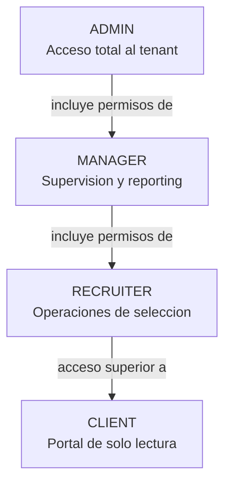
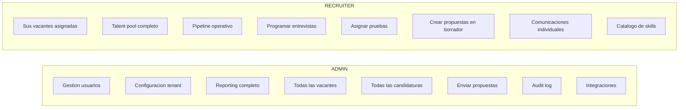
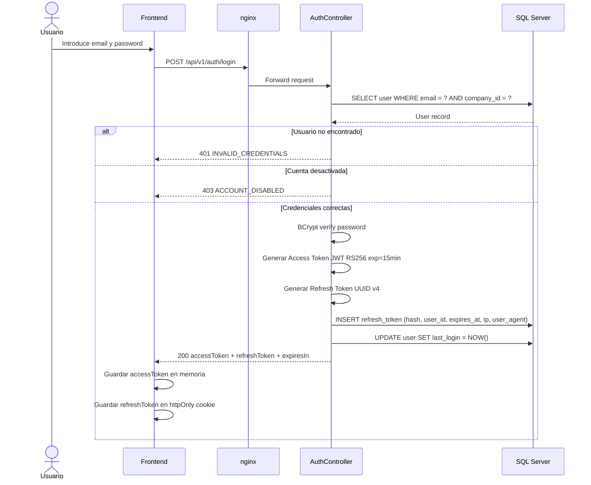
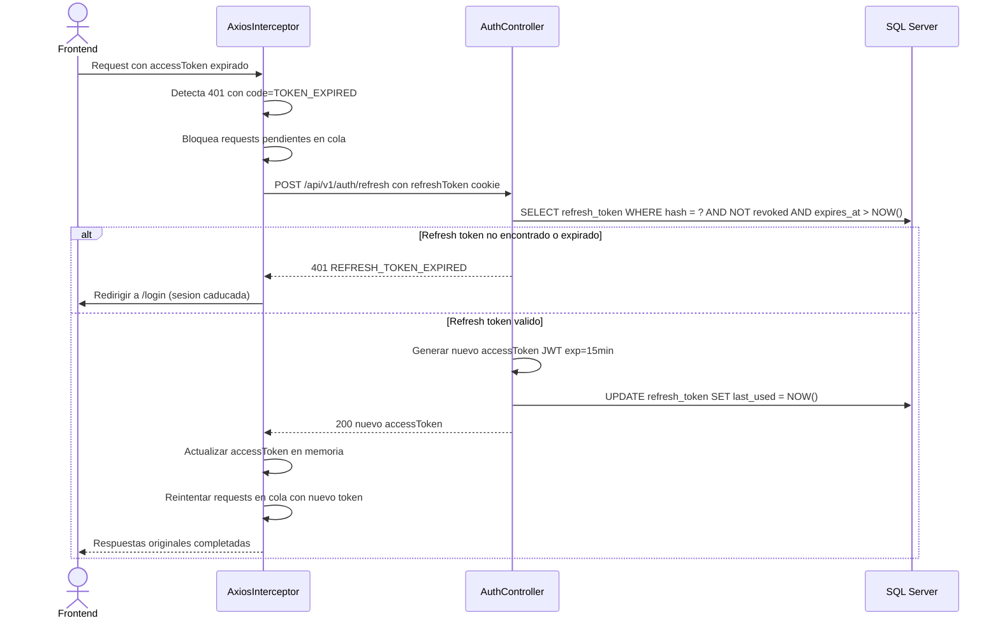
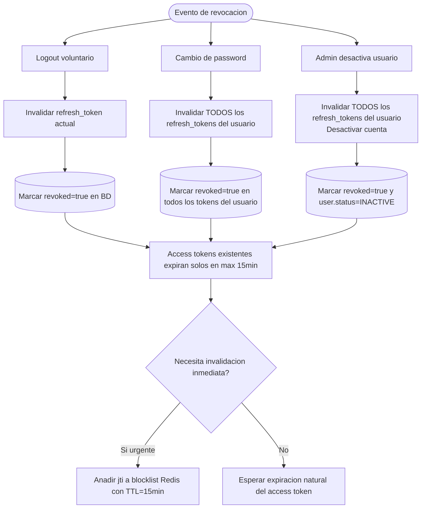
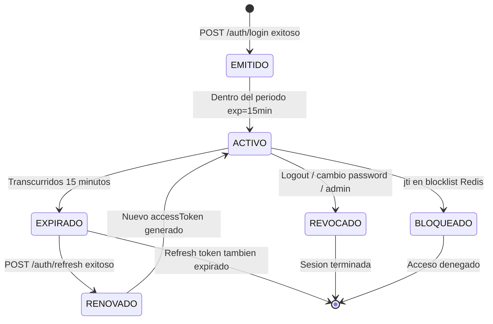
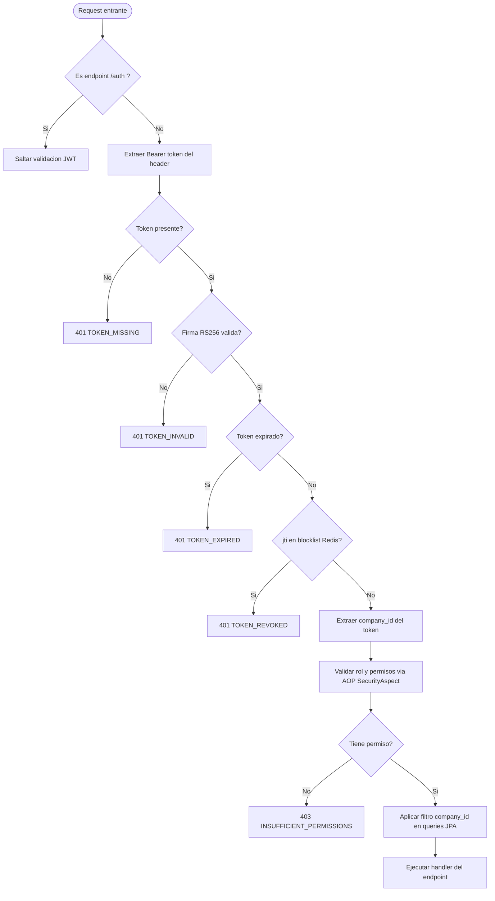
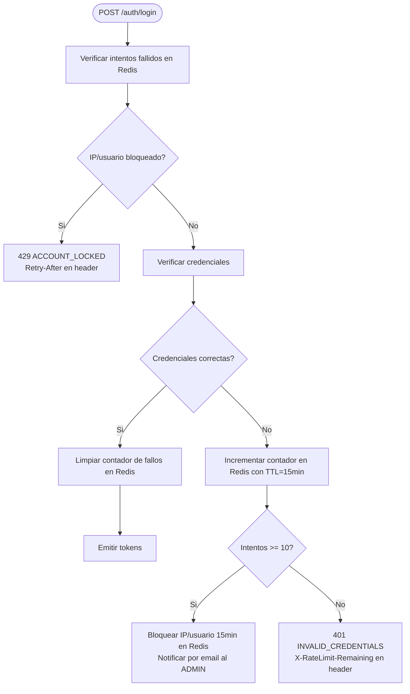
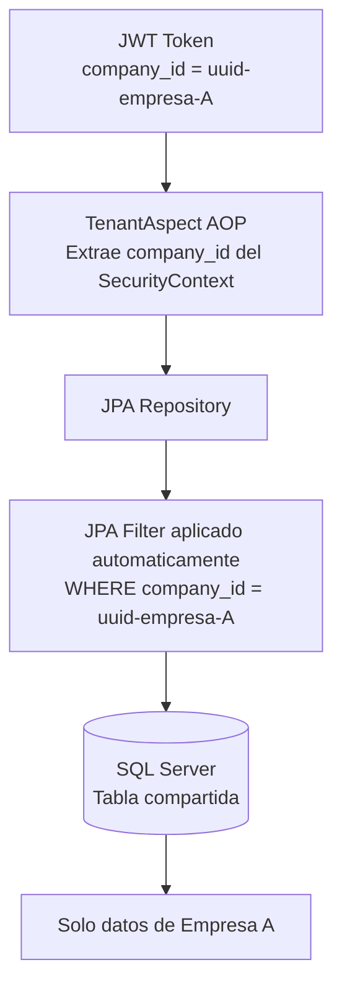
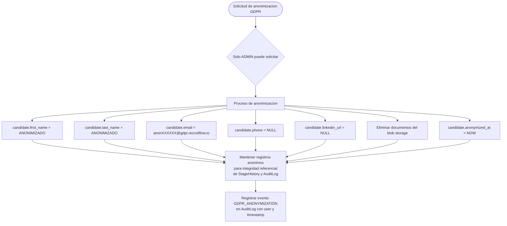

# RecruitFlow — Diseño de Seguridad
**Versión:** 1.0
**Fecha:** 2026-04-04
**Autor:** Arquitecto de Seguridad Senior
**Estado:** Aprobado

---

## Tabla de contenidos

1. [Modelo de seguridad](#1-modelo-de-seguridad)
2. [Roles del sistema](#2-roles-del-sistema)
3. [Matriz de permisos](#3-matriz-de-permisos)
4. [Flujo JWT detallado](#4-flujo-jwt-detallado)
5. [Política CORS](#5-política-cors)
6. [Rate Limiting](#6-rate-limiting)
7. [Scopes por tenant](#7-scopes-por-tenant)
8. [Seguridad en capa de datos](#8-seguridad-en-capa-de-datos)
9. [Headers de seguridad HTTP](#9-headers-de-seguridad-http)
10. [Auditoría y trazabilidad](#10-auditoría-y-trazabilidad)

---

## 1. Modelo de seguridad

RecruitFlow implementa un modelo de seguridad en **cuatro capas** independientes y complementarias:

```
┌────────────────────────────────────────────────────────────────────┐
│  CAPA 1 — Perímetro: HTTPS + CORS + Rate Limiting (nginx)          │
├────────────────────────────────────────────────────────────────────┤
│  CAPA 2 — Autenticación: JWT Bearer Token (Spring Security)        │
├────────────────────────────────────────────────────────────────────┤
│  CAPA 3 — Autorización: RBAC + Tenant Isolation (Spring AOP)       │
├────────────────────────────────────────────────────────────────────┤
│  CAPA 4 — Datos: company_id filter + Soft Delete GDPR (JPA)        │
└────────────────────────────────────────────────────────────────────┘
```

### Principios aplicados

| Principio | Implementación |
|---|---|
| **Least privilege** | Cada rol tiene solo los permisos mínimos necesarios |
| **Defense in depth** | Validación en controller, service y repositorio |
| **Tenant isolation** | Toda consulta filtra por `company_id` extraído del JWT |
| **Zero trust interno** | El backend valida el JWT en cada request; no hay sesión de servidor |
| **Fail secure** | En caso de duda, denegar. 403 > 200 con datos vacíos |
| **Audit trail** | Toda escritura queda registrada con usuario, timestamp e IP |

---

## 2. Roles del sistema

### Definición de roles

| Rol | Código | Descripción |
|---|---|---|
| **Administrador** | `ADMIN` | Gestión total del tenant: usuarios, configuración, todos los módulos. Un tenant tiene mínimo 1 ADMIN. |
| **Manager** | `MANAGER` | Supervisión de procesos de selección, acceso a reporting, aprobación de propuestas. No puede gestionar usuarios ni configuración empresa. |
| **Recruiter** | `RECRUITER` | Operaciones diarias de reclutamiento: vacantes, candidatos, pipeline, entrevistas. No accede a configuración ni reporting avanzado. |
| **Cliente** | `CLIENT` | Portal de empresa cliente: visualización de sus vacantes activas y candidatos propuestos. Solo lectura. |

> Este documento detalla los roles **ADMIN** y **RECRUITER** conforme a la solicitud.

### Jerarquía de roles

```
flowchart TD
    ADMIN --> MANAGER
    MANAGER --> RECRUITER
    RECRUITER --> CLIENT
```



---

## 3. Matriz de permisos

### Leyenda

| Símbolo | Significado |
|---|---|
| ✅ | Permitido sin restricciones |
| 🔒 | Permitido con condición (se detalla en la tabla) |
| ❌ | Denegado — genera HTTP 403 |
| — | No aplica a este rol |

---

### 3.1 Módulo: Vacantes (`/positions`)

| Operación | ADMIN | RECRUITER | Condición RECRUITER |
|---|---|---|---|
| Listar vacantes | ✅ | ✅ | Solo las que tiene asignadas o son de su empresa |
| Ver detalle vacante | ✅ | ✅ | Solo si pertenece al tenant |
| Crear vacante | ✅ | ✅ | |
| Editar vacante | ✅ | 🔒 | Solo vacantes en estado DRAFT u OPEN; no puede cerrarlas |
| Cerrar vacante | ✅ | ❌ | Requiere rol MANAGER o superior |
| Publicar en portales | ✅ | 🔒 | Solo si la vacante le está asignada |
| Eliminar vacante (soft) | ✅ | ❌ | |
| Asignar recruiter a vacante | ✅ | ❌ | |
| Ver salario de la vacante | ✅ | 🔒 | Solo si tiene flag `canViewSalary` activo en su perfil |

---

### 3.2 Módulo: Candidatos (`/candidates`)

| Operación | ADMIN | RECRUITER | Condición RECRUITER |
|---|---|---|---|
| Listar talent pool | ✅ | ✅ | |
| Ver perfil completo | ✅ | ✅ | |
| Crear candidato | ✅ | ✅ | |
| Editar datos básicos | ✅ | ✅ | |
| Cambiar estado a BLACKLISTED | ✅ | ❌ | Requiere MANAGER o superior |
| Subir documentos | ✅ | ✅ | |
| Eliminar documentos | ✅ | 🔒 | Solo documentos que él mismo subió |
| Ver datos GDPR | ✅ | ❌ | Solo ADMIN puede ver fecha de consentimiento y retención |
| Solicitar anonimización GDPR | ✅ | ❌ | |
| Parsear CV | ✅ | ✅ | |
| Exportar candidatos (CSV) | ✅ | ❌ | Requiere MANAGER o superior |
| Añadir/quitar tags | ✅ | ✅ | |
| Ver expectativa salarial | ✅ | 🔒 | Solo si tiene flag `canViewSalary` |

---

### 3.3 Módulo: Pipeline / Candidaturas (`/applications`)

| Operación | ADMIN | RECRUITER | Condición RECRUITER |
|---|---|---|---|
| Listar candidaturas | ✅ | ✅ | Solo de vacantes asignadas o de su empresa |
| Ver detalle candidatura | ✅ | ✅ | Solo si pertenece al tenant |
| Crear candidatura | ✅ | ✅ | |
| Ver Kanban | ✅ | ✅ | |
| Avanzar etapa pipeline | ✅ | 🔒 | No puede avanzar a OFFER ni HIRED directamente |
| Descartar candidatura | ✅ | ✅ | Debe indicar motivo de descarte |
| Reactivar candidatura descartada | ✅ | ❌ | Requiere MANAGER o superior |
| Añadir nota INTERNAL | ✅ | ✅ | |
| Añadir nota SHARED_WITH_CLIENT | ✅ | ❌ | Requiere MANAGER o superior |
| Ver match score | ✅ | ✅ | |
| Ver historial de etapas | ✅ | ✅ | |

---

### 3.4 Módulo: Matching (`/matching`)

| Operación | ADMIN | RECRUITER | Condición RECRUITER |
|---|---|---|---|
| Ejecutar matching para vacante | ✅ | 🔒 | Solo vacantes asignadas |
| Ver posiciones para candidato | ✅ | ✅ | |
| Ver score de candidatura | ✅ | ✅ | |
| Ajustar pesos del algoritmo | ✅ | ❌ | Solo ADMIN desde configuración |

---

### 3.5 Módulo: Entrevistas (`/interviews`)

| Operación | ADMIN | RECRUITER | Condición RECRUITER |
|---|---|---|---|
| Programar entrevista | ✅ | ✅ | |
| Ver detalle entrevista | ✅ | ✅ | Solo de sus candidaturas |
| Reagendar entrevista | ✅ | 🔒 | Solo si él la programó o está asignado |
| Cancelar entrevista | ✅ | 🔒 | Solo si la programó él y aún no se realizó |
| Registrar feedback | ✅ | 🔒 | Solo si es el entrevistador designado |
| Ver feedback de otros entrevistadores | ✅ | 🔒 | Solo puede ver el resumen; las notas privadas solo MANAGER+ |
| Invitar entrevistador externo | ✅ | ❌ | |

---

### 3.6 Módulo: Pruebas técnicas (`/assessments`)

| Operación | ADMIN | RECRUITER | Condición RECRUITER |
|---|---|---|---|
| Asignar prueba a candidato | ✅ | ✅ | |
| Ver solución enviada | ✅ | ✅ | |
| Evaluar prueba | ✅ | 🔒 | Solo si está asignado como evaluador |
| Crear plantilla de prueba | ✅ | ❌ | Requiere MANAGER o superior |
| Editar plantilla de prueba | ✅ | ❌ | |
| Eliminar plantilla | ✅ | ❌ | |

---

### 3.7 Módulo: Propuestas (`/offers`)

| Operación | ADMIN | RECRUITER | Condición RECRUITER |
|---|---|---|---|
| Crear propuesta (DRAFT) | ✅ | 🔒 | Puede crear en DRAFT; no puede enviar |
| Editar propuesta en DRAFT | ✅ | 🔒 | Solo la que él creó y está en DRAFT |
| Enviar propuesta al candidato | ✅ | ❌ | Requiere aprobación de MANAGER |
| Registrar respuesta del candidato | ✅ | ✅ | |
| Ver propuestas enviadas | ✅ | 🔒 | Solo las de sus procesos |
| Aprobar propuesta para envío | ✅ | ❌ | Solo ADMIN/MANAGER |

---

### 3.8 Módulo: Comunicaciones (`/communications`)

| Operación | ADMIN | RECRUITER | Condición RECRUITER |
|---|---|---|---|
| Enviar email individual | ✅ | ✅ | |
| Enviar email masivo (>50 destinatarios) | ✅ | ❌ | Requiere MANAGER o superior |
| Crear plantilla de email | ✅ | 🔒 | Solo plantillas personales (no globales) |
| Editar plantilla global | ✅ | ❌ | |
| Eliminar plantilla | ✅ | ❌ | |
| Ver historial de comunicaciones | ✅ | 🔒 | Solo las enviadas por él o a sus candidatos |

---

### 3.9 Módulo: Clientes (`/clients`)

| Operación | ADMIN | RECRUITER | Condición RECRUITER |
|---|---|---|---|
| Listar clientes | ✅ | ✅ | Solo nombre y datos básicos |
| Ver detalle cliente | ✅ | 🔒 | Sin datos financieros ni contractuales |
| Crear cliente | ✅ | ❌ | |
| Editar cliente | ✅ | ❌ | |
| Eliminar cliente | ✅ | ❌ | |
| Asignar recruiter a cliente | ✅ | ❌ | |

---

### 3.10 Módulo: Administración (`/users`, `/skills`, configuración)

| Operación | ADMIN | RECRUITER | Condición |
|---|---|---|---|
| Listar usuarios | ✅ | ❌ | |
| Crear usuario | ✅ | ❌ | |
| Editar rol de usuario | ✅ | ❌ | |
| Desactivar usuario | ✅ | ❌ | |
| Ver log de auditoría | ✅ | ❌ | |
| Listar skills | ✅ | ✅ | |
| Crear skill | ✅ | ✅ | La skill queda pendiente de aprobación si la crea RECRUITER |
| Editar skill | ✅ | ❌ | |
| Eliminar skill | ✅ | ❌ | |
| Ver configuración empresa | ✅ | ❌ | |
| Editar configuración empresa | ✅ | ❌ | |
| Gestionar integraciones (webhooks, API tokens) | ✅ | ❌ | |
| Ver métricas y reporting | ✅ | 🔒 | Solo métricas de sus propias vacantes |

---

### 3.11 Resumen ejecutivo de permisos



---

## 4. Flujo JWT detallado

### 4.1 Estructura del token

**Access Token** (JWT firmado con RS256):

```json
{
  "header": {
    "alg": "RS256",
    "typ": "JWT",
    "kid": "recruitflow-2026-04"
  },
  "payload": {
    "sub": "user-uuid",
    "email": "recruiter@empresa.com",
    "role": "RECRUITER",
    "company_id": "company-uuid",
    "company_slug": "empresa-sl",
    "permissions": ["positions:read", "candidates:write", "pipeline:write"],
    "iat": 1712224800,
    "exp": 1712228400,
    "iss": "https://api.recruitflow.io",
    "aud": "recruitflow-app",
    "jti": "unique-token-id"
  }
}
```

| Claim | Tipo | Descripción |
|---|---|---|
| `sub` | UUID | ID del usuario |
| `role` | string | Rol principal del usuario |
| `company_id` | UUID | Tenant al que pertenece — inmutable en el token |
| `permissions` | string[] | Lista explícita de permisos para validación rápida |
| `jti` | UUID | ID único del token — usado para revocación |
| `exp` | unix timestamp | Expiración: **15 minutos** |
| `iat` | unix timestamp | Momento de emisión |

**Refresh Token** — opaco (UUID v4 almacenado hasheado en BD):
- Duración: **7 días** (renovable en cada uso)
- Vinculado a: `user_id`, `company_id`, `user_agent`, `ip_address`
- Se invalida si el user_agent o la IP cambian de forma sospechosa (flag de revisión)

---

### 4.2 Flujo de emisión (Login)



> **Decisión de seguridad**: El `accessToken` se guarda en memoria (no localStorage) para evitar XSS. El `refreshToken` en cookie `httpOnly; Secure; SameSite=Strict` para evitar robo desde JS.

---

### 4.3 Flujo de refresco (Token Refresh)



---

### 4.4 Flujo de revocación

La revocación es necesaria en tres escenarios:



**Tabla de estrategias de revocación**:

| Escenario | Refresh Token | Access Token | Tiempo de efecto |
|---|---|---|---|
| Logout voluntario | Revocar token actual | Expiración natural | Máx. 15 min |
| Cambio de password | Revocar todos los tokens | Expiración natural | Máx. 15 min |
| Admin desactiva usuario | Revocar todos los tokens | Blocklist inmediata (Redis) | Inmediato |
| Sospecha de compromiso | Revocar todos los tokens | Blocklist inmediata (Redis) | Inmediato |
| Rotación de clave RSA | Revocar todos los tokens | Blocklist inmediata (todos) | Inmediato |

---

### 4.5 Ciclo de vida completo del token



---

### 4.6 Validación del token en cada request



---

## 5. Política CORS

### 5.1 Configuración en nginx

```nginx
# /etc/nginx/conf.d/cors.conf

map $http_origin $cors_origin {
    default                         "";
    "https://app.recruitflow.io"    $http_origin;
    "https://staging.recruitflow.io" $http_origin;
    # Desarrollo local — solo si ENV=development
    "http://localhost:5173"         $http_origin;
    "http://localhost:3000"         $http_origin;
}

server {
    listen 443 ssl;

    location /api/ {
        # Cabeceras CORS
        add_header 'Access-Control-Allow-Origin'      $cors_origin always;
        add_header 'Access-Control-Allow-Credentials' 'true' always;
        add_header 'Access-Control-Allow-Methods'     'GET, POST, PUT, PATCH, DELETE, OPTIONS' always;
        add_header 'Access-Control-Allow-Headers'     'Authorization, Content-Type, X-Request-ID, X-Tenant-Slug' always;
        add_header 'Access-Control-Max-Age'           '86400' always;
        add_header 'Access-Control-Expose-Headers'    'X-Request-ID, X-RateLimit-Remaining' always;

        # Preflight
        if ($request_method = 'OPTIONS') {
            return 204;
        }

        proxy_pass http://backend:8080;
    }
}
```

### 5.2 Configuración en Spring Security (segunda línea de defensa)

```java
@Configuration
public class CorsConfig {

    @Bean
    public CorsConfigurationSource corsConfigurationSource() {
        CorsConfiguration config = new CorsConfiguration();

        config.setAllowedOriginPatterns(List.of(
            "https://*.recruitflow.io",
            "http://localhost:[3000,5173]"  // solo con perfil dev
        ));
        config.setAllowedMethods(List.of("GET","POST","PUT","PATCH","DELETE","OPTIONS"));
        config.setAllowedHeaders(List.of("Authorization","Content-Type","X-Request-ID","X-Tenant-Slug"));
        config.setExposedHeaders(List.of("X-Request-ID","X-RateLimit-Remaining"));
        config.setAllowCredentials(true);
        config.setMaxAge(86400L);

        UrlBasedCorsConfigurationSource source = new UrlBasedCorsConfigurationSource();
        source.registerCorsConfiguration("/api/**", config);
        return source;
    }
}
```

### 5.3 Política por entorno

| Entorno | Orígenes permitidos | Notas |
|---|---|---|
| Producción | `https://app.recruitflow.io` | Solo HTTPS · sin wildcards |
| Staging | `https://staging.recruitflow.io` · `https://preview-*.recruitflow.io` | Wildcard de subdominio permitido |
| Desarrollo | `http://localhost:5173` · `http://localhost:3000` | Solo con perfil Spring `dev` activo |
| CI/CD tests | Deshabilitado (tests directos sin navegador) | |

---

## 6. Rate Limiting

### 6.1 Niveles de rate limiting

El rate limiting se aplica en nginx como primera línea, con un segundo nivel en Spring para lógica de negocio.

#### Nivel 1: nginx (por IP)

```nginx
# Zonas de límite por IP
limit_req_zone $binary_remote_addr zone=auth_zone:10m    rate=5r/m;
limit_req_zone $binary_remote_addr zone=api_zone:10m     rate=100r/m;
limit_req_zone $binary_remote_addr zone=upload_zone:10m  rate=10r/m;
limit_req_zone $binary_remote_addr zone=matching_zone:10m rate=20r/m;

server {
    # Endpoint de login — muy restrictivo para evitar brute force
    location = /api/v1/auth/login {
        limit_req zone=auth_zone burst=3 nodelay;
        limit_req_status 429;
        proxy_pass http://backend:8080;
    }

    # Subida de archivos
    location ~ ^/api/v1/candidates/.*/documents {
        limit_req zone=upload_zone burst=5;
        proxy_pass http://backend:8080;
    }

    # Matching — operacion costosa
    location ~ ^/api/v1/matching/.*/run {
        limit_req zone=matching_zone burst=2 nodelay;
        proxy_pass http://backend:8080;
    }

    # API general
    location /api/ {
        limit_req zone=api_zone burst=20 nodelay;
        proxy_pass http://backend:8080;
    }
}
```

#### Nivel 2: Spring (por usuario autenticado)

```java
// Anotación personalizada
@Target(ElementType.METHOD)
@Retention(RetentionPolicy.RUNTIME)
public @interface RateLimit {
    int requestsPerMinute() default 60;
    String key() default "userId";  // userId | companyId | ip
}

// Uso en controllers
@PostMapping("/{positionId}/run")
@RateLimit(requestsPerMinute = 10, key = "userId")
public MatchingResult runMatching(@PathVariable UUID positionId, ...) { ... }

@PostMapping("/candidates/parse-cv")
@RateLimit(requestsPerMinute = 20, key = "userId")
public ParseCvResponse parseCv(...) { ... }
```

### 6.2 Tabla de límites por endpoint

| Endpoint | Límite por IP | Límite por Usuario | Límite por Tenant |
|---|---|---|---|
| `POST /auth/login` | 5/min · bloqueo 15min tras 10 fallos | — | — |
| `POST /auth/refresh` | 20/min | — | — |
| `POST /matching/*/run` | 20/min | 10/min | 100/hora |
| `POST /candidates/parse-cv` | 10/min | 20/min | 200/día |
| `POST /candidates/{id}/documents` | 10/min | 30/min | — |
| `POST /communications/email` | 30/min | 50/min | 500/hora (anti-spam) |
| `GET /candidates` (listado) | 100/min | 200/min | — |
| Resto de GET | 200/min | — | — |
| Resto de POST/PATCH/DELETE | 100/min | 120/min | — |

### 6.3 Respuesta al superar el límite

```http
HTTP/1.1 429 Too Many Requests
Content-Type: application/json
Retry-After: 60
X-RateLimit-Limit: 5
X-RateLimit-Remaining: 0
X-RateLimit-Reset: 1712224860

{
  "code": "RATE_LIMIT_EXCEEDED",
  "message": "Has superado el límite de peticiones. Intenta de nuevo en 60 segundos.",
  "retryAfterSeconds": 60,
  "timestamp": "2026-04-04T10:00:00Z"
}
```

### 6.4 Bloqueo por intentos fallidos de login



---

## 7. Scopes por tenant

### 7.1 Aislamiento de datos (Multi-tenancy)

RecruitFlow usa una arquitectura **single-database, multi-tenant** con `company_id` como discriminador en todas las entidades.



#### Implementación con Spring AOP + JPA Filter

```java
// 1. Filtro JPA para tenant isolation (se activa en cada request)
@Component
public class TenantFilter implements Filter {

    @Override
    public void doFilter(ServletRequest req, ServletResponse res, FilterChain chain) {
        String companyId = SecurityContextHolder.getContext()
            .getAuthentication()
            .getDetails()  // companyId extraído del JWT
            .toString();

        TenantContext.set(companyId);
        try {
            chain.doFilter(req, res);
        } finally {
            TenantContext.clear();  // CRÍTICO: limpiar tras el request
        }
    }
}

// 2. EntityManager interceptor — añade WHERE company_id automáticamente
@Aspect
@Component
public class TenantAspect {

    @Before("execution(* com.recruitflow.*.infrastructure.repository.*.*(..))")
    public void enforceTenantScope(JoinPoint jp) {
        String companyId = TenantContext.get();
        if (companyId == null) {
            throw new SecurityException("Tenant context not initialized");
        }
        // JPA @Filter se activa por EntityManager en cada sesión
    }
}
```

### 7.2 Reglas de aislamiento por entidad

| Entidad | Aislamiento | Regla adicional |
|---|---|---|
| Position | Por `company_id` | ✅ |
| Candidate | Por `company_id` | ✅ |
| Application | Por `company_id` vía Position | ✅ |
| Interview | Por `company_id` vía Application | ✅ |
| Assessment | Por `company_id` vía Application | ✅ |
| Offer | Por `company_id` vía Application | ✅ |
| User | Por `company_id` | Un usuario no puede ver usuarios de otro tenant |
| Skill | Por `company_id` + global | Skills globales visibles para todos los tenants (read-only) |
| Client | Por `company_id` | ✅ |
| AuditLog | Por `company_id` | ADMIN solo ve su propio audit log |

### 7.3 Verificación de pertenencia al tenant

Además del filtro automático, el `SecurityAspect` verifica la pertenencia en operaciones sensibles:

```java
@Aspect
@Component
public class SecurityAspect {

    @Before("@annotation(requiresPermission)")
    public void checkPermission(JoinPoint jp, RequiresPermission requiresPermission) {
        AuthUser user = getCurrentUser();

        // Verificar rol mínimo
        if (!user.hasRole(requiresPermission.role())) {
            throw new AccessDeniedException("Insufficient role: " + requiresPermission.role());
        }

        // Verificar que el recurso pertenece al tenant del usuario
        UUID resourceId = extractResourceId(jp);
        if (resourceId != null && !belongsToTenant(resourceId, user.getCompanyId())) {
            // Devolver 404 en lugar de 403 para no revelar existencia del recurso
            throw new ResourceNotFoundException("Resource not found: " + resourceId);
        }
    }
}
```

> **Decisión de seguridad**: Cuando un usuario intenta acceder a un recurso de otro tenant, se devuelve **404** (no encontrado) en lugar de 403 (prohibido). Esto evita revelar la existencia de recursos de otros tenants.

### 7.4 Scopes de permisos en el JWT

Los permisos se codifican como `recurso:accion` dentro del token:

| Scope | ADMIN | RECRUITER |
|---|---|---|
| `positions:read` | ✅ | ✅ |
| `positions:write` | ✅ | ✅ |
| `positions:delete` | ✅ | ❌ |
| `candidates:read` | ✅ | ✅ |
| `candidates:write` | ✅ | ✅ |
| `candidates:gdpr` | ✅ | ❌ |
| `pipeline:read` | ✅ | ✅ |
| `pipeline:write` | ✅ | ✅ |
| `pipeline:advance_offer` | ✅ | ❌ |
| `interviews:read` | ✅ | ✅ |
| `interviews:write` | ✅ | ✅ |
| `offers:read` | ✅ | ✅ |
| `offers:send` | ✅ | ❌ |
| `matching:run` | ✅ | ✅ |
| `matching:config` | ✅ | ❌ |
| `communications:bulk` | ✅ | ❌ |
| `users:manage` | ✅ | ❌ |
| `admin:audit` | ✅ | ❌ |
| `admin:settings` | ✅ | ❌ |

---

## 8. Seguridad en capa de datos

### 8.1 Contraseñas

- Algoritmo: **BCrypt** con cost factor 12
- No se almacena la contraseña en texto plano en ningún log
- Política mínima: 10 caracteres, 1 mayúscula, 1 número, 1 símbolo
- Historial: no repetir las últimas 5 contraseñas
- Expiración: cada 180 días para ADMIN; opcional para RECRUITER

### 8.2 Datos sensibles en BD

| Dato | Tratamiento |
|---|---|
| Contraseñas | BCrypt hash (cost=12) — nunca reversible |
| Refresh tokens | SHA-256 hash — nunca en claro |
| Datos de candidato (GDPR) | En claro con `anonymized_at` para soft delete |
| Salarios (candidate.salary_expectation) | Cifrado AES-256 a nivel de aplicación (campo sensitivo) |
| CV parseado | Solo metadata; el archivo original en blob storage privado |
| API tokens de integración | SHA-256 hash; se muestra en claro solo en el momento de creación |

### 8.3 Soft delete y GDPR



---

## 9. Headers de seguridad HTTP

Configurados en nginx para todas las respuestas:

```nginx
# Security headers
add_header Strict-Transport-Security  "max-age=31536000; includeSubDomains; preload" always;
add_header X-Content-Type-Options     "nosniff" always;
add_header X-Frame-Options            "DENY" always;
add_header X-XSS-Protection           "1; mode=block" always;
add_header Referrer-Policy            "strict-origin-when-cross-origin" always;
add_header Permissions-Policy         "camera=(), microphone=(), geolocation=()" always;
add_header Content-Security-Policy    "default-src 'self'; script-src 'self'; style-src 'self' 'unsafe-inline'; img-src 'self' data: https:; connect-src 'self' https://api.recruitflow.io; frame-ancestors 'none'" always;

# Eliminar headers que revelan información del servidor
proxy_hide_header X-Powered-By;
proxy_hide_header Server;
add_header Server "RecruitFlow" always;
```

| Header | Valor | Protege contra |
|---|---|---|
| `Strict-Transport-Security` | max-age=1 año + preload | Downgrade HTTPS → HTTP |
| `X-Content-Type-Options` | nosniff | MIME type sniffing |
| `X-Frame-Options` | DENY | Clickjacking |
| `Content-Security-Policy` | default-src self | XSS, data injection |
| `Referrer-Policy` | strict-origin-when-cross-origin | Fuga de URLs internas |
| `Permissions-Policy` | Cámara/mic/geo deshabilitados | Acceso no autorizado a periféricos |

---

## 10. Auditoría y trazabilidad

### 10.1 Eventos auditados

Todo evento de escritura y los accesos sensibles se registran en la tabla `audit_log`:

| Categoría | Eventos registrados |
|---|---|
| **Autenticación** | login exitoso, login fallido, logout, cambio de password, bloqueo de cuenta |
| **Usuarios** | crear, editar rol, desactivar, reactivar |
| **Vacantes** | crear, publicar, cerrar |
| **Candidatos** | crear, editar, cambio de estado, anonimización GDPR |
| **Pipeline** | cambio de etapa, descarte con motivo |
| **Propuestas** | crear, enviar, respuesta del candidato |
| **Comunicaciones** | envío masivo (>10 destinatarios) |
| **Administración** | cambio de configuración, gestión de integraciones |
| **Seguridad** | acceso denegado (403), token revocado, rate limit superado |

### 10.2 Estructura del registro de auditoría

```json
{
  "id": "uuid",
  "companyId": "uuid",
  "userId": "uuid",
  "userEmail": "recruiter@empresa.com",
  "userRole": "RECRUITER",
  "action": "CANDIDATE_STAGE_CHANGED",
  "entityType": "Application",
  "entityId": "uuid",
  "previousState": { "stage": "SCREENING" },
  "newState": { "stage": "INTERVIEW" },
  "ipAddress": "85.123.45.67",
  "userAgent": "Mozilla/5.0...",
  "requestId": "X-Request-ID del request",
  "timestamp": "2026-04-04T10:05:00Z"
}
```

### 10.3 Retención y acceso al audit log

| Período | Política |
|---|---|
| 0–90 días | Consulta en tiempo real desde UI (solo ADMIN) |
| 90 días – 2 años | Archivado en almacenamiento frío (blob storage) |
| > 2 años | Eliminación conforme a política GDPR/LOPD |

- El audit log es **append-only**: ningún usuario puede modificar ni eliminar registros dentro del período de retención activa.
- Los registros del audit log están **excluidos del aislamiento de tenant** a nivel de escritura (el sistema siempre puede escribir); solo la lectura está filtrada por `company_id`.

---

*Documento de seguridad RecruitFlow v1.0 — Revisión requerida ante cualquier cambio de arquitectura o incorporación de nuevos módulos*
*Próxima revisión: 2026-07-04*
