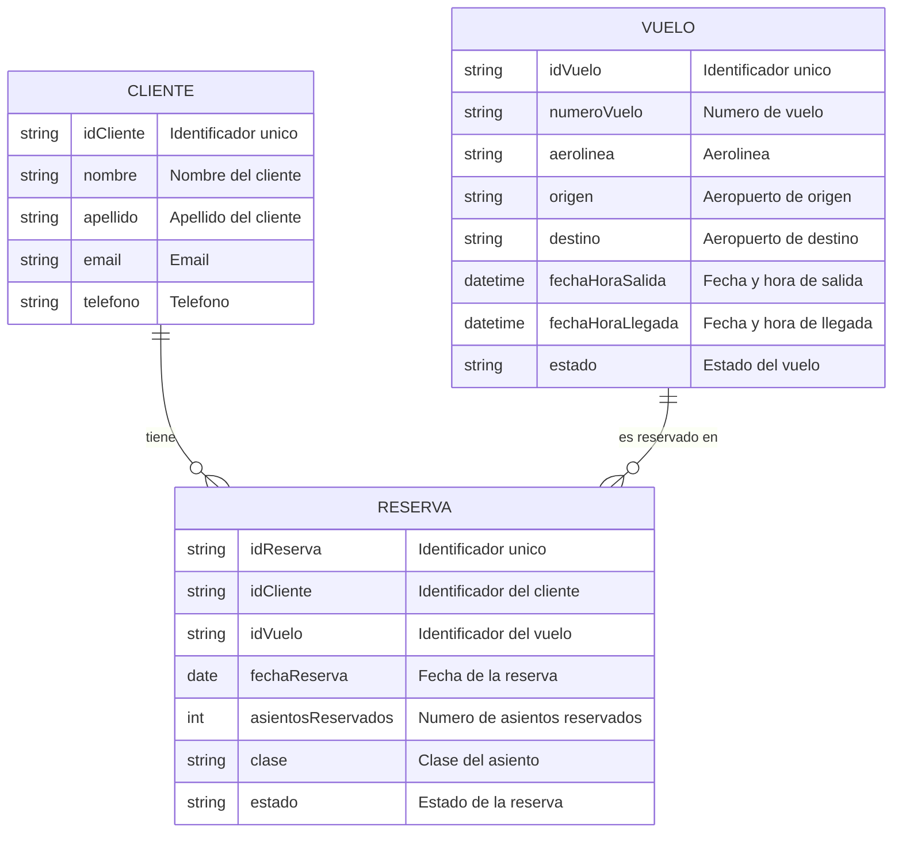

# Test erDiagram

```mermaid
erDiagram
    CLIENTE {
        string idCliente "Identificador unico"
        string nombre "Nombre del cliente"
        string apellido "Apellido del cliente"
        string email "Email"
        string telefono "Telefono"
    }
    VUELO {
        string idVuelo "Identificador unico"
        string numeroVuelo "Numero de vuelo"
        string aerolinea "Aerolinea"
        string origen "Aeropuerto de origen"
        string destino "Aeropuerto de destino"
        datetime fechaHoraSalida "Fecha y hora de salida"
        datetime fechaHoraLlegada "Fecha y hora de llegada"
        string estado "Estado del vuelo"
    }
    RESERVA {
        string idReserva "Identificador unico"
        string idCliente "Identificador del cliente"
        string idVuelo "Identificador del vuelo"
        date fechaReserva "Fecha de la reserva"
        int asientosReservados "Numero de asientos reservados"
        string clase "Clase del asiento"
        string estado "Estado de la reserva"
    }

    CLIENTE ||--o{ RESERVA : "tiene"
    VUELO ||--o{ RESERVA : "es reservado en"
```
